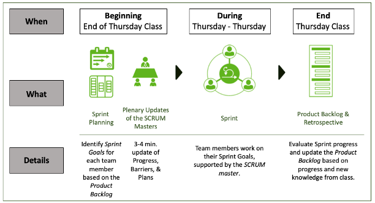

```{r setup, include=FALSE}
library(learnr)
library(gradethis)
library(knitr)

gradethis::gradethis_setup()
tutorial_options(exercise.timelimit = 60)
knitr::opts_chunk$set(echo = FALSE, warning = FALSE, message = FALSE)

# Ensure that library is loaded.
library(tidyverse)
```

```{r, context="data", include=FALSE}
# Ensure that the data is loaded for the remainder of this tutorial.
consumers <- UsingRTutorials::consumers #  
# Alternatives: readr::read_csv("http://82.196.4.233:3838/www/consumers.csv") or readr::read_csv("data/consumers.csv")
```

<!-- Define programming tip style -->

```{=html}
<style>
.tip {
  background-color: #f5f5f5;
}
</style>
```
<!-- Define question style -->

```{=html}
<style>
.question {
  color: #5A9DDB;
}
</style>
```
<!-- Define emphasis style -->

```{=html}
<style>
.emphasis {
  color: #e8301b;
}
</style>
```
## Overview

-   Welcome and Course Organization
-   Coding in R
-   The Grammar of Graphics with ggplot::
-   Collaboration on the Data Project

## Course Organization

### Lecturers

Dr. Christin Scholz, [c.scholz\@uva.nl](mailto:c.scholz@uva.nl){.email}

Assistant Professor Health & Persuasive Communication ACHC
Communication, Brain & Society Lab, www.cobras-lab.com

Dr. Xin Gao, [x.gao2\@uva.nl](mailto:x.gao2@uva.nl){.email}

Lecturer Research Methods

### Our expectations

-   Willingness to dedicate time to learning R.
-   Openness to learning new things and take on a challenge.

### Who are you?

Tell us about yourself:

1.  What is your study programme?

2.  What is your programming experience?

3.  What is one fun fact about yourself?

### What should you expect?

**At the end of this class, you will NOT know EVERYTHING about R.**

We hope you will:

\- Have a working knowledge of R essentials and be able to get started
with your own data.\
- Understand why R is awesome!\
- Develop know-how to quickly find out what you don’t know.

"Frustration is natural when you start programming in R [...]. But while
you should expect to be a little frustrated, take comfort in that this
experience is typical and temporary: it happens to everyone, and the
only way to get over it is to keep trying."

### Materials

Book:

-   Hadley Wickham, Mine Cetinkaya-Rundel, Garrett Grolemund (2023). R
    for Data Science. 2nd Edition. O’Reilly.

-   Online version: <https://r4ds.hadley.nz/>.

-   AFTER EXTENSIVE trial and error: online help is available for
    exercises (e.g.
    <https://mine-cetinkaya-rundel.github.io/r4ds-solutions/>)

Additional materials: Canvas, MS Teams

::: emphasis
Study the syllabus (module guide) on Canvas!
:::

### The tidyverse approach

We use the tidyverse approach to R programming.

```{r out.width="50%"}
knitr::include_graphics("images/tidyverse2.png")
```

Source:
<https://r-unimelb.gitbook.io/rbook/into-the-tidyverse/the-tidyverse>

tidyverse suite of packages:

-   data import: readr::
-   visualization: ggplot2::
-   data wrangling: dplyr::, tidyr::
-   replicable research: R Markdown

Cheat sheets!

NOTE: The tidyverse package(s) are loaded in the tutorials, so they can
be used.

### Topics

```{r schedule, echo=FALSE}
data.frame(Week = c(1, 1, 2, 2, 3, 3, 4, 4),
           Date = c("Jan 9", "Jan 11", "Jan 16",
                    "Jan 18", "Jan 23", "Jan 25",
                    "Jan 30", "Feb 1"),
           Topics = c(
             " Basics, Workflow, and First Visualizations",
             " Transforming and Exploring Data, Reports in Quarto",
             " Data Tidying and Joins",
             " Special Data types: Strings, Factors, Dates and Times",
             " Programming: Functions and BaseR",
             " A Brief Intro to Modelling",
             " Communicating results: Finetuning Plot and Reports",
             " Project Presentation"
           )) |>
  knitr::kable(format = "html", col.names = c("Week", "Date", "Topics & Chapters"), align = c("l", "l", "l")) |>
  kableExtra::kable_styling(bootstrap_options = "striped", full_width = TRUE)
```

### Grading

Final grade:

1.  Problem Sets (60%).
2.  Data Project: reproducible report with one data visualization per
    team member (40%).

### Problem Sets

Each problem set consists of two parts:

1.  Coding: Take home assignment consisting of a selection of exercises
    like those in *R for Data Science*. Assigned to each student on
    Thursday as Canvas assignment. Submission deadline: following
    Sunday.

2.  Explanation: In class "test" at the beginning of each Tuesday
    session (Week 2-4; \~15 min). Add comments to the code you submitted
    in part 1 to precisely describe a) what the code does, and b) why
    you performed each operation.

### Data Project: Tell a visual story

-   Exploratory analysis of a complex data set: Showcase your R skills.
-   Groups of 5 students.
-   Group effort: Tidying the dataset.
-   Individual effort: One data visualization per student based on the
    tidy data.
-   Reproducible: All steps from raw data to final results (R Markdown).
-   *SCRUM-light* project management.

### Visual story example

```{r out.width="100%"}
knitr::include_graphics("images/wolf.png")
```

Source: <https://interaktiv.morgenpost.de/woelfe-in-deutschland/>

A visualization requires a lot of data wrangling:

-   Selection: Which info do we show?
-   Styling: Do we simplify (model) data?
-   Combining: Link data from different sources.
-   Justification: How do we treat missing data?

### Get inspired...

Some examples of data visualizations:

-   fivethirtyeight (<https://fivethirtyeight.com/>). Some data sets are
    available in fivethirtyeight R package.
-   Pew Research Center, e.g.,
    <https://www.pewresearch.org/fact-tank/2019/12/13/19-striking-findings-from-2019/>.

Books:

-   Edward R. Tufte (1997), *Visual Explanations. Images and Quantities,
    Evidence and Narrative*. (A classic)
-   Alberto Cairo (2016), *The Truthful Art. Data, Charts, and Maps for
    Communication*.

### Session Organization

Course Content (\~1.5 hours)

-   Tue (Week 2-4): Weekly Assignment Part 2: Explanation (\~15 min)
-   Tue: Q&A on last week’s topics & problem sets (Submit more
    complicated questions on Canvas. Brownie points for creating a
    reprex - see book Chapter 8).
-   Overview of new topic(s) & practice.

Data Project Collaboration (\~1.5 hours)

-   Collaborate in analyzing & visualizing a complex data set.
-   Project management with *SCRUM-light*.

Use your study buddy, come prepared, and bring questions.

### Study Buddies

…an optional source of knowledge, advice, and support.

Why have a study buddy?

-   Peer learning is highly effective.
-   R users form a community. Become part of it!
-   Learning to program requires moral support.

Recommendations

-   Meet at least 1x/week.
-   Read before you meet.
-   Discuss the course content, not the group project.
-   Formulate questions for class.

We will assign a study buddy to you.

### SCRUM(-Light)

SCRUM is a framework for managing teamwork in a **systematic** and
**empirically informed** manner.

What is SCRUM(-Light)?

-   Four 1-week *"Sprints"*.
-   **Sprint**: Set goals, complete tasks, evaluate.
-   *SCRUM master*: Oversees and facilitates the *Sprint*.
-   Detailed procedure on Canvas; Week 1 = guided Sprint.

Why SCRUM(-Light)?

-   Managing a complex team project is difficult!
-   Projects tend to be completed last minute and dominated by some
    students.
-   SCRUM is used by professional teams worldwide.

### Teaming Up for the Data Project

1.  Alcohol Posts and Alcohol Use.\

2.  Dynamics and Performance of an IT Call Center.\

3.  Social Evolution.\

4.  Friends and Families.\

5.  German Chancellor Candidates Debate.

6.  EU 2014 elections.\

7.  Or your own... (See Canvas for requirements)

The Canvas ["Data Projects Data
Sets"](https://canvas.uva.nl/courses/40018/pages/data-project-data-sets?module_item_id=1902862)
page contains the data and data descriptions.

Who will work on which complex dataset (and with whom)?

::: emphasis
Submit a list of (\~5) team members & a team name on the Canvas
discussion board during the break.
:::

### Questions about the Syllabus?

## Intermezzo: Tutorial Installation

You installed the latest versions, didn’t you?

-   R: <https://www.r-project.org/>
-   RStudio: <http://www.rstudio.com/download>

In addition, install this tutorial:

-   Install the `remotes` package:
    -   Type `install.packages("remotes")` in the RStudio console.
    -   Execute the command by pressing *Enter/Return*.
-   Install the `learnr` package: `install.packages("learnr")`
-   Install the `gradethis` package:
    `remotes::install_github("rstudio-education/gradethis")`
    -   This should also install the `learnr` package.
    -   Be patient! Wait for the message `DONE (gradethis)`.
-   Install the tutorials:
    `remotes::install_github("xgaouva/UsingRTutorialsJan2024")`
    -   Answer `no` to question
        `Do you want to install from sources the package which needs compilation?`.
    -   Wait for the message `DONE (UsingRTutorials)`.

### 

### Start the tutorial

Now you can start the first tutorial:

-   Execute the command
    `learnr::run_tutorial("session1", "UsingRTutorials")` in the RStudio
    console.

Alternatively:

-   Restart R (Session \> Restart R) to show the tutorials in the
    RStudio *Tutorial* tab.
-   Click *Start Tutorial* for tutorial **Session 1: Basics, Workflow
    and First Visualizations** in the *Tutorial* tab. (Takes some time!)
-   Show the tutorial in a new window with the
     button.
-   While you are working with the tutorial, you can also work in
    RStudio.

### Using a tutorial

-   Tutorials instead of slides.
-   Hands-on plenary or individual coding.
-   Additional (non-mandatory) materials.
-   Reviewing topics after class.

Your tutorial answers are saved until you press *Start Over*.

Use button  to stop the tutorial.

## Coding in R: Using functions

We use functions in R to accomplish something.

`funtion_name(argument_name = value, ...)`

Function arguments specify the input for a function:

-   Named arguments (more typing, less confusion):
    `seq(from = 1, to = 5)`.
-   Unnamed (less typing, more confusion): `seq(1, 5)`.

We recommend named arguments (at least in the beginning).

::: question
What does the command (below) do? Add the argument names to the
arguments in the function.
:::

```{r argumentsNamed1, exercise = TRUE}
seq(1, 15, 2)
```

<!-- To hide the solution, use a textual hint. -->

::: {#argumentsNamed1-hint}
**Hint:** Use the Help page for this function (`?seq`). The help page
will open in a browser window. If you use the help funstion in RStudio,
the help page opens in the *Help* tab.
:::

```{r argumentsNamed1-solution}
seq(from = 1, to = 15, by = 2)
```

```{r argumentsNamed1-check}
gradethis::grade_code(
  incorrect = "Supply each argument name with an equals sign."
  )
```

### 

::: tip
**Programming Tips**

-   Run code and have a look at the output to figure out what the
    arguments mean.
-   Look up the arguments of the function in the Help page or from the
    code completion options shown when you start typing within the
    brackets. **Hint**: In the RStudio interface, put your cursor in the
    name of a function and press F1 to get help.
-   If the code is not valid, R displays an error message when you
    attempt to run the code. Correct the mistake before you continue.
-   Run the updated code to see if the results are what they should be.
:::

::: question
Use this programming approach to find out what the `length.out` argument
means.
:::

```{r argumentsNamed2, exercise = TRUE}
seq(1, 15, length.out = )
```

### 

::: question
Correct the code below, which should give integer numbers from 10 down
to 1.
:::

```{r argumentsNamed3, exercise = TRUE}
seq(10, 1, 1)
```

<!-- To hide the solution, use a textual hint. -->

::: {#argumentsNamed3-hint}
**Hint:** What does the error message say if you run the code?
:::

### Where do the results go?

We can assign the results of a function to a data object:

`left_hand_object <- funtion_name(argument_name = value, ...)`

If left-hand data object:

-   does not exist: new data object created.
-   exists: data object overwritten.
-   is not named: output to screen (console or plot area).

In the previous exercises, the function results were sent to the screen.

::: question
Now, store the results of the three functions below in data objects
named `my_output`, `my_Output`, and `my_output` respectively.
:::

```{r output1, exercise = TRUE}
seq(from = 1, to = 20, by = 1)
seq(from = 10, to = 20, by = 1)
seq(from = 10, to = 10, by = 1)
```

<!-- To hide the solution, use a textual hint. -->

::: {#output1-hint}
**Hint:** Use the \<- operator to store results. Spell names correctly.
R is case-sensitive: lower case is different from uppercase.
:::

```{r output1-solution}
my_output <- seq(from = 1, to = 20, by = 1)
my_Output <- seq(from = 10, to = 20, by = 1)
my_output <- seq(from = 10, to = 10, by = 1)
```

```{r output1-check}
gradethis::grade_code()
```

### 

::: question
What does the data object `my_output` contain? Enter the value(s) below.
:::

```{r cleanUp2, exercise = TRUE, exercise.setup = "output1"}

```

```{r cleanUp2-check}
gradethis::grade_result(
  pass_if(10, "The first data object created with the name `my_output` is overwritten by the data object last created because they have the same name. In this way, a data object may not contain the data that you initially intended it to contain. Be careful!"),
  fail_if(~ TRUE, "If you run 'my_output', you can see what it contains.")
)
```

### Cleaning up

::: {style="background-color: #f5f5f5;"}
**Programming Tip**

-   The number of data objects in the R environment may grow quickly. It
    is good practice to discard data objects that are not needed
    (anymore). The base R functions `remove()`and, more concisely,
    `rm()` remove one or more objects from the environment.
:::

```{r echo=FALSE}
# Ensure that the data objects are available in the tutorial.
my_Output <- seq(10, 20, 1)
my_output <- seq(10, 10, 1)
```

::: question
Remove all data objects created in the preceding exercise with one
`rm()` command.
:::

```{r cleanUp, exercise = TRUE}
rm()
```

<!-- To hide the solution, use a textual hint. -->

::: {#cleanUp-hint}
**Hint:** Separate data objects with commas. Do not include the same
data object name more than once.
:::

```{r cleanUp-solution}
rm(my_output, my_Output)
```

```{r cleanUp-check}
gradethis::grade_code(
  incorrect = "Names of data objects must be used only once and be separated by commas."
  )
```

## Visual Exploration

The trend is towards visualizing data properties rather than tabulating
them.

```{r summary, echo=FALSE, out.width="60%"}
# Summary of brand awareness by gender and wom.
means <- consumers |> group_by(`Gender` = gender, `Word of mouth` = wom) |>
  summarise(`Average brand awareness` = round(mean(brand_aw), digits = 1)) 
# Numeric summary.
knitr::kable(means, "html") |>
  kableExtra::kable_styling(font_size = 16, full_width = FALSE, position = "left")
```

```{r echo=FALSE, fig.asp=0.6}
means |> 
  ggplot() +
  geom_bar(aes(x = `Word of mouth`, y = `Average brand awareness`, fill = Gender), stat = "identity", position = "dodge") +
  theme_bw(base_size = 12) +
  scale_x_discrete(name = "Heard of brand by word of mouth") +
  scale_fill_discrete(name = "") +
  theme(legend.position = "top",
        plot.background = element_blank()) #see ggplot book
rm(means)
```

### 

### Plots with `ggplot()`

Philosophy: Grammar of Graphics (Leland Wilkinson)

-   Build graph in layers.
-   Graphic properties: X, Y, color, size, shape, transparency.
-   Each graphic property may express a variable.
-   Additional features: statistics, position adjustment, coordinate
    system, faceting.

### Recreate a plot in steps

We will use some (fake) `consumers` data about a particular brand and
exposure to an advertising campaign for the brand. These are the
variables:

```{r variableDesc}
tibble::tibble(
  `Variable name` = c("ad_expo", "wom", "gender", "brand_aw", "firstname"),
  `Variable Label` = c("Exposure to the campaign", "Heard about the brand through word of mouth", "Gender of the respondent", "Awareness of the brand", "Respondent's first name"),
  `Value Labels`= c("1 = No exposure; 10 = Max exposure", "yes, no", "female, male", "1 = Not aware; 10 = Max aware", "")) |>
  knitr::kable(booktabs = TRUE)
```

```{r plot-recreate1, exercise=FALSE, message=FALSE, warning=FALSE}
# Standard ggplot plot with title and axis labels.
ggplot2::ggplot(
  data = consumers,
  mapping =
    aes(x = ad_expo,
        y = brand_aw)
  )+
  geom_point(
    mapping = aes(color = gender, shape = wom),
    size = 4
    ) +
  geom_smooth(
    method = "lm",
    formula = y ~x,
    se = FALSE,
    color = "black"
    ) +
  labs(
    title = "Does brand awareness depend on exposure, word-of-mouth, and gender?",
    x = "Exposure to the campaign",
    y = "Brand awareness"
    )
```

We are going to recreate the above plot in steps.

### Step 1: Aesthetics: the plane

-   x: horizontal axis (always required).
-   y: vertical axis.

::: question
Add the points to the plot.
:::

```{r ggplotPlane, exercise = TRUE, exercise.lines = 8, message=FALSE, warning=FALSE}
ggplot(
  data = consumers
  )
```

<!-- To hide the solution, use a textual hint. -->

::: {#ggplotPlane-hint}
**Hint:** Use the *Data Visualization with ggplot cheat sheet*
(available from the RStudion *Help \> Cheat Sheets* menu) if you cannot
remember the geom that you need. It is usually better to specify the x
and y coordinates of the plane in the `ggplot()` function than in a
geom.
:::

```{r ggplotPlane-solution}
ggplot(
  data = consumers,
  mapping =
    aes(x = ad_expo,
        y = brand_aw)
  )+
  geom_point()
```

```{r ggplotPlane-check}
gradethis::grade_code()
```

### Step 2 - Aesthetics: Attributes

```{r plot-recreate2, exercise=FALSE, message=FALSE, warning=FALSE}
# Standard ggplot plot with title and axis labels.
ggplot2::ggplot(
  data = consumers,
  mapping =
    aes(x = ad_expo,
        y = brand_aw)
  )+
  geom_point(
    mapping = aes(color = gender, shape = wom),
    size = 4
    ) +
  geom_smooth(
    method = "lm",
    formula = y ~x,
    se = FALSE,
    color = "black"
    ) +
  labs(
    title = "Does brand awareness depend on exposure, word-of-mouth, and gender?",
    x = "Exposure to the campaign",
    y = "Brand awareness"
    )
```

::: question
Add dots to represent individual datapoints and set the colour, shape,
and size of the dots.
:::

```{r ggplotDotcolor, exercise = TRUE, exercise.lines = 10, message=FALSE, warning=FALSE}
# Copy the solution to the preceding exercise here as your starting point.
ggplot(
  data = consumers
  )
```

<!-- To hide the solution, use a textual hint. -->

::: {#ggplotDotcolor-hint}
**Hint:** An aesthetic, such as colour or size, must be included in the
`aes()` function if it must be linked to a variable. Each group on the
variable then receives its own color.
:::

```{r ggplotDotcolor-solution}
ggplot(
  data = consumers,
  mapping =
    aes(x = ad_expo,
        y = brand_aw)
  )+
  geom_point(
    mapping = aes(shape = wom, color = gender),
    size = 4
    )
```

```{r ggplotDotcolor-check}
gradethis::grade_code(
   correct = "Dot colour and shape are linked to a variable, so they must be inside an aes() function. In contrast, dot size is constant (one value for all dots), so it must be outside an aes() function."
)
```

### Step 3 - Additional layers

```{r plot-recreate3, exercise=FALSE, message=FALSE, warning=FALSE}
# Standard ggplot plot with title and axis labels.
ggplot2::ggplot(
  data = consumers,
  mapping =
    aes(x = ad_expo,
        y = brand_aw)
  )+
  geom_point(
    mapping = aes(color = gender, shape = wom),
    size = 4
    ) +
  geom_smooth(
    method = "lm",
    formula = y ~x,
    se = FALSE,
    color = "black"
    ) +
  labs(
    title = "Does brand awareness depend on exposure, word-of-mouth, and gender?",
    x = "Exposure to the campaign",
    y = "Brand awareness"
    )
```

::: question
Add the linear regression line to the plot.
:::

```{r ggplotRegression, exercise = TRUE, exercise.lines = 15, message=FALSE, warning=FALSE}
# Copy the solution to the preceding exercise here as your starting point.
ggplot(
  data = consumers
  )
```

<!-- To hide the solution, use a textual hint. -->

::: {#ggplotRegression-hint}
**Hint:** Mind the details of the regression line.
:::

```{r ggplotRegression-solution}
ggplot(
  data = consumers,
  mapping =
    aes(x = ad_expo,
        y = brand_aw)
  )+
  geom_point(
    mapping = aes(shape = wom, color = gender),
    size = 4
    ) +
  geom_smooth(
    method = "lm",
    se = FALSE,
    color = "black"
    )
```

```{r ggplotRegression-check}
gradethis::grade_code()
```

### Step 4 - Labels

```{r plot-recreate4, exercise=FALSE, message=FALSE, warning=FALSE}
# Standard ggplot plot with title and axis labels.
ggplot2::ggplot(
  data = consumers,
  mapping =
    aes(x = ad_expo,
        y = brand_aw)
  )+
  geom_point(
    mapping = aes(color = gender, shape = wom),
    size = 4
    ) +
  geom_smooth(
    method = "lm",
    formula = y ~x,
    se = FALSE,
    color = "black"
    ) +
  labs(
    title = "Does brand awareness depend on exposure, word-of-mouth, and gender?",
    x = "Exposure to the campaign",
    y = "Brand awareness"
    )
```

::: question
Add the labels to the plot or change the labels. Mind the details.
:::

```{r ggplotLabels, exercise = TRUE, exercise.lines = 20, message=FALSE, warning=FALSE}
# Copy the solution to the preceding exercise here as your starting point.
ggplot(
  data = consumers
  )
```

<!-- To hide the solution, use a textual hint. -->

::: {#ggplotLabels-hint}
**Hint:** Mind the details of the regression line.
:::

```{r ggplotLabels-solution}
ggplot(
  data = consumers,
  mapping =
    aes(x = ad_expo,
        y = brand_aw)
  )+
  geom_point(
    mapping = aes(shape = wom, color = gender),
    size = 4
    ) +
  geom_smooth(
    method = "lm",
    se = FALSE,
    color = "black"
    ) +
  labs(
    title = "Does brand awareness depend on exposure, word-of-mouth, and gender?",
    x = "Exposure to the campaign",
    y = "Brand awareness"
    )
```

```{r ggplotLabels-check}
gradethis::grade_code()
```

### Facetting

Different graphs for different groups of observations.

-   facet_wrap(\~ x): one grouping variable
-   facet_grid(y \~ x): two grouping variables

```{r plot_facet_example, exercise=FALSE, message=FALSE, warning=FALSE}
# Adaptation: word of mouth as facets instead of shape.
ggplot(
  data = consumers,
  mapping = 
    aes(x = ad_expo,
        y =brand_aw)
  )+
  geom_point(
    mapping = aes(color = gender),
    size = 4
    ) +
  geom_smooth(
    mapping = 
    aes(color = gender),
    method = "lm",
    se = FALSE
    ) +
  labs(
    title = "Does brand awareness depend on exposure, word-of-mouth, and gender?",
    x = "Exposure to the campaign",
    y = "Brand awareness"
    ) +
  facet_wrap(vars(wom))
```

::: question
Adjust the visualization to match the plot above. Create two plots in
one row.
:::

```{r plot_facet, exercise=TRUE, exercise.lines = 20, warning=FALSE, message=FALSE }
# Copy the solution to the preceding exercise here as your starting point.
ggplot()
```

::: {#plot_facet-hint}
**Hint:** You must use the vars() function to identify the variable that
is used to create facets.
:::

```{r plot_facet-solution}
# Adaptation: word of mouth as facets instead of shape.
ggplot(
  data = consumers,
  mapping = 
    aes(x = ad_expo,
        y =brand_aw)
  )+
  geom_point(
    mapping = aes(color = gender),
    size = 4
    ) +
  geom_smooth(
    mapping = 
    aes(color = gender),
    method = "lm",
    se = FALSE
    ) +
  labs(
    title = "Does brand awareness depend on exposure, word-of-mouth, and gender?",
    x = "Exposure to the campaign",
    y = "Brand awareness"
    ) +
  facet_wrap(~wom)
```

```{r plot_facet-check}
gradethis::grade_code(
  correct = "You can also use facet_wrap(vars(wom))."
)
```

### Adding labels (advanced)

We may want to know who is the outlier in the plot, having an
exceptionally low exposure score. Use `geom_text()` to add the
participants' first names to the plot, as shown below. Carefully inspect
the arguments for this geom.

```{r plot_label_show, echo=FALSE, warning=FALSE, message=FALSE}
# Adaptation: add firstname as label.
ggplot2::ggplot(
  data = consumers,
  mapping = 
    aes(x = ad_expo,
        y = brand_aw)
  )+
  geom_point(
    mapping = aes(shape = wom, color = gender),
    size = 4
    ) +
  geom_smooth(
    mapping = 
    aes(color = gender),
    method = "lm",
    se = FALSE,
    ) +
  labs(
    title = "Does brand awareness depend on exposure, word-of-mouth, and gender?",
    x = "Exposure to the campaign",
    y = "Brand awareness"
    ) +
  geom_text(
    aes(label = firstname),
    nudge_y = 0.4,
    check_overlap = TRUE
    )
```

::: question
Create this graph yourself.
:::

```{r plot_label, exercise=TRUE, exercise.lines = 20, warning=FALSE, message=FALSE}
ggplot(
  data = consumers,
  mapping = 
    aes(x = ad_expo,
        y = brand_aw)
  )+
  geom_point(
    mapping = aes(shape = wom, color = gender),
    size = 4
    ) +
  geom_smooth(
    mapping = 
    aes(color = gender),
    method = "lm",
    se = FALSE,
    ) +
  labs(
    title = "Does brand awareness depend on exposure, word-of-mouth, and gender?",
    x = "Exposure to the campaign",
    y = "Brand awareness"
    ) +
  geom_text()
```

::: {#plot_label-hint}
**Hint:** Use help on this geom to get more information about the
arguments of this geom.
:::

```{r plot_label-solution}
# Adaptation: swap color and shape, line color as aesthetic.
ggplot(
  data = consumers,
  mapping = 
    aes(x = ad_expo,
        y = brand_aw)
  )+
  geom_point(
    mapping = aes(shape = wom, color = gender),
    size = 4
    ) +
  geom_smooth(
    mapping = 
    aes(color = gender),
    method = "lm",
    se = FALSE,
    ) +
  labs(
    title = "Does brand awareness depend on exposure, word-of-mouth, and gender?",
    x = "Exposure to the campaign",
    y = "Brand awareness"
    ) +
  geom_text(
    aes(label = firstname),
    nudge_y = 0.4,
    check_overlap = TRUE
    )
```

```{r plot_label-check}
gradethis::grade_code(
  correct = "The example plot uses `geom_text()` because the boxes created by `geom_label()` obscure the data."
  )
```

### Adding primitives (advanced)

Actually, we can draw all kinds of shapes on the plot, for example, an
arrow drawing attention to the extremely low exposure score.

::: question
Use `geom_segment` to create this plot.
:::

```{r plot_primitives_show, echo=FALSE, warning=FALSE, message=FALSE}
# Adaptation: Add arrow pointing to extreme value.
ggplot2::ggplot(
  data = consumers,
  mapping = 
    aes(x = ad_expo,
        y = brand_aw)
  )+
  geom_point(
    mapping = aes(shape = wom, color = gender),
    size = 4
    ) +
  geom_smooth(
    mapping = 
    aes(color = gender),
    method = "lm",
    se = FALSE
    ) +
  labs(
    title = "Does brand awareness depend on exposure, word-of-mouth, and gender?",
    x = "Exposure to the campaign",
    y = "Brand awareness"
    ) +
  geom_segment(
    x = 1, xend = 1, y = 4, yend = 2,
    arrow = arrow(
      type = "closed"
    )
  )
```

```{r plot_primitives, exercise=TRUE, exercise.lines = 20}
ggplot(
  data = consumers,
  mapping = 
    aes(x = ad_expo,
        y = brand_aw)
  )+
  geom_point(
    mapping = aes(shape = wom, color = gender),
    size = 4
    ) +
  geom_smooth(
    mapping = 
    aes(color = gender),
    method = "lm",
    se = FALSE
    ) +
  labs(
    title = "Does brand awareness depend on exposure, word-of-mouth, and gender?",
    x = "Exposure to the campaign",
    y = "Brand awareness"
    ) +
  geom_segment()
```

::: {#plot_primitives-hint}
**Hint:** Pay attention to the `arrow` argument. It uses a function! Use
help on the geom and on this function.
:::

```{r plot_primitives-solution}
# Adaptation: Add arrow pointing to extreme value.
ggplot(
  data = consumers,
  mapping = 
    aes(x = ad_expo,
        y = brand_aw)
  )+
  geom_point(
    mapping = aes(shape = wom, color = gender),
    size = 4
    ) +
  geom_smooth(
    mapping = 
    aes(color = gender),
    method = "lm",
    se = FALSE
    ) +
  labs(
    title = "Does brand awareness depend on exposure, word-of-mouth, and gender?",
    x = "Exposure to the campaign",
    y = "Brand awareness"
    ) +
  geom_segment(
    x = 1, xend = 1, y = 4, yend = 2,
    arrow = arrow(
      type = "closed"
    )
  )
```

```{r plot_primitives-check}
gradethis::grade_code(
  correct = "And yes, you can change the color and size of the arrow just like you can change them for points and other geoms."
)
```

## Evaluating a Plot

Once you master the `ggplot2` package and other packages for creating
plots (see the **Fancy stuff** part of this tutorial), you should start
thinking about what you want to convey with a plot and whether the plot
conveys your message in a clear and attractive way.

We will use the following criteria in this course:

1.  The data visualization is sufficiently complex to tell a story. For
    example, it presents both a pattern (as a first impression) and
    deviations from this pattern (inviting reflection about the
    pattern). The deviations, however, should not be overwhelming
    because of too much information.

2.  The data visualization is self-explanatory. It should be
    comprehensible if it is presented by itself. For example, use
    informative, readable labels.

3.  The data visualization gives an accurate, not a biased view of the
    data. For example, sizes should accurately reflect quantity.

4.  The data visualization uses graphic features (size, font type,
    colors, line styles) in such a way that the main parts are stressed
    and unimportant parts remain visually in the background. Justify
    your choices with comments in the code.

If you see a plot (or any other graphic):

-   Have a close look at a plot. What does it tell you?
-   When the plot disappears, try to formulate your first impression of
    the plot, both in terms of the information it gives (What stands out
    in the plot?) and the (dis)pleasure it gives you.
-   When the plot reappears, inspect it more closely. Where do your eyes
    go and which information do you collect during the process of
    looking at the plot.

::: question
Practice with the plots below. Use the checkboxes to show plots, which
will first be shown for a few seconds and, a bit later, for a longer
time.
:::

```{r, echo=FALSE}
fluidPage(
  fluidRow(
    column(2,
      radioButtons("radio", label = h3("Select a plot"),
    choices = list("Plot 1" = 1, "Plot 2" = 2, "Plot 3" = 3, "Plot 4" = 4, "Plot 5" = 5, "Plot 6" = 6), 
    selected = 1),
      sliderInput("slider", label = "", min = 0, max = 20, value = 0,
                  step = 1, ticks = FALSE, 
                  animate = TRUE
      )
    ),
    column(10,
      plotOutput("regPlot")
    )
  )  
)
```

```{r, context="server", warning=FALSE, message=FALSE}
output$regPlot <- renderPlot({
  g <- ggplot(
    data = consumers,
    aes(x = ad_expo, y = brand_aw)
    ) +
    scale_x_continuous(name = "Exposure", breaks = 1:10, limits = c(1, 10)) +
    scale_y_continuous(name = "Brand awareness", breaks = 1:10, limits = c(1, 10)) +
    theme_bw( base_size = 14 )
  
  ## Create plot versions
  if (input$radio == 1) { 
    # just regression line and confidence interval
    g <- g + geom_smooth(method = "lm", formula = y ~ x, se = TRUE, color = "black")
    }
  else if (input$radio == 2) {
    # point size reflects brand_aw
    g <- g + 
      geom_point(aes(size = brand_aw), color = "grey") +
      geom_smooth(method = "lm", formula = y ~ x, se = FALSE)
    }
  else if (input$radio == 3) {
    # outlier not visible (and regression line without outlier)
    g <- g + 
      geom_point(size = 2, color = "grey") +
      geom_smooth(data = consumers[consumers$ad_expo > 1,], 
        mapping = aes(x = ad_expo, y = brand_aw),
        method = "lm", formula = y ~ x, se = FALSE) +
      scale_x_continuous(limits = c(4, 10))
    }
  else if (input$radio == 4) {
    # grey total regression line, red regression line without outlier
    g <- g + 
      geom_point(size = 2, aes(color = ifelse(ad_expo > 1, "grey", "red")), show.legend = FALSE) +
      geom_smooth(method = "lm", formula = y ~ x, se = FALSE, color = "grey", size = 2) +
      geom_smooth(
        data = consumers[consumers$ad_expo > 1,], 
        mapping = aes(x = ad_expo, y = brand_aw),
        method = "lm", formula = y ~ x, se = FALSE, color = "red"
        ) +
      geom_text(x = 3.9, y = 4.3, label = "without outlier", size = 3, color = "red", alpha = 0.6) +
      scale_color_manual(values = c("red", "grey"))
    }
  else if (input$radio == 5) {
    # regression line per gender, with additional regression line for males without outlier
    g <- g + 
      geom_point(aes(color = gender), size = 2) +
      geom_smooth(method = "lm", formula = y ~ x, se = FALSE, aes(color = gender)) +
      geom_smooth(
        data = consumers[consumers$ad_expo > 1 & consumers$gender == "male",], 
        mapping = aes(x = ad_expo, y = brand_aw),
        method = "lm", formula = y ~ x, se = FALSE, color = "blue", linetype = "dashed"
        ) +
      geom_text(x = 4.1, y = 3.4, label = "without outlier", size = 3, color = "blue", alpha = 0.6)
    }
  else if (input$radio == 6) {
    # density conours and regression lines per gender
    g <- g + 
      geom_density2d(aes(color = gender),  adjust = 2) +
      geom_smooth(method = "lm", formula = y ~ x, se = FALSE, aes(color = gender))
    }
  
  ## Show plot, depending on slider value
  if (input$slider == 0) {
    #show press button text
    ggplot(data = consumers) + geom_text(x = 0.5, y = 0.5, label = "Press the little play button", size = 12) 
    } 
  else if ((input$slider > 0 & input$slider < 4) | (input$slider > 10)) {
    # ask user to reset the slider 
    if (input$slider == 20) {
      if (input$radio == 3 ) {hor_pos = 7}
      else {hor_pos = 5.5}
      g <- g + geom_text(x = hor_pos, y = 8.5, label = "Reset the slider to 0\nbefore you watch another plot.", size = 8)
      }
    #show plot
    g
    } 
  else {
    # What did you see?
    ggplot(data = consumers) + geom_text(x = 0.5, y = 0.5, label = "What did you see?", size = 18)
    }
})
```

## Additional Materials

Book on ggplot2:

-   Hadley Wickham (2016), ggplot2. Elegant Graphics for Data Analysis.
    Springer. <https://www.springer.com/gp/book/9783319242750> or build
    it yourself on github: <https://github.com/hadley/ggplot2-book>

Interactive training:

-   <https://www.datacamp.com/courses/data-visualization-with-ggplot2-1>

## Debugging (advanced)

Your friend tried to create a non-stacked bar chart showing the
proportion of females in the consumers data set who heard by word of
mouth against the proportion who did not, as well as the proportion of
males who heard and who did not hear by word of mouth.

::: question
Your friend did not manage to get the code to work. Can you do that?
:::

```{r debug, exercise = TRUE, eval=FALSE}
ggplot(data consumers) +
  geom_bar(
    mapping = aes(
      x = wom, 
      color = gender,
      position = "dodge"
  )
```

<!-- To hide the solution, use a textual hint. -->

::: {#debug-hint}
**Hints:**

-   Pay attention to the error messages when you run the code.
-   For proportions, you have to use a computed variable: check out the
    help on `geom_bar()`.
-   You may want to check the *R for Data Science* book: bar charts are
    tricky.
:::

```{r debug-solution}
ggplot(data = consumers) +
  geom_bar(
    mapping = aes(
      x = wom, 
      y = ..prop..,
      group = gender,
      fill = gender
    ),
    position = "dodge"
  )
```

```{r debug-check}
gradethis::grade_code(
  correct = "To get proportions, you must indeed specify both the y argument (indicating that you want proportions) and the group argument (specifying which total to use for caluclating proportions).", 
  incorrect = "If you don't see the problems, build up the graph from zero, step by step."
  )
```

::: tip
**Programming Tips**

-   When you program something complicated, build it in steps.
-   Check intermediate results regularly by running the code and
    inspecting the results.
:::

## Fancy Stuff

### `gganimate` package

If you want to animate your `ggplot` plot, the package
[`gganimate`](https://gganimate.com/index.html) provides you with tools
to create an animated GIF (with the `gifski` package) or a video (with
the `av` package).

The code below creates an animated gif using
[Gapminder](https://www.gapminder.org/) data on life expectancy, GDP per
capita, and population size by country.

::: question
Play around with the settings that are specific to `animate()`.
:::

Note that it takes quite some time to generate the animation.

```{r gganimate1, exercise=TRUE, exercise.lines = 32, exercise.timelimit = 120, eval=FALSE}
# Install the following packages if they haven't been installed.
library(gganimate)
library(gifski)
library(gapminder) #data used

# This code creates an animated ggplot
g <- ggplot(gapminder::gapminder, aes(gdpPercap, lifeExp, size = pop, colour = country)) +
  geom_point(alpha = 0.7, show.legend = FALSE) +
  scale_colour_manual(values = country_colors) +
  scale_size(range = c(2, 12)) +
  scale_x_log10() +
  facet_wrap(~continent) +
  # Here comes the gganimate specific bits
  labs(title = 'Year: {frame_time}', x = 'GDP per capita', y = 'life expectancy') +
  transition_time(year) +
  ease_aes('linear') +
  shadow_wake(
    wake_length = 0.2
  )

# And here, we show the animated plot.
gganimate::animate(
  plot = g, #gganimate plot to be shown
  nframes = 78, #1 frame for each year from 1952 to 2007 plus 2x11 additional frames for start and end 
  renderer = gifski_renderer( #save as animated GIF
    file = "gapminder.gif",
    loop = TRUE
    ),
  start_pause = 12, #first frame shows 12 times
  end_pause = 12, #last frame shows 36 times
  rewind = FALSE #roll back to the start
)
```

### 

If you would have a look at the gapminder data (e.g., with
`View(gapminder)`), you would see that the data are available for 1952,
1957, 1962, 1967, and so on. The `gganimate()` animation creates frames
for the years in between. In a way, the data for the in-between-years
are fabricated; they may give a wrong view of reality.

::: tip
**Programming Tip**

-   Carefully inspect the results created by packages that do a lot of
    work for you. They may do things that you do not want.
:::

Movement is fascinating but it can also be frustrating if the user
cannot pause or determine the speed of the animation. *Evaluate the pros
and cons of animations critically.*

### `ggplotly()` in the `plotly` package

The `plotly` library is designed for creating interactive graphics. It
has its own language for creating graphs but for the `ggplot` user, it
provides the 'ggplotly()' function to change a `ggplot` plot into an
interactive `plotly` plot.

The `plotly` library offers the option to zoom, select items in the
graph, and see additional information about the items in the graph.

::: question
Run the code to see the graph.
:::

If you carefully position your cursor on a dot, the respondent's first
name will pop up (works better if you select the *Compare data on hover*
option).

```{r plotly1, exercise=TRUE, exercise.lines = 26}
#these packages have been installed by UsingRTutorials
library(plotly) 
library(gapminder) #contains the data used here

#Step 1: create a ggplot
g <- ggplot(
  data = consumers,
  aes(x = ad_expo, y = brand_aw)
  ) +
    geom_point(aes(color = gender), size = 2) +
    geom_smooth(method = "lm", formula = y ~ x, se = FALSE, aes(color = gender)) +
    geom_smooth(
      data = consumers[consumers$ad_expo > 1 & consumers$gender == "male",], 
      mapping = aes(x = ad_expo, y = brand_aw),
      method = "lm", formula = y ~ x, se = FALSE, color = "blue", linetype = "dashed"
      ) +
    geom_text(
      aes(label = firstname),
      alpha = 0 #trick: make labels invisible (transparent)
      ) +
    scale_x_continuous(name = "Exposure", breaks = 1:10, limits = c(1, 10)) +
    scale_y_continuous(name = "Brand awareness", breaks = 1:10, limits = c(1, 10)) +
    theme_bw()

#Step 2: Turn the ggplot into a plotly plot and use plotly options.
ggplotly(g, tooltip = c("text"), dynamicTicks = TRUE)
```

### 

There are (limited) options for animation, as demonstrated in the plot
below. Run the code to see the plot.

::: question
Change the code, so the pop ups only show the country name.
:::

```{r plotly2, exercise=TRUE}
#Step 1: create a ggplot and use a variable to define the frames of the animation
p <- ggplot(gapminder, aes(gdpPercap, lifeExp, color = continent)) +
  geom_point(aes(size = pop, frame = year, ids = country)) +
  scale_x_log10() #this changes the scale to a log scale, so very large differences are compressed

#Step 2: Turn the ggplot into a plotly plot.
ggplotly(p)
```

::: {#plotly2-hint}
**Hint:** Have a look at the help for the `ggplotly()` function.
:::

```{r plotly2-solution}
p <- ggplot(gapminder, aes(gdpPercap, lifeExp, color = continent)) +
  geom_point(aes(size = pop, frame = year, ids = country)) +
  scale_x_log10() #this changes the scale to a log scale, so very large differences are compressed

ggplotly(p, tooltip = "country")
```

```{r plotly2-check}
gradethis::grade_code()
```

### Shiny

The [`shiny`]() package is the RStudio contribution to interactive R
products. Actually, this tutorial is made with Shiny and it contains a
Shiny app, namely, the animated plots used in the *Evaluating a plot*
Section.

Here is the code for these plots. You cannot run the code here because
we cannot start a Shiny app from within a Shiny app (this tutorial). If
you create a new Shiny app in RStudio (*File \> New File \> Shiny Web
App*) and copy and paste the below code into the Shiny app file
(replacing all existing contents), you can run the app from RStudio (use
the *Run App* button).

::: question
Experiment with the user interface and the R code.
:::

```{r shiny1, eval=FALSE, echo=TRUE}
# load the shiny package
library(shiny)

# first part of the app: the User Interface (ui)
ui <- fluidPage(
    fluidRow( #the first (and only) row in the interface
        column(2, #the first (left) column, width 2 out of 12
               radioButtons("radio", label = h3("Select a plot"),
                            choices = list("Plot 1" = 1, #label and value if selected
                                           "Plot 2" = 2, 
                                           "Plot 3" = 3, 
                                           "Plot 4" = 4, 
                                           "Plot 5" = 5, 
                                           "Plot 6" = 6), 
                            selected = 1),
               #only a slider can be animated
               sliderInput("slider", label = "", min = 0, max = 20, value = 0,
                           step = 1, ticks = FALSE, 
                           animate = TRUE
               )
        ),
        column(10, #the second (right) column, width 10 out of 12
               plotOutput("regPlot") #containing the plot named regPlot
        )
    )  
)

# second part of the app: the R code
server <- function(input, output, session) {
  # create a plot named regPlot to be shown in the output
  output$regPlot <- renderPlot({
    # the basic (empty) plot  
    g <- ggplot(
      data = consumers,
      aes(x = ad_expo, y = brand_aw)
      ) +
      scale_x_continuous(name = "Exposure", breaks = 1:10, limits = c(1, 10)) +
      scale_y_continuous(name = "Brand awareness", breaks = 1:10, limits = c(1, 10)) +
      theme_bw( base_size = 14 )
    
    ## Create a plot version for each radio option
    if (input$radio == 1) { 
      # just add regression line and confidence interval to the empty plot
      g <- g + geom_smooth(method = "lm", 
                           formula = y ~ x, se = TRUE, 
                           color = "black")
    }
    else if (input$radio == 2) {
      # point size reflects brand_aw
      g <- g + 
        geom_point(aes(size = brand_aw), color = "grey") +
        geom_smooth(method = "lm", formula = y ~ x, se = FALSE)
    }
    else if (input$radio == 3) {
      # outlier not visible (and regression line without outlier)
      g <- g + 
        geom_point(size = 2, color = "grey") +
        geom_smooth(data = consumers[consumers$ad_expo > 1,], 
                    mapping = aes(x = ad_expo, y = brand_aw),
                    method = "lm", formula = y ~ x, se = FALSE) +
        scale_x_continuous(limits = c(4, 10))
    }
    else if (input$radio == 4) {
      # grey total regression line, red regression line without outlier
      g <- g + 
        geom_point(size = 2, 
          aes(color = ifelse(ad_expo > 1, "grey", "red")), show.legend = FALSE) +
        geom_smooth(method = "lm", formula = y ~ x, se = FALSE, 
                    color = "grey", size = 2) +
        geom_smooth(
          # trick: base R to create a subset of all consumers, omitting the outlier
          data = consumers[consumers$ad_expo > 1,], 
          mapping = aes(x = ad_expo, y = brand_aw),
          method = "lm", formula = y ~ x, se = FALSE, color = "red"
        ) +
        geom_text(x = 3.9, y = 4.3, label = "without outlier", 
                  size = 3, color = "red", alpha = 0.6) +
        scale_color_manual(values = c("red", "grey"))
    }
    else if (input$radio == 5) {
      # regression line per gender, with additional regression line 
      # for males without outlier
      g <- g + 
        geom_point(aes(color = gender), size = 2) +
        geom_smooth(
          method = "lm", formula = y ~ x, se = FALSE, aes(color = gender)
          ) +
        geom_smooth(
          data = consumers[consumers$ad_expo > 1 & consumers$gender == "male",], 
          mapping = aes(x = ad_expo, y = brand_aw),
          method = "lm", formula = y ~ x, se = FALSE, 
          color = "blue", linetype = "dashed"
        ) +
        geom_text(x = 4.1, y = 3.4, label = "without outlier", 
                  size = 3, color = "blue", alpha = 0.6)
    }
    else if (input$radio == 6) {
      # density conours and regression lines per gender
      g <- g + 
        geom_density2d(aes(color = gender),  adjust = 2) +
        geom_smooth(
          method = "lm", formula = y ~ x, se = FALSE, aes(color = gender)
          )
    }
    
    # Show plot, depending on slider value
    # This is the animation trick: slider values range from 0 to 20,
    # if it is 0, a text is shown, if it is 1 or 2 or at least 10, 
    # the plot is shown, a text is shown between 2 and 10, and
    # a text is added to the plot if the slider is 20.
    if (input$slider == 0) {
      #show press button text
      ggplot(data = consumers) + 
        geom_text(
          x = 0.5, y = 0.5, 
          label = "Press the little play button", size = 12
          ) 
    } 
    else if ((input$slider > 0 & input$slider < 4) | (input$slider > 10)) {
      # ask user to reset the slider 
      if (input$slider == 20) {
        if (input$radio == 3 ) {hor_pos = 7}
        else {hor_pos = 5.5}
        g <- g + geom_text(
          x = hor_pos, y = 8.5, 
          label = "Reset the slider to 0\nbefore you watch another plot.", 
          size = 8
          )
      }
      #show plot
      g
    } 
    else {
      # What did you see?
      ggplot(data = consumers) + 
        geom_text(
          x = 0.5, y = 0.5, 
          label = "What did you see?", size = 18
          )
    }
  })  
}

# the command to create and run the app
shinyApp(ui, server)
```

Check out the [Shiny demos
gallery](https://shiny.rstudio.com/gallery/#demos) for inspiration.
Start simple!

If you want to create a Shiny app, first create your plot with
`ggplot()`, then add it to the Shiny app.

## Collaboration on the Data Project

### Work as a team. Tell a visual story.

-   Exploratory analysis of a complex data set: Showcase your R skills.

-   Group effort: Tidying the dataset

-   Individual effort: One data visualization per student.

-   Reproducible: All steps from raw data to final results (Quarto).

-   Your group work will be guided by our SCRUM-light project management
    procedure.

### SCRUM-Light

SCRUM is a framework for managing teamwork in a systematic and
empirically informed manner.

**Why SCRUM(-light)?**

-   Managing complex team-projects is difficult!

-   SCRUM helps to fairly and efficiently spread tasks across weeks and
    across team members and helps to hold team members accountable for
    completing important tasks.

-   SCRUM is used by professional teams worldwide.

**Relevant SCRUM terms**

| Term            | Using R Definition                                                                                                                                                |
|--------------|----------------------------------------------------------|
| Sprints         | Short intervals in which the team sets goals, completes tasks and then evaluates. We'll have four, 1-week sprints (with sprint 1 being a bit shorter: Tue - Thu). |
| SCRUM Master    | Person who oversees and facilitates the sprint. Choose a different team member per week.                                                                          |
| Product         | The final data project                                                                                                                                            |
| Product Goals   | The grading criteria the product needs to fulfill (see Syllabus).                                                                                                 |
| Product Backlog | A detailed to do lists that translates the product goals into concrete smaller tasks needed to achieve each product goal.                                         |

The SCRUM(-light) procedure is described in detail on
[Canvas](https://canvas.uva.nl/courses/40018/pages/scrum-procedure?module_item_id=1902863).

### Sprint 1

```{r out.width="100%"}

```

Sprint 1 is guided. Check out the partially filled in Product Backlog
template for Week 1 in the [SCRUM
guide](https://canvas.uva.nl/courses/40018/pages/scrum-procedure?module_item_id=1902863)
on Canvas.

### Apply your skills from Session 1 to your Data Project

Plots are very useful for getting a first idea of your data.

As a first step, use `ggplot` plots to describe individual variables and
relations between variables in (one of) your Data Project file(s).

#### Load and inspect one of your Data Project data files

Time to start exploring (visualizing) your Data Project data,

::: question
If you haven't done so previously, download the Data Project data
file(s) from Canvas to a directory that you create for your Data
Project.
:::

The tutorial must be able to find this data set, so you have to make the
Data Project directory your working directory:

-   In RStudio, use the *Session* menu, *Set Working Directory*, *Choose
    Directory* option.
-   In the dialog screen, find the Data Project directory that you
    created and press *Open*.
-   Copy the `setwd()` command from the RStudio console to the below
    code box. Now, you can work with the data set within this code box.

::: question
Use the below code box to import your data set, inspect it, and create
plots.
:::

```{r DataProject1, exercise = TRUE}
# Set your Data Project directory as working directory.
# (Copy the setwd() command from RStudio here.)

# Load your data in the object myData.
myData <- read_csv("filename.csv")

# Have a look at the variables in your data.
str(myData)

# Create your first plot.
ggplot()

# Create a second plot.
ggplot()

# And a third?
ggplot()
```

::: tip
**Programming Tips**

-   Build up plots in steps, from simple to complex.
-   Use lots of comments to explain what you are trying to do. Your team
    mates and your future self would like to know.
:::

Note: As long as you do not press the *Start Over* button, the code (and
plots) are preserved in this tutorial, so you can use the code later.

### SCRUM masters update

-   Use 1-2 minutes (per project group) to update the other groups on
    your first Sprint plan.

### We’ve made a start!

-   Contact your buddy.
-   Study the assigned book chapters before the next session.
-   Submit questions about the course material on Canvas.
-   SCRUM masters: Make sure your teams are organized to complete Sprint
    1 by Thursday.
