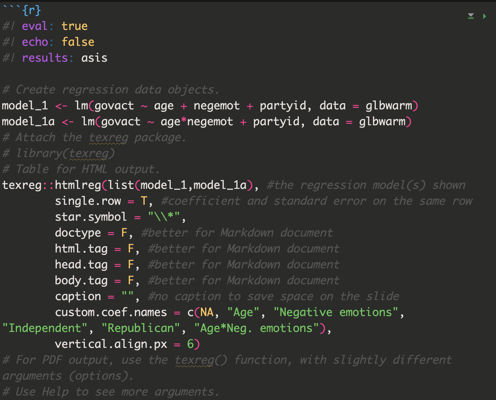

```{r setup, include=FALSE}
# Ensure that libraries are loaded.
library(tidyverse)
library(learnr)
library(gradethis)
library(knitr)
library(kableExtra)
library(haven) #For importing SPSS data files.
library(car) #For ANOVA.  
library(texreg) #For pretty regression results.
library(effects) #For two-way interaction plots.
library(broom) #For cleaning up statistical results.

tutorial_options(exercise.timelimit = 20, exercise.checker = gradethis::grade_learnr)
knitr::opts_chunk$set(echo = FALSE, warning = FALSE, message = FALSE)
```

```{r, context="data", include=FALSE}
# Ensure that the data is loaded for the remainder of this tutorial.
glbwarm <- UsingRTutorials::glbwarm
glbwarm_spss <- UsingRTutorials::glbwarm_spss
# The estimated regression model with rstanarm. 
model_1aBayes <- UsingRTutorials::model_1aBayes
```

<!-- Define programming tip style -->

```{=html}
<style>
.tip {
  background-color: #f5f5f5;
}
</style>
```
<!-- Define question style -->

```{=html}
<style>
.question {
  color: #5A9DDB;
}
</style>
```
<!-- Define emphasis style -->

```{=html}
<style>
.emphasis {
  color: #e8301b;
}
</style>
```

## Overview

-   Practice with Statistical Models 
-   Presenting results in Reproducible Text and Print-Quality Tables

## Practice with Statistical Models

[ADD??]

## Reproducible Presentation of Results

Once you fit your statistical model, you'll need to interpret and present the results, 
ideally in a way that is easily reproducible. R provides many useful tools for this. 
Let's take a look. 

### 

### Example data

Example data: `glbwarm` (accessible within this tutorial).

Source: Erik Nisbet; <http://afhayes.com/>

Inspect the variables in the Environment.

Main data types: 1. Number: `govact`, `posemot`, `negemot`, `age`. 2. Character: `ideology`, `sex`, `partyid`.

::: question
Inspect variable summaries.
:::

```{r inspect, exercise = TRUE, exercise.eval = TRUE}
summary(glbwarm)
```

### Present Statistical Results in Text

Let's present the results of the following *t* test in APA style using 
reproducible code.

::: question
Run an independent samples *t* test to examine whether younger participants (age < median age)
show more support for government action than older participants (age >= median age).
:::

```{r ttest, exercise = TRUE,exercise.eval = TRUE}
# First a new variable 'age_cat' to specify the age groups "younger" and "older" and save it in the glbwarm dataframe.

# Then conduct the t-test.
```

```{r ttest-solution}
# First a new variable 'age_cat' to specify the age groups and save it in the glbwarm dataframe.
glbwarm <- glbwarm |>
  mutate(age_cat = ifelse(age < median(age, na.rm = TRUE), "younger", "older"))
# Then conduct the t-test and save it in a results object called result_t
result_t <- glbwarm |> t.test(govact ~ age_cat, data = _)
```

```{r ttest-check}
gradethis::grade_code(
  correct = "", 
  incorrect = ""
  )
```

###

The code below takes our `result_t` object and formats it in APA style. The 
resulting text is fully reproducible and helps you avoid copy-pasting, typos, 
and extra work in case your data changes.

<div class="question" >
What does the `digits` argument do?
</div>

```{r APA1, exercise = TRUE, exercise.eval = TRUE, exercise.lines = 7, exercise.setup="ttest-solution"}
paste0(                       # base R function to concatenate strings
  "*t* (", 
  round(result_t$parameter, digits = 2), ") = ",        # df
  round(result_t$statistic, digits = 2),                # t
  ", *p* = ", round(result_t$p.value, digits = 3),      # p
  ", 95%CI[", round(result_t$conf.int[1], digits = 2),  # 95%CI lower
  ", ", round(result_t$conf.int[2], digits = 2), "]")   # 95%CI upper
```

The stars will turn *t* and *p* into italics in a rendered document.

### 

This works well for this particular t-test, but it isn't very flexible. What
if the p-value of a test is < .001? We should report it as "p < .001". Below
is a more flexible version of our code that implements this.

<div class="question" >

1.   What does the `digits` argument do?
2.   To which function does it belong?
3.   Explain how 'ifelse()` works.

Experiment with the code to check your answers.
</div>

```{r APA2, exercise = TRUE}
paste0("*t* (", 
  format(round(result_t$parameter, digits = 2), nsmall = 2), ") = ",
  format(round(result_t$statistic, digits = 2), nsmall = 2), 
  ", *p* ", 
  ifelse(result_t$p.value < 0.0005, 
         paste0("= ", format(round(result_t$p.value, digits = 3), nsmall = 2)),
         "< 0.001"),
  ", 95%CI[", format(round(result_t$conf.int[1], digits = 2), nsmall = 2),
  ", ", format(round(result_t$conf.int[2], digits = 2), nsmall = 2), "]")
```

<!-- To hide the solution, use a textual hint. -->
<div id="APA2-hint">
__Hint:__ Use help on functions `format()` and `ifelse()`.
</div>

### Print-Quality Results Tables

#### Off-The-Shelf Tables

There are several packages that help you to tabulate statistical results. The table below lists some of them with their characteristic features.

```{r packageTables, echo=FALSE}
# Create a data frame for the contents of the table.
dt <- data.frame(
  Package = c("base, stats", "stargazer", "texreg"),
  Models = c("all", "regression", "regression"),
  Format = c("plain text", "PDF, HTML, plain", "PDF, HTML, plain"),
  Style = c("-", "div., not APA", "generic"),
  Comparison = c("-", "side-by-side", "side-by-side"),
  Peculiarities = c("summary() and print(), only for quick inspection", "", "texreg(), hmtlreg(), screenreg()"),
  stringsAsFactors = FALSE
  )
names(dt)[5] <- paste0(names(dt)[5], footnote_marker_symbol(1))
dt |>
  knitr::kable(align = "llllll", escape = F) |> #show with kable() from the knitr package
  kable_styling(full_width = T) |>
  row_spec(0, font_size = 18) |>
  footnote(symbol = "Results of two or more models in one table.")
```

### 

#### Print-Quality Table With `texreg`

```{r model2_texreg, eval=TRUE, echo=FALSE, message=FALSE, warning=FALSE, results='asis'}
library(texreg)
model_1 <- lm(govact ~ age + negemot + partyid, data = glbwarm)
model_1a <- lm(govact ~ age*negemot + partyid, data = glbwarm)
# Table for HTML output.
texreg::htmlreg(list(model_1,model_1a), #the regression model(s) shown
        single.row = T, #coefficient and standard error on the same row
        star.symbol = "\\*", 
        doctype = F, #better for Markdown document
        html.tag = F, #better for Markdown document 
        head.tag = F, #better for Markdown document
        body.tag = F, #better for Markdown document 
        caption = "", #no caption to save space on the slide
        custom.coef.names = c(NA, "Age", "Negative emotions", "Independent", "Republican", "Age*Neg. emotions"),
        vertical.align.px = 6)
# For PDF output, use the texreg() function, with slightly different arguments (options).
# Use Help to see more arguments.
```

::: question
The above table is generated from the code below. What happens if you run the code?
:::

```{r texreg-init}
model_1 <- lm(govact ~ age + negemot + partyid, data = glbwarm)
model_1a <- lm(govact ~ age*negemot + partyid, data = glbwarm)
```

```{r texreg, exercise = TRUE, exercise.setup = "texreg-init"}
# Attach the texreg package.
library(texreg)
# Table for HTML output.
texreg::htmlreg(list(model_1,model_1a), #the regression model(s) shown
        single.row = T, #coefficient and standard error on the same row
        star.symbol = "\\*", 
        doctype = F, #better for Markdown document
        html.tag = F, #better for Markdown document 
        head.tag = F, #better for Markdown document
        body.tag = F, #better for Markdown document 
        caption = "", #no caption to save space on the slide
        custom.coef.names = c(NA, "Age", "Negative emotions", "Independent", "Republican", "Age*Neg. emotions"),
        vertical.align.px = 6)
# For PDF output, use the texreg() function, with slightly different arguments (options).
# Use Help to see more arguments.
```

### 

`htmlreg()` produces HTML code:

-   This code should not be treated as ordinary text when the Quarto document is knitted.
-   Instead, it must be used and formatted as HTML code.

The `results='asis'` code chunk option is needed to knit the html output of the code chunk as formatted text.

The full code chunk in the Quarto document (note the `results='asis'` argument):

```{r, out.width="70%"}

```

And this is what the knitted text looks like:

```{r eval=TRUE, echo=FALSE, results='asis'}
# Create regression data objects.
model_1 <- lm(govact ~ age + negemot + partyid, data = glbwarm)
model_1a <- lm(govact ~ age*negemot + partyid, data = glbwarm)
# Attach the texreg package.
library(texreg)
# Table for HTML output.
texreg::htmlreg(list(model_1,model_1a), #the regression model(s) shown
        single.row = T, #coefficient and standard error on the same row
        star.symbol = "\\*", 
        doctype = F, #better for Markdown document
        html.tag = F, #better for Markdown document 
        head.tag = F, #better for Markdown document
        body.tag = F, #better for Markdown document 
        caption = "", #no caption to save space on the slide
        custom.coef.names = c(NA, "Age", "Negative emotions", "Independent", "Republican", "Age*Neg. emotions"),
        vertical.align.px = 6)
```

### 

#### Functions for lm objects

`htmlreg()` is one example of a function that operates on lm() objects.

Other useful functions:

-   `confint()`,
-   `coef()`,
-   `resid()`.

::: question
Find out what these functions do. Apply them to `model_1` and check out the options of these functions.
:::

```{r lmfunctions, exercise = TRUE, exercise.setup = "texreg-init"}

```

<!-- To hide the solution, use a textual hint. -->

::: {#lmfunctions-hint}
**Hint:** Read the help info to these functions.
:::

###

#### Custom Tables with `broom` and `knitr`

For full control of your table, create it with packages `broom` and `knitr`.

(`broom` is part of the tidyverse package)

You need 3 steps:

1.  Use function `tidy()` in the `broom` package to extract relevant statistics from a statistical results object into a tibble.
2.  Select and adjust values to suit your needs.
3.  Create a table with `knitr::kable()` and `kableExtra` with all formatting options you need.

#### Step 1: Use function `tidy()` in the `broom` package to extract relevant statistics

::: question
Use `tidy()` and data objext `model_1a` to see the regression coefficients with their standard errors, t values, p values as a tibble.

Can you also get the 95% confidence intervals?

Send the result to the screen.
:::

```{r broom, exercise = TRUE, exercise.setup = "texreg-init"}

```

<!-- To hide the solution, use a textual hint. -->

::: {#broom-hint}
**Hint:** Check out help on `tidy.lm`. You are tidying the results of a linear model (`lm()`).
:::

```{r broom-solution}
model_1a |> tidy(conf.int = TRUE, conf.level = 0.95)
```

```{r broom-check}
gradethis::grade_code(
  correct = "", 
  incorrect = ""
  )
```

#### Step 2: Select and adjust values to suit your needs.

`broom` produces a tibble (data frame), so you can wrangle it like any other.

::: question
Explain the code below. If you are unsure about a code element, change it and see what happens.
:::

```{r broom2, exercise = TRUE, exercise.setup = "texreg-init", exercise.lines = 12}
model_1a |> 
  tidy(conf.int = TRUE, conf.level = 0.95) |> 
  mutate(
    estimate = format(round(estimate, digits = 2), nsmall = 2), 
    p.value = format(round(p.value, digits = 3), nsmall = 3), 
    CI = paste0( "[", format( round(conf.low, digits = 2), nsmall = 2 ), ", ", format( round(conf.high, digits = 2), nsmall = 2 ), "]" )
    ) |>
  select(term, estimate, p.value, CI)
```

### 

If you want to use stars to mark the significance level of regression coefficients, you can add a new character variable showing the number of stars.

::: question
Find and explain the line of code that adds stars indicating the significance level.
:::

```{r broom3, exercise = TRUE, exercise.setup = "texreg-init"}
model_1a |> 
  tidy(conf.int = TRUE, conf.level = 0.95) |> 
  mutate(
    estimate = format(round(estimate, digits = 2), nsmall = 2), 
    p.value = format(round(p.value, digits = 3), nsmall = 3),
    sig = case_when( p.value < .001 ~ "***", p.value < .01 ~ "**", p.value < .05 ~ "*", TRUE ~ "" ), 
    CI = paste0( "[", format( round(conf.low, digits = 2), nsmall = 2 ), ", ", format( round(conf.high, digits = 2), nsmall = 2 ), "]" )
    ) |>
  select(term, estimate, p.value, CI)

```

#### Step 3: Create a table with `knitr::kable()` and `kableExtra`

With `knitr` and `kableExtra`, we can create a table including footnotes.

::: question
Play around with the `kable` and `kableExtra` options to see what they do.
:::

```{r kable, exercise = TRUE, exercise.setup = "texreg-init", exercise.eval = TRUE, exercise.lines = 17}
model_1a |> 
  tidy(conf.int = TRUE, conf.level = 0.95) |> 
  mutate(
    estimate = format(round(estimate, digits = 2), nsmall = 2), 
    p.value = format(round(p.value, digits = 3), nsmall = 3), 
    sig = case_when( 
      p.value < .001 ~ "***", 
      p.value < .01 ~ "**", 
      p.value < .05 ~ "*", 
      TRUE ~ "" ), 
    CI = paste0( "[", format( round(conf.low, digits = 2), nsmall = 2 ), 
      ", ", format( round(conf.high, digits = 2), nsmall = 2 ), "]" )
    ) |> 
  select(term, estimate, sig, CI) |> #p.value dropped
  kable(digits = c(0, 2, 0, 0),
    col.names = c("Parameter", "B", "", "95% CI"),
    align = "lrlc",
    caption = "Table 1. Predicting opinions about global warming.",
    booktabs = TRUE, #nicer layout in PDF
    escape = FALSE #pay attention to special characters
    ) |>
  kable_styling(full_width = FALSE) |>
  row_spec(0, font_size = 16) |>
  column_spec(1, width = "5cm") |>
  column_spec(2, width = "3cm") |>
  column_spec(3, width = "0.5cm") |>
  column_spec(4, width = "5cm") |>
  footnote(
    general_title = "",
    general = "   * p < .05. ** p < .01. *** p < .001."
    )
```

### 

Some final points about tabulating results:

-   Special characters such as stars (`*`) and percentage signs (`%`) can be troublesome in tables. You may have to escape them with one or more backslashes (`\\`).

-   PDF output has more formatting options than HTML (or Word).

-   `kable()` does not knit nicely to Word. Knit to HTML and import HTML in Word.

## What's next

-   Sprint 5: Retrospective & Review.
-   Sprint 6: Planning, Update Project Backlog.
    -   Consider including: 
        -   Working on your individual project.
        -   Exploring your data for interesting patterns using statistical analysis.
        -   Time to practice and review for the exam.
    
### Reminder

Statistical analyses are not necessary for the Data Project. The Data Project focuses on visualizations.

You can, however, use statistical analysis to detect patterns in your data that you then try to visualize. If you do that, do not use off-the-shelf plots. Show that you can create a plot that hopefully is more attractive and more informative than off-the-shelf statistical plots.