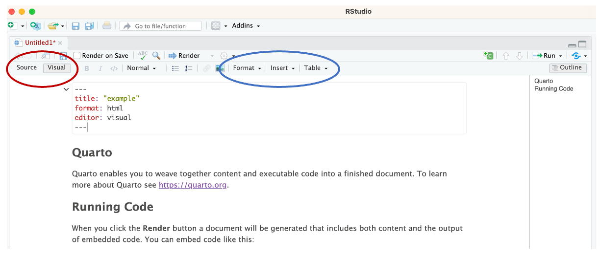
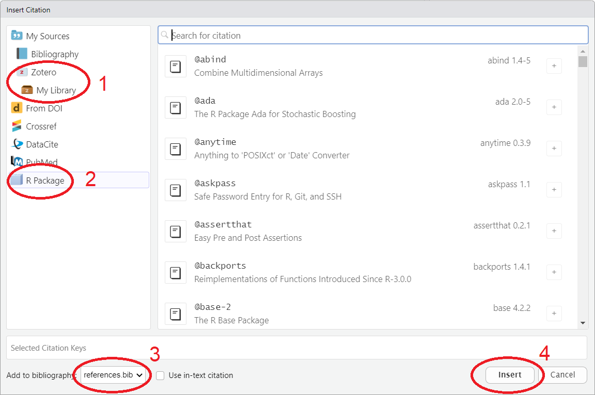
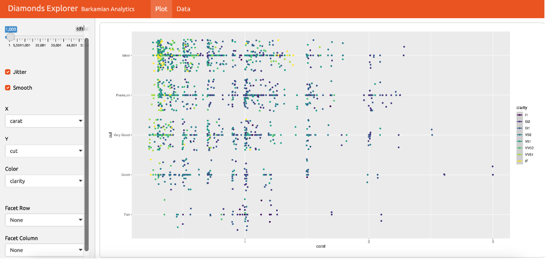

```{r setup, include=FALSE}
# Ensure that libraries are loaded.
library(tidyverse)
library(learnr)
library(gradethis)
library(effects) #For two-way interaction plots.
library(kableExtra)
library(RColorBrewer) #For color palettes.


tutorial_options(exercise.timelimit = 20, exercise.checker = gradethis::grade_learnr)
knitr::opts_chunk$set(echo = FALSE, warning = FALSE, message = FALSE)
```

```{r, context="data", include=FALSE}
# Ensure that the data is loaded for the remainder of this tutorial.
glbwarm <- UsingRTutorials::glbwarm
glbwarm_spss <- UsingRTutorials::glbwarm_spss
# The estimated regression model with rstanarm. 
model_1aBayes <- UsingRTutorials::model_1aBayes

Glasgow <- UsingRTutorials::Glasgow
```

<!-- Define programming tip style -->

```{=html}
<style>
.tip {
  background-color: #f5f5f5;
}
</style>
```
<!-- Define question style -->

```{=html}
<style>
.question {
  color: #5A9DDB;
}
</style>
```
<!-- Define emphasis style -->

```{=html}
<style>
.emphasis {
  color: #e8301b;
}
</style>
```
## Overview

-   Plotting statistical results

-   Polishing your graphics

-   Report layout in Quarto

## Plotting Statistical Results

Next to presenting your statistical results in text and tables, you may want to visualize some interesting effects. R offers a variety of packages that produce custom plots for different types of models. Let's explore some of these options.

**Spoiler:** Although they can be useful for quick and dirty exploration, we will advise you not to use them, but to create your own custom plots instead.

### 

We will use an example model fit to the `glbwarm` dataset (`model_1a`). As you can see below, this model regresses support for government action on party identification as well as an interaction between age and negative emotions.

```{r lmplots.vignette, eval=FALSE, echo=TRUE}
model_1a <- lm(govact ~ age*negemot + partyid, data = glbwarm)
```

```{r lmplots-setup}
model_1a <- lm(govact ~ age*negemot + partyid, data = glbwarm)
```

### Standard `plot()` function

A data object with statistical results usually has a `plot()` function:

-   These plots are for quick inspection rather than final presentation.
-   They can be very useful for checking assumptions.

::: question
Apply the `plot()` function to the result of linear regression (`model_1a`).

-   Which plots do you get?
-   Are these all plots that you can get with this function?
:::

```{r lmplots, exercise = TRUE}

```

```{r lmplots-solution, exercise.reveal_solution = FALSE}
plot(model_1a)
```

```{r lmplots-check}
gradethis::grade_code(
  correct = "", 
  incorrect = ""
  )
```

<!-- To hide the solution, use a textual hint. -->

::: {#lmplots-hint}
**Hint:** See `plot.lm()` for help.
:::

### Off-The-Shelf Plots

There are many packages offering ready-to-use plots, for example:

-   `coefplot`: plots regression coefficients for one or more models (generates `ggplot2` plots)
-   `visreg`: plots regression lines (generates `ggplot2` plots).
-   `effects`: plots regression lines (does not not generate `ggplot2` plots).

**Note:** If such a package generates `ggplot2` plots, they can be further customized. Save the plot (e.g., `p`) and then add layers, themes, ... (e.g., `p + theme_bw()`).

### Interaction Plot with the `effects` Package

You can plot interaction effects with the `effects` package in two steps.

```{r effects, exercise=TRUE, exercise.setup = "lmplots-setup", exercise.eval = TRUE }
# Load effects package.
library(effects)
# Step 1: Create a data object containing all effects.
eff.model2 <- effects::allEffects(model_1a)
# Step 2: Plot interaction effects.
plot(eff.model2, 'age:negemot', x.var = 'age')
```

Note the `rug` on the horizontal axis, showing the age score of all cases within a `negemot` group.

### Custom Plots with `ggplot()`

It is not so difficult to create this plot with `ggplot()`.

Advantage: Full control. E.g., why does the plot from the `effects` package skip negative emotions around three?

::: question
Create a ggplot from `glbwarm` like the above effects plot with facets for negative emotions between 1 and 1.5 (labeled `1`), between 1.5 and 2.5 (labeled `2`), between 2.5 and 3.5 (labeled `3`), between 3.5 and 4.5 (labeled `4`), between 4.5 and 5.5 (labeled `5`), between 5.5 and 6 (labeled `6`). Name the new variable `negemot_bin`.
:::

```{r ggplot, exercise = TRUE, exercise.setup = "lmplots-setup"}

```

```{r ggplot-hint-1}
# Create the binned negative emotions variable.
glbwarm |>
  mutate(negemot_bin = 
  case_when(
    negemot < 1.5 ~ 1,
    negemot < 2.5 ~ 2,
    negemot < 3.5 ~ 3,
    negemot < 4.5 ~ 4,
    negemot < 5.5 ~ 5,
    negemot >= 5.5 ~ 6
    )
  )
```

```{r ggplot-hint-2}
# Pipe the tibble into ggplot() and use geom_smooth().
glbwarm |>
  mutate(negemot_bin = 
  case_when(
    negemot < 1.5 ~ 1,
    negemot < 2.5 ~ 2,
    negemot < 3.5 ~ 3,
    negemot < 4.5 ~ 4,
    negemot < 5.5 ~ 5,
    negemot >= 5.5 ~ 6
    )
  ) |>
  ggplot( ) +
    geom_smooth( )
```

```{r ggplot-hint-3}
# Use geom_rug() to represent all observations on the horizontal axis.
```

```{r ggplot-hint-4}
# Use facet_wrap() on the binned negative emotions variable.
```

```{r ggplot-solution, exercise.reveal_solution = FALSE}
glbwarm |> mutate(negemot_bin = case_when( negemot < 1.5 ~ 1, negemot < 2.5 ~ 2, negemot < 3.5 ~ 3, negemot < 4.5 ~ 4, negemot < 5.5 ~ 5, negemot >= 5.5 ~ 6)) |> ggplot(aes(x = age)) + geom_smooth(aes(y = govact), method = lm) + geom_rug() + facet_wrap(vars(negemot_bin))
```

```{r ggplot-check}
gradethis::grade_code(
  correct = "", 
  incorrect = ""
  )
```

Do you notice differences between your plot and the plot created with the `effects` package?

Which plot do you trust more?

### ANOVA Means Plot with `ggplot()`

It is not that difficult to create a means plot showing the results of analysis of variance.

```{r anovaplothidden, eval=TRUE, echo=FALSE}
glbwarm |> group_by(partyid, sex) |> 
  summarise(avg_govact = mean(govact)) |> 
  ggplot(aes(x = partyid, y = avg_govact, 
             color = sex)) + 
    geom_line(aes(group = sex)) + 
    geom_point() +
    labs(x = "Party identification",
    y = "Gov.intervention") +
    scale_y_continuous(
      limits = c(min(glbwarm$govact), max(glbwarm$govact)),
      breaks = 1:7
    ) +
    theme_bw() +
    theme(legend.position = c(0.8, 0.8),
      legend.background = element_blank())
```

::: question
Use your data wrangling skills and `gglot()` to create the above means plot.
:::

```{r anovaplot, exercise = TRUE}
glbwarm |> group_by(partyid, sex) |> 
  summarise(avg_govact = mean(govact)) |> 
  ggplot( ____ )
```

```{r anovaplot-hint-1}
# First calculate the group means that must be shown.
glbwarm |> group_by(partyid, sex) |> 
  summarise(avg_govact = mean(govact))
# Important: You plot summaries now, not the original observations.
```

```{r anovaplot-hint-2}
# Use geom_point() to show the dots.
```

```{r anovaplot-hint-3}
# Use geom_line() to show the lines with the group argument.
```

```{r anovaplot-hint-4}
# Use scale_y_continuous to influence the y-axis tickmarks.
```

```{r anovaplot-hint-5}
# Use theme_bw() for the general appearance of the plot.
```

```{r anovaplot-hint-6}
# Use legend.position and legend.background within theme()
# for the fine details of the legend.
# For those who love the details, the exact legend position in the
# example plot is c(0.8,0.8).
```

```{r anovaplot-hint-7}
# Don't forget to adjust the axis labels.
```

```{r anovaplot-solution, exercise.reveal_solution = FALSE}
glbwarm |> group_by(partyid, sex) |> 
  summarise(avg_govact = mean(govact)) |> 
  ggplot(aes(x=partyid,y=avg_govact,color=sex,group=sex)) +
  geom_point() +geom_line() + theme_bw() + 
  scale_y_continuous(breaks=seq(1,7,1),limits=c(1,7)) +
  labs(y='Gov.intervention',x='Party identification') +
  theme(legend.position=c(0.8,0.8), legend.background=element_rect(fill=alpha('white',0)))
```

```{r anovaplot-check}
gradethis::grade_code(
  correct = "", 
  incorrect = ""
  )
```

```{r, context="data", include=FALSE}
# Ensure that the data is loaded for the remainder of this tutorial.
glbwarm <- UsingRTutorials::glbwarm
```

<!-- Define programming tip style -->

```{=html}
<style>
.tip {
  background-color: #f5f5f5;
}
</style>
```
<!-- Define question style -->

```{=html}
<style>
.question {
  color: #5A9DDB;
}
</style>
```
<!-- Define emphasis style -->

```{=html}
<style>
.emphasis {
  color: #e8301b;
}
</style>
```
## Polishing Your Graphics

### Labels and legend position

Setting plot labels:

-   `labs()` layer: basic adjustments.
-   `theme()` layer: fine tuning of all details, including the legend. **Note**: features of graphical elements are specified with functions (with their own help page):
-   `element_text()`, e.g., `theme(plot.title = element_text(size = 10))`
-   `element_rect()`, e.g., `theme(plot.background = element_rect(fill = "green"))`
-   `element_line()`, e.g., `theme(axis.line = element_line(linewidth = 3, colour = "grey80"))`

```{r labelsshow}
ggplot(data = glbwarm, mapping = 
    aes(x = age, y = govact, 
        color = partyid)) +
  geom_jitter() +
  labs(title = "Support for intervention by age", 
    x = "Age", y = "Support for government intervention",
    color = "Party identification"
    ) +
  theme(legend.position = "bottom")
```

::: question
-   Create the above plot using tibble `glbwarm`, which is available in this tutorial. Pay special attention to the labels and legend position.
:::

```{r labels, exercise = TRUE}

```

<!-- To hide the solution, use a textual hint. -->

::: {#labels-hint}
**Hint:** Remember that the answer checker checks the presence of all layers before it checks the contents of the layers, so first add all layers if you want to use the automatic feedback for building the plot.

**Hint:** Check out help on function `theme()` to find the argument that sets the position of the legend.
:::

```{r labels-solution}
ggplot(data = glbwarm, mapping = aes(x = age, y = govact, color = partyid)) + geom_jitter() + labs(title = "Support for intervention by age", x = "Age", y = "Support for government intervention", color = "Party identification") + theme(legend.position = "bottom")
```

```{r labels-check}
gradethis::grade_code(
  correct = "", 
  incorrect = "You may have the layers in a different order, e.g., first theme() and then labs(). That is OK."
  )
```

### Themes

Some plot characteristics are combined into theme types, e.g.:

-   `theme_bw()`,
-   `theme_classic()`,
-   `theme_dark()`,
-   `theme_void()`,
-   `theme_minimal()`.

You can set some overall plot characteristics within these theme layers, e.g.:

-   `base_size` (size of fonts used)
-   `base_family` (font type used: `"serif"`, `"sans"`, or `"mono"`).

::: question
-   Experiment with `base_size` and `base_family` in the code below.
:::

```{r themes, exercise = TRUE}
ggplot(data = glbwarm, mapping = 
    aes(x = age, y = govact, 
        color = partyid)) +
  geom_jitter() +
  labs(title = "Support for intervention by age", 
    x = "Age", y = "Support for government intervention", 
    color = "Party identification") +
  theme_classic(base_size = 14, base_family = "sans") +
  theme(legend.position = "bottom")
```

::: tip
**Programming Tip**

-   Use `theme()` after, not before a theme type (such as `theme_bw()`), otherwise the theme type overrides the `theme()` settings.
:::

### 

Argument `base_size` sets a base size for all texts displayed in a plot.

If you want to set the size of a particular type of text within the plot, for example, the text values displayed in the legend, you can do that within a `theme()` layer.

::: question
-   Complete the code below to set the size of the legend title to 10 and the size of the legend entries to 8.
:::

```{r legend, exercise = TRUE}
ggplot(data = glbwarm, mapping = 
    aes(x = age, y = govact, 
        color = partyid)) +
  geom_jitter() +
  labs(title = "Support for intervention by age", 
    x = "Age", y = "Support for government intervention", 
    color = "Party identification") +
  theme_classic(base_size = 14, base_family = "sans") +
  theme(legend.position = "bottom",
        legend.
        legend.
        )
```

```{r legend-hint-1}
# The arguments to change legend title or legend entries are among the ones
# starting with legend. ; makes sense, doesn't it?
?theme
```

```{r legend-hint-2}
# The arguments that address properties of the text, use function element_text(). Check out help on this function.
?element_text
```

```{r legend-solution}
ggplot(data = glbwarm, mapping = aes(x = age, y = govact, color = partyid)) + geom_jitter() + labs(title = "Support for intervention by age", x = "Age", y = "Support for government intervention", color = "Party identification") + theme_classic(base_size = 14, base_family = "sans") + theme(legend.position = "bottom", legend.title = element_text(size = 10), legend.text = element_text(size = 8))
```

```{r legend-check}
gradethis::grade_code(
  correct = "", 
  incorrect = ""
  )
```

### Custom colors

For marking groups by colors , `ggplot()` uses a vector of colors, assigning the first group to the first color, and so on.

Custom colors:

-   Create a vector of colors that matches (number and order) the groups in your plot.
-   `RColorBrewer` offers nice color palettes (book [Figure 11.1](https://r4ds.hadley.nz/communication)).
-   Function `brewer.pal` in this package creates such a vector.

Democrats should be blue, Republicans red, and let us use green for Independents.

::: question
-   Use the `scale_color_manual()` layer and the RColorBrewer `Accent` palette to assign the right colors to party identification in the plot.
:::

```{r colors, exercise = TRUE}
ggplot(data = glbwarm, mapping = 
    aes(x = age, y = govact, 
        color = partyid)) +
  geom_jitter() +
  labs(
    title = "Support for intervention by age", 
    x = "Age", 
    y = "Support for government intervention",
    color = "Party identification"
    ) +
  theme_classic(base_size = 14, base_family = "sans") +
  theme(legend.position = "bottom") +
  scale_color_manual()
```

```{r colors-hint-1}
# Look up the Accent palette in the book or with the code below.
display.brewer.pal(8, name = "Accent")
# It has 8 colors ordered from green [1] to darkgrey [8].
# Which entries do you need from this vector?
```

```{r colors-hint-2}
# Extract the codes of the three desired colors from the palette.
brewer.pal(8, "Accent")[c( )]
# Note: 8 specifies the number of colors in this palette.
```

```{r colors-hint-3}
# The `values =` argument in scale_color_manual() assigns colors to groups.
scale_color_manual(values = brewer.pal(8, "Accent")[c(5, 1, 6)])
```

```{r colors-solution}
ggplot(data = glbwarm, mapping = aes(x = age, y = govact, color = partyid)) +
  geom_jitter() + labs(title = "Support for intervention by age", x = "Age", y = "Support for government intervention", color = "Party identification") + theme_classic(base_size = 14, base_family = "sans") + theme(legend.position = "bottom") + scale_color_manual(values = brewer.pal(8, "Accent")[c(5, 1, 6)])
```

```{r colors-check}
gradethis::grade_code(
  correct = "", 
  incorrect = ""
  )
```

::: tip
**Programming Tip**

-   Discrete scales, for example, distinguishing between groups, are quite different from continuous scales. As a consequence, palettes for discrete scales do not work for continuous scales and the other way around.
:::

### Scales and ticks

Fine-tuning the ticks (value labels) on axes:

-   Use layers `scale_x_continuous()` and `scale_y_continuous()`,
-   to set the breaks, minor breaks, limits, and, if you like, axis label.

::: question
-   Adjust the plot axes such that the vertical axis shows a grid line and label for each possible value of the original 7-point scale (1 to 7) and the horizontal axis shows labels and grid lines for decades (20, 30, 40, ..., 90) and only a grid line for each 2.5 years within a decade starting at 15 (15, 17.5, 22.5, 25, ..., 87.5).
:::

```{r ticks, exercise = TRUE, exercise.eval = TRUE}
ggplot(data = glbwarm, mapping = 
    aes(x = age, y = govact, color = partyid)) +
  geom_jitter() +
  theme_bw(base_size = 14) +
  theme(legend.position = "none") 
```

```{r ticks-hint-1}
# Add the two layers.
ggplot(data = glbwarm, mapping = 
    aes(x = age, y = govact, color = partyid)) +
  geom_jitter() +
  theme_bw(base_size = 14) +
  theme(legend.position = "none") +
  scale_y_continuous() +
  scale_x_continuous()
```

```{r ticks-hint-2}
# Use `breaks =` for labels with grid lines and `minor_breaks =` for grid lines only.
ggplot(data = glbwarm, mapping = 
    aes(x = age, y = govact, color = partyid)) +
  geom_jitter() +
  theme_bw(base_size = 14) +
  theme(legend.position = "none") +
  scale_y_continuous(breaks = , minor_breaks = ) +
  scale_x_continuous(breaks = , minor_breaks = )
```

```{r ticks-hint-3}
# Use an efficient way to get sequences of numbers for the axis values.
1:7
seq(from = 20, to = 90, by = 10)
```

```{r ticks-hint-4}
# And don't forget to switch off minor breaks on the Y axis.
minor_breaks = NULL
```

```{r ticks-solution}
ggplot(data = glbwarm, mapping = aes(x = age, y = govact, color = partyid)) + geom_jitter() + theme_bw(base_size = 14) + theme(legend.position = "none") + scale_y_continuous(breaks = 1:7, minor_breaks = NULL) + scale_x_continuous(breaks =  seq(from = 20, to = 90, by = 10), minor_breaks = seq(from = 15, to = 87.5, by = 2.5))
```

```{r ticks-check}
gradethis::grade_code(
  correct = "", 
  incorrect = "Perhaps, you added the scale layers in a different order or in a different place. That is OK if you see the required axis values and grey lines."
  )
```

### Manual additions

Use graphical primitives and `geom_label()` or `geom_text()` to touch up a graphic.

There are two ways of manually positioning graphical primitives within a plot

-   If the axes are numerical, use axis values as coordinates.
-   Otherwise, use a number between 0 and 1 as relative position.

```{r additionsshow}
ggplot(data = glbwarm, mapping = 
    aes(x = age, y = govact, 
        color = partyid)) +
  scale_color_manual(values = 
    brewer.pal(8, "Accent")[c(5, 1, 6)]) +
  geom_jitter() +
  geom_text(x = 90, y = 4, 
    label = "Source: Global warming data set by Eric Nisbeth.
    Author: Yah Tutor.",
    angle = 90, size = 2.5,
    color = "black") +
  scale_x_continuous(limits = c(15, 90)) + 
  theme_classic(base_size = 11) +
  theme(legend.position = "bottom")
```

::: question
-   Use a text geom to add the source ("Source: Global warming data set by Eric Nisbeth.") and author ("Author: Yah Tutor.") to the plot as shown in the above figure.
:::

```{r additions, exercise = TRUE}
ggplot(data = glbwarm, mapping = 
    aes(x = age, y = govact, 
        color = partyid)) +
  scale_color_manual(values = 
    brewer.pal(8, "Accent")[c(5, 1, 6)]) +
  geom_jitter() +
  geom_text( ) +
  scale_x_continuous(limits = c(15, 90)) + #ensures that the text fits within the plot
  theme_classic(base_size = 11) +
  theme(legend.position = "bottom")
```

```{r additions-hint-1}
# Check out section Aesthetics in the help on geom_text() to find the
# arguments that you need.
```

```{r additions-hint-2}
# You are supposed to provide the coordinates manually in the ggplot code
# (instead of calculating it from the data set.)
# For this reason, do not put the coordinates within an aes() function.
```

```{r additions-hint-3}
# Divide the label over two lines in your code to get the source and author on
# different lines.
label = "Source: Global warming data set by Eric Nisbeth.
    Author: Yah Tutor."
```

```{r additions-solution}
ggplot(data = glbwarm, mapping = aes(x = age, y = govact, color = partyid)) + scale_color_manual(values = brewer.pal(8, "Accent")[c(5, 1, 6)]) + geom_jitter() + geom_text(x = 90, y = 4, label = "Source: Global warming data set by Eric Nisbeth.
    Author: Yah Tutor.", angle = 90, size = 2.5, color = "black") + scale_x_continuous(limits = c(15, 90)) +  theme_classic(base_size = 11) + theme(legend.position = "bottom")
```

```{r additions-check}
gradethis::grade_code(
  correct = "", 
  incorrect = ""
  )
```

## Report Layout With Quarto

In Quarto, many output characteristics can be set in the YAML header at the beginning of the document.

::: question
In RStudio, open a new Quarto document. One-by-one, add the following options to the YAML header and render the document to see how it changes.
:::

-   Table of contents: `toc: true`
-   Change the position of the table of contents: `toc-location: left` or `toc-location: body`
-   Section numbering: `number_sections: true`
-   Figure and table captions:
    -   Add a figure and a table to the document (e.g. use data from the `palmerpenguins::` package).
    -   Add labels (`#| label: fig-/tbl-`) and captions (`#| fig-cap: "your caption"`/`#| tbl-cap: "your caption"`)
    -   Change the caption locations: for instance `fig-cap-location: bottom` or `tbl-cap-location: top`

You can find many more options online. Careful: Look at the options that are available for your intended output document (e.g. PDF, Word, or HTML): <https://quarto.org/docs/output-formats/all-formats.html>

### Visual editor

```{r out.width="80%"}

```

Use the visual editor for easy:

-   Text formatting.
-   Table and figure insertion.
-   Table formatting.
-   Insertion of footnotes.
-   Insertion of references.

### Formatting Text

::: question
Now, add a description of the plot or data file for the reader of the document.
:::

Use Quarto text formatting options if needed, see *Help\>Markdown Quick Reference* in RStudio for the main options.

Some often used text formatting in Quarto.

```{r eval=FALSE, echo=TRUE}
-   Headers: #, ##, ###
-   Font type: *italics*, **bold**
-   (un)ordered lists: First level *, second level indented +
-   links: [linked phrase](http://example.com)
-   image: 
-   blockquotes: >
-   LaTeX equations: $equation$
-   superscript^2^ and subscript~2~
```

### References

To include literature references in an Quarto document, you need four things:

1.  A bibliography file containing the referenced literature, preferably in BibTex format: `references.bib`. Note: You can also pull references directly from popular reference managers like Zotero or online sources like PubMed.
2.  A line in the YAML specifying the bibliography file(s) to use, for example, `bibliography: references.bib`. Note: If you do not start with a pre-defined .bib file, but instead rely fully on a reference manager, this line will be added automatically to the YAML header when you add your first reference.
3.  A line in the YAML specifying the format to be used for the references, for example, `csl: apa.csl`. Note: The file `apa.csl` needs to be saved in the working directory (more below).
4.  A citation key in the text where you want to insert the reference, for example, "As argued by [@McQuail2005], Communication Science deals with ...".

```{r out.width="90%"}

```

Adding a reference within the visual editor:

-   Put the cursor where you want the reference.
-   Select *Citation* from the *Insert* menu.
    1.  Select your reference software (if any) to select a reference.
    2.  Or select the R packages that you are using, to acknowledge the work of the authors.
    3.  The default file name of the references file is `references.bib`.
    4.  Insert the selected references in the Quarto document.

### 

RStudio then:

1.  Inserts the reference in the document.
2.  Creates or expands the file `references.bib`.
3.  Adds this file to the YAML, so a list of references is created when you knit the document.

::: question
-   Open a new Quarto file. On the first page, cite the following R packages: `base`, `tidyverse`, `knitr`, and `kableExtra`.
:::

### 

To get the literature references in APA style, we need a citation style file.

::: question
-   Download the file with the APA journal citation style `apa.csl` from <https://www.zotero.org/styles>.
-   Save it in your working directory.
-   Reference the APA journal citation style `apa.csl` in the YAML of the Quarto file. Add the line: `csl: apa.csl`
-   Render the document to HTML and inspect the references. All okay?
:::

<!-- Define emphasis style -->

```{=html}
<style>
.emphasis {
  color: #e8301b;
}
Ensure that the references and citation style files are saved in the working directory!
</style>
```
### Figure code chunk options

Figures usually demand additional attention:

-   not too small and not too large,
-   have a caption,
-   are shown in the right place.

*YAML Header* sets for all figures:

-   Where the figure caption is located: `fig-cap-location: top` or how it's aligned: `fig-align: left`
-   Default width: `fig-width`
-   For more options see: <https://quarto.org/docs/output-formats/all-formats.html> (choose your output format)

Adjust a single figure with code chunk options (<https://quarto.org/docs/computations/execution-options.html>):

-   `#| fig.cap =` figure caption as string.
-   `#| fig.align =` 'left', 'right', or 'center'.
-   `#| out.width =` width of figure in output in percentage of line width (`"80%"`) or as a fixed width in pixels for HTML (`"300px"`) or inches, centimeters for PDF and Word (`"4.5in"`, `"6cm"`).
-   `#| fig.asp =` ratio of height to width.

Figures are automatically numbered in PDF output, but not in Word or HTML. To accomplish this, you need to use cross-referencing. More below.

Note:

-   If the size of a figure in the document is too small, `knitr` may end with the error message that the margins are too large.

::: question
-   Reduce the size of a figure in a Quarto file to 50 percent (half the line width), make it square, and add the caption "This is my figure."
-   Add one of the plots created in the Data Project part of the previous session in a separate code chunk.
-   Add a caption to the plot and change the plot to a square layout. Render the document to check the results.
:::

### Custom tables

We have already explored tables when discussing the presentation of statistical results.
Tables can also be useful for presenting other types of information and overviews
in your reports.

###

**Using the Visual Editor**

-   Helps including a table that you type from scratch.
-   Only use for a diagram.
-   Never use for R results!

### 

**Using R Code for Reproducibility**

As discussed in the modelling sections of this course, the `kable()` provides basic options for tabular output (within the `knitr` package). It works works very well with piping and Quarto. In addition, we use the `kableExtra` function to fine-tune tables created with `kable()`.

**Example:** Present summary results as a table with `knitr::kable()` and `kableExtra`.

Let's start by noting that we must have the data in the required shape before we create a table. In other words, `kable()` does not do any counting or summarizing for us. It only displays our data.

::: question
Make sense of the code below; add comments explaining every step. What happens if you do not drop the `sex` variable?
:::

```{r kable, exercise = TRUE, exercise.eval = TRUE}
Glasgow |>
  group_by(sex, wave) |>
  summarise(tobacco_prop = mean(tobacco != "1 none", na.rm = TRUE)) |>
  ungroup() |>
  select(-sex) |> 
  kable(
    digits = 2,
    col.names = c("Wave", "Proportion using tobacco"),
    align = "lcc",
    caption = "Proportion of Glasgow students using tobacco."
  )
```

```{r kable-hint-1}
# Use help on the `kable()` function (`?kable`) for more information on the options provided by `kable()`.
```

### 

The above table is not particularly pretty, so let us improve it with the help of package `kableExtra`.

```{r tableExampleExtra, exercise=TRUE, exercise.eval=TRUE}
library(kableExtra)
Glasgow |>
  group_by(sex, wave) |>
  summarise(tobacco_prop = mean(tobacco != "1 none", na.rm = TRUE)) |>
  ungroup() |>
  select(-sex) |> 
  kable(
    digits = 2,
    col.names = c("Wave", "Proportion using tobacco"),
    align = "lcc",
    caption = "Proportion of Glasgow students using tobacco."
  ) |>
  kableExtra::kable_classic(full_width = FALSE) |>
  kableExtra::pack_rows("Boys", 1, 3) |>
  kableExtra::pack_rows("Girls", 4, 6)
```

::: question
Play around with this table using the code box above. Check out the options offered by `kableExtra` on the [package website](https://cran.r-project.org/web/packages/kableExtra/vignettes/awesome_table_in_html.html).
:::

### Cross-references

Quarto allows you to number and cross-reference figures, tables, and sections.

**Cross-referencing a figure added using an image file**

-   Add the figure by adding the following in the Markdown (text) part of a Quarto document. IMPORTANT: do this in the Source editor, not the visual editor: `{#LABEL}`
-   Elsewhere in the document, reference the figure in your text: "See `@fig-CAPTION` for an illustration

**Cross-referecing tables and figures created in code chunks**

-   Create the figure (e.g. using `ggplot::`) or table inside a code chunk

-   Add the beginning of the code chunk:

    -   add a figure label (`#| label: fig-LABEL`) and caption (`#| fig-cap: CAPTION`);

    -   or add a table label (`#| label: tbl-LABEL`) and caption (`#| tbl-cap: CAPTION`)

::: question
-   Add a section label to the **Quarto** Section in a new Quarto file and use it to refer to this section in a sentence "As we have seen in Section 0.1, we can show statistical results in a Quarto document." that you add to the **Running Code** Section. (e.g. `## Introduction {#sec-introduction}`)
-   Add a figure using an image file on your computer and cross-reference it: "Figure 1 is beautiful, isn't it?"
:::

::: tip
**Programming Tip** - Don't use blanks in Section ID labels or names of code chunks that create a table or figure.
:::

### Rendering Problems

Problems with rendering to HTML:

-   Probably errors in your code (also applies to Word and PDF).
-   Spot and fix them.
-   Use code chunk option `eval=FALSE` to see if a code chunk causes the problem.

Problems with rendering to Word:

-   Functions for tables and figures may not work for Word.
-   Knit to HTML and import HTML in Word.

Problems with rendering to PDF:

-   Characters like `%`, `\`, `/` have special meaning in LaTeX, which is the language used to create the PDF.
-   Ensure that variable names or captions do not include them.


## Fancy Stuff

### Dashboards

A dashboard is used to show a group of related data visualizations.

Below is a screen shot of an example created using Quarto an Shiny, and available at <https://quarto.org/docs/dashboards/examples/>.

```{r out.width="100%"}

```

Read more about dashboards at <https://quarto.org/docs/dashboards/> .

## What's Next

- We are half-way through Sprint 6.
- Take a moment to update your Sprint Backlog. What knowledge from today's session can you use to further improve your report?
- For inspiration, carefully inspect your rendered Quarto document for the presence and layout of plots and tables and for unwanted code or R messages.
