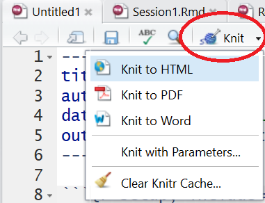

```{r setup, include=FALSE}
library(learnr)
library(gradethis)
library(knitr)

tutorial_options(exercise.timelimit = 60, exercise.checker = gradethis::grade_learnr)
knitr::opts_chunk$set(echo = FALSE, warning = FALSE, message = FALSE)

# Ensure that library is loaded.
library(tidyverse)
```

```{r, context="data", include=FALSE}
# Ensure that the data is loaded for the remainder of this tutorial.
Glasgow <- UsingRTutorials::Glasgow
```

<!-- Define programming tip style -->
<style>
.tip {
  background-color: #f5f5f5;
}
</style>

<!-- Define question style -->
<style>
.question {
  color: #5A9DDB;
}
</style>

<!-- Define emphasis style -->
<style>
.emphasis {
  color: #e8301b;
}
</style>

## Overview

-   First 1.5 hours: Course content
    +   Q&A
    +   Data Wrangling with `dplyr::`
    +   Workflow and Data Import
    +   Integrating text and data: R Markdown

-   Second 1.5 hours: Data project
    +   Finish Sprint #1, plan and start Sprint #2
    +   Plenary updates of the SCRUM masters

## Q&A

-   Any questions about the organization of the course?
-   Any questions about last tutorial's topics?
-   Any new topics that must receive attention today?

## Data Wrangling with `dplyr::`

Today, we use a data set containing information about friendships, tobacco, alcohol, and substance use among 160 students, who were followed over their second, third and fourth year at a secondary school in Glasgow (*Teenage Friends and Lifestyle Study* research project).

The data set, named `Glasgow`, is available within this tutorial, so you do not have to load it. 

-    **student**: respondent ID, as a character string.
-    **age**: respondent age, in years with one decimal digit.
-    **sex**: respondent sex, boy or girl.
-    **smoking_at_home**: any smokers at home, yes or no.
-    **smoking_parents**: smoking by at least one parent, yes or no.
-    **smoking_siblings**: smoking by at least one sibling, yes or no.
-    **wave**: time of observation, starting in February 1995, when the pupils were aged 13, and ending in January 1997.
-    **alcohol**: respondent alcohol consumption: 1 (none), 2 (once or twice a year), 3 (once a month), 4 (once a week) and 5 (more than once a week).
-    **cannabis**: respondent cannabis consumption: 1 (none), 2 (tried once), 3 (occasional) and 4 (regular).
-    **tobacco**: respondent tobacco consumption: 1 (none), 2 (occasional) and 3 (regular, i.e. more than once per week).
-    **money**: respondent's pocket money per month, in British pounds.
-    **romantic**: whether the student had a romantic relation, yes or no.
-    **friendships**: number of friendship nominations received by other respondents.

### 

### Piping

The `tidyverse` approach to data wrangling can be summarized as follows:

- Transform data with functions: data frame → new data frame.
- Breakdown transformations into logical steps.
- Chain transformations into a pipe `%>%`): Use resulting data of previous step as input data of next step.

```{r}
data.frame(
  Function = c("filter(): select cases", 
               "arrange(): sort cases", 
               "select(): select variables", 
               "mutate(): compute new variables", 
               "summarise(): aggregate (collapse) data", 
               "group_by(): split by group"),
  Goal = c("I want to focus on part of my cases.", 
           "I want to rearrange my cases.", 
           "I want to focus on some of my variables.", 
           "I want to change variables.", 
           "I want summary statistics.", 
           "I want summaries or changed variables for each group.")
  ) %>%
  knitr::kable(
    caption = "Main data transformation functions",
    booktab = TRUE
    ) %>% 
  kableExtra::kable_styling(
    bootstrap_options = "striped"
    )
```

Or, visually:

```{r, out.width="50%"}
knitr::include_graphics("images/mainwrangling.png")
```

### 

<div class="question" >
Apply the `tidyverse` approach to the code below: Start with the data set and join all transformations in one pipe such that the result is shown on the screen.
</div>

```{r pipe, exercise = TRUE, eval=FALSE}
helpData1 <- filter(Glasgow, money >= 0)
helpData2 <- group_by(helpData1, sex, student)
helpData3 <- summarise(helpData2, n_rom = sum(romantic == "yes", na.rm = TRUE))
count(helpData3, sex, n_rom)
```

```{r pipe-hint-1}
# In a pipe, the data frame originating from a previous step is automatically
# the data frame used for the next step. You don't have to save an intermediary
# data frame or specify its name in a pipe. And don't forget to add the pipe
# symbol!
```

```{r pipe-hint-2}
# A pipe for the first function:
Glasgow %>% 
  filter(money >= 0)
```

```{r pipe-hint-3}
# Have a look at the result of this pipe with View().
Glasgow %>% 
  filter(money >= 0) %>% View()
# Note that the View window may be hidden behind your RStudio screen.
```

```{r pipe-hint-4}
# A pipe for the first two functions:
Glasgow %>% 
  filter(money >= 0) %>%
  group_by(sex, student)
# Note that group_by() does not change the result.
# It's effect is that subsequent functions are applied to each group 
# instead of to the whole data set.
```

```{r pipe-hint-5}
# See the impact of group_by on the summarise() function:
Glasgow %>% 
  filter(money >= 0) %>%
  group_by(sex, student) %>% 
  summarise(n_rom = sum(romantic == "yes", na.rm = TRUE)) %>% View()
# Run the code also without group_by() to see the difference.
```

```{r pipe-hint-6}
# You can now finish this pipe on your own, right?
```

```{r pipe-solution, exercise.reveal_solution = FALSE}
Glasgow %>% filter(money >= 0) %>% group_by(sex, student) %>% summarise(n_rom = sum(romantic == "yes", na.rm = TRUE)) %>% count(sex, n_rom)
```

```{r pipe-check}
gradethis::grade_code(
  incorrect = "Don't mind an `Error occured while checking the submission` message."
)
```

<div class="tip" >
__Programming Tip__

For readability, formulate a comment explaining what each step in the pipe does or is meant to do to the data.

For example:

```{r, eval=FALSE, echo=TRUE}
myData %>% 
  #we only want to look at girls in the first wave
  filter(sex == "girl" & wave == "t1") %>%
  #for whom we want to know the average number of friends (but missings may appear!)
  summarise(avg_friends = mean(friendships, na.rm = TRUE))
```

</div>

<div class="question" >
Add a comment to every step of the solution to the previous exercise, explaining the purpose of the code in this step.
</div>

## A Frequency Table

Frequency tables count how often values appear in the data: counts per group. 

A count is a summary: We replace all cases within a group by one case containing the number of cases in that group.

```{r summary1-shown}
Glasgow %>%
  # we need summarizing numbers for each number of friendships, so group first
  # grouping automatically sorts on the variable, so the cumulation works fine
  group_by(friendships) %>%
  # summary statistics: note that a new variable can be used immediately
  summarise(
    Freq = n(),
    Perc = 100 * Freq / nrow(Glasgow)
  )
```

<div class="question" >
Create the above table with the absolute frequencies (raw counts), relative frequencies (percentages), and cumulative relative frequencies of the number of friendships per student in the `Glasgow` data set.
</div>

As always, use tidyverse functions and join all functions in one pipe.

```{r summary1, exercise = TRUE}

```

```{r summary1-hint-1}
# You must group the data before you summarise.
Glasgow %>%
  group_by( ??? )
# Which variable provides the groups?
# In other words: The values of which variable are counted?
```

```{r summary1-hint-2}
# Use summarise() with the n() function to count the number of cases per group. 
Glasgow %>%
  group_by( ??? ) %>%
  summarise(
    Freq = n()
  )
# Instead of summarise(Freq = n()), we can use the function count().
```

```{r summary1-hint-3}
# For relative frequencies, divide the raw counts by the number of cases. 
Glasgow %>%
  group_by( ??? ) %>%
  summarise(
    Freq = n(),
    Perc = ??? / nrow(Glasgow)
  )
# Note that we can use the data set again within a pipe step!
```

```{r summary1-hint-4}
# With the preceding two hints, you should be able to get the correct code.
```

```{r summary1-check}
gradethis::grade_result(
  pass_if(
      ~ {nrow(.result) == 13 && ncol(.result) == 3 && identical(names(.result), c("friendships", "Freq", "Perc")) && round(.result[[1, 3]]) == 13  && round(.result[[2, 3]]) == 12 },
    # function(x) {nrow(x) == 13 && ncol(x) == 4 && names(x) == c("friendships", "Freq", "Perc", "CumPerc") && round(x[[1, 3]]) == 13  && round(x[[2, 4]]) == 25 },
    "You correctly gouped and summarised the number of friendships, using the exact same variable names as in the presented table. And you did not forget to create percentages instead of proportions."),
  fail_if(~ nrow(.result) != 13, "How can you get one row for each number of friendships?"),
  fail_if(~ ncol(.result) != 3, "Did you summarize the frequencies and the percentages? Use `summarize()` to calculate the frequencies and percentages; this will give you one row for each number of friendships."),
  fail_if(~ !(identical(names(.result), c("friendships", "Freq", "Perc"))), "Use the names of new variables exactly as they are used in the presented table."),
  fail_if(~ round(.result[[1, 3]]) != 13, "Did you notice that we need percentages, not proportions? Use `Perc = 100 * Freq / nrow(Glasgow)`.")
)
```

<div class="tip" >
__Programming Tip__

- The current version of __summarise()__ by default undoes the last grouping. Hence the message in the console "`summarise()` ungrouping output (override with `.groups` argument)". 
- This is the safe option. It is easy to forget that data are grouped, but results on grouped data can be very different from what you expect or want. 
</div>

## Recoding and Grouping

Some useful functions for recoding or grouping variables have been added to `tidyverse` since the publication of the book _R for Data Science_: 

-   `recode(x, old = new, old = new, ...)`: Replace single old values by new values in variable `x`. 

```{r eval=FALSE, echo=TRUE}
# School year instead of wave indicator.
Glasgow %>% mutate(schoolyear = 
    recode(wave,  "t1" = 2,
                  "t2" = 3,
                  "t3" = 4))
# Note that the old value is named first.
```

-   `case_when(criterion ~ new value, criterion ~ new value, ...)`: Replace sets of old values (according to a criterion) by new values.

```{r eval=FALSE, echo=TRUE}
# Group number of friends.
Glasgow %>% 
  mutate(friends_class = case_when(
    friendships == 0 ~ "No friends", 
    friendships < 5 ~ "1 - 4 friends", 
    TRUE ~ "6+ friends"))
# The condition is left to the tilde, the new value to the right.
# Note the importance of the steps: persons without friends 
# are excluded from the group with less than 5 friends.
```

-   `ntile(x, n)`: Group variable `x` into `n` bins, each containing approximately the same number of cases.

```{r eval=FALSE, echo=TRUE}
# Group number of friends in three (more or less) equally large groups.
Glasgow %>% 
  mutate(friends_bin = ntile(friendships, 3))
```

-   `na_if(x, y)`: replace a specific value `y` on variable `x` with `NA`.

```{r eval=FALSE, echo=TRUE}
# Set -1 friends to missing.
Glasgow %>% 
  mutate(friends_nonmissing = na_if(friendships, -1))
```

Now, do it yourself.

<div class="question" >
Create a new variable `money_class` dividing the Glasgow students into three groups containing more or less the same number of cases.

Send the results to the screen.
</div>

```{r binning, exercise = TRUE}

```

```{r binning-hint-1}
# Use __mutate()__ to create the new variable.
Glasgow %>% mutate(money_class = ??? )
# Which of the recoding and grouping functions should you use?
```

```{r binning-solution, exercise.reveal_solution = FALSE}
Glasgow %>% mutate(money_class = ntile(x = money, n = 3))
```

```{r binning-check}
gradethis::grade_code(
  correct = "", 
  incorrect = "Please, specify argument names."
  )
```

###

<div class="question" >
Create a new variable `money_class2` with the following groups for the Glasgow students' pocket money: 

- group 0: 0 (no pocket money), 
- group 1: 1 - 10, 
- group 2: more than 10 pounds per month.

Send the results to the screen.
</div>

```{r recodemoney, exercise = TRUE}

```

```{r recodemoney-hint-1}
# Use mutate().
Glasgow %>% mutate(
  money_class2 = ???()
)
# Which of the recoding and grouping functions should you use?
```

```{r recodemoney-hint-2}
# Indeed, use case_when().
Glasgow %>% mutate(
  money_class2 = case_when(
    
  )
)
# Which of the recoding and grouping functions should you use?
```

```{r recodemoney-hint-3}
# What is the condition for group 1: 1 - 10? 
# Use __>=__ and __<=__ for "larger or equal" and "smaller or equal".
Glasgow %>% mutate(
  money_class2 = case_when(
    money == 0 ~ 0,
    ??? ~ 1
  )
)
```

```{r recodemoney-hint-4}
# What is the condition for group 2: more than 10 pounds per month? 
# Use __>=__ and __<=__ for "larger or equal" and "smaller or equal".
Glasgow %>% mutate(
  money_class2 = case_when(
    money == 0 ~ 0,
    money > 0 & money <= 10 ~ 1,
    ??? ~ 2
  )
)
```

```{r recodemoney-solution, exercise.reveal_solution = FALSE}
Glasgow %>% mutate(money_class2 = case_when( money == 0 ~ 0, money > 0 & money <= 10 ~ 1, money > 10 ~ 2))
```

```{r recodemoney-check}
gradethis::grade_code(
  correct = "You correctly delimited the classes. Because negative values are not covered by the classes, they are automatically set to missing (__NA__).", 
  incorrect = "Values outside the groups are automatically set to, so you don't have to treat them in a special way."
  )
```

###

<div class="question" >
Instead of grouping the values, set `-1` on variable `money` to missing (change the `money` variable). A negative number of pounds as pocket money cannot be correct.
</div>

Send the results to the screen.

```{r recodemissing, exercise = TRUE}

```

```{r recodemissing-hint-1}
# Use mutate().
Glasgow %>% mutate(
  money = ???()
)
# Which of the recoding and grouping functions should you use?
```

```{r recodemissing-hint-2}
# Indeed, the na_if() function.
# Check out the help for this function to see which arguments you have to use.
```

```{r recodemissing-solution, exercise.reveal_solution = FALSE}
Glasgow %>% mutate(money = na_if(x = money, y = -1))
```

```{r recodemissing-check}
gradethis::grade_code(
  correct = "", 
  incorrect = ""
  )
```

## Missing Values

In R, missing values are indicate by `NA`.

### How are missing values treated?

The `alcohol` variable in the `Glasgow` data set has missing values. 

<div class="question" >
What happens with the missing values in the following commands?
</div>

```{r quizNA}
quiz(
  caption = "",
  question("`Glasgow %>% filter(alcohol == \"1 none\")`",
    answer("Missing values are included."),
    answer("Missing values are ignored.", correct = TRUE),
    answer("The result is a missing value.")
  ),
  question("`Glasgow %>% select(alcohol)`",
    answer("Missing values are included.", correct = TRUE),
    answer("Missing values are ignored."),
    answer("The result is a missing value.")
  ),
  question("`Glasgow %>% summarise(no_alcohol = sum(alcohol == \"1 none\"))`",
    answer("Missing values are included."),
    answer("Missing values are ignored."),
    answer("The result is a missing value.", correct = TRUE)
  ),
  question("`Glasgow %>% summarise(no_alcohol = sum(alcohol == \"1 none\", na.rm = TRUE))`",
    answer("Missing values are included."),
    answer("Missing values are ignored.", correct = TRUE),
    answer("The result is a missing value.")
  )
)
```

<div class="tip" >
__Programming Tip__

- If you are not sure about what some code exactly does, run it (on a dataset) and check the results.
- You can use the code box below to check the commands of the above questions.
</div>

```{r quizNAcode, exercise = TRUE}
#Copy code from the questions here...

```

### Dealing with missing values

Missing values are special: we cannot use them like other values.

<div class="question" >
Correct the code below to count the number of missing values on the `alcohol` variable in the `Glasgow` data set.
</div>

```{r countNA, exercise = TRUE, eval=FALSE}
summarise(Glasgow, alcohol_NA = (alcohol == NA))
```

<!-- To hide the solution, use a textual hint. -->
<div id="countNA-hint">
__Hint:__ We cannot use `== NA`. Check page 2 of the Data Transformation with `dplyr` cheat sheet for a function to work with missing values (`NA`). Oh, and with how many rows do you want to end up?
</div>

```{r countNA-solution}
summarise(Glasgow, alcohol_NA = sum(is.na(alcohol)))
```

```{r countNA-check}
gradethis::grade_code()
```

The previous exercise does not use a pipe because we apply just one transformation. Here, a pipe is perhaps a bit too much.

<div class="tip" >
__Programming Tip__

It is very easy to mix up __=__ and __==__.

- __=__ means the same as __<-__ in R, namely "becomes". __y = 0__ means that data object __y__ becomes zero.
- __==__ means "is equal to". __y == 0__ checks if __y__ equals zero, which is either true or false.
</div>

## New Variables from Equations

A previous exercise contained this code: `Glasgow %>% summarise(no_alcohol = sum(alcohol == "1 none"))`. 

The part `sum(alcohol == "1 none")` is weird, isn't it? How can we sum an equation?

<div class="question" >
Instead of summarizing, use `mutate()` to create a variable named `whats_this` that is the equation `(alcohol == "1 none")`. Only retain the old variable `alcohol` and the new variable `whats_this` and sort on both variables. Then scroll through the result: What is the relation between `whats_this` and `alcohol`? 
</div>

```{r conditions1, exercise = TRUE}
Glasgow %>% 
  select(alcohol) %>%
  mutate( ____ ) %>%
  count(alcohol, whats_this)
```

```{r eval=FALSE}
# correct code
h <- Glasgow %>% 
  select(alcohol) %>%
  mutate(whats_this = (alcohol == "1 none")) %>%
  count(alcohol, whats_this)
```

```{r conditions1-check}
gradethis::grade_result(
  pass_if(~ 
    { ncol(.result) == 3 &&
      nrow(.result) == 6 &&
      "alcohol" %in% names(.result) && "whats_this" %in% names(.result)
    }, "You have correctly created a new variable."),
  # too many variables
  fail_if(~ ncol(.result) != 3, "Select only the requested variables."),
  # wrong variable selected or wrong name for new variable
  fail_if(~ !("alcohol" %in% names(.result) && "whats_this" %in% names(.result)), "Select the requested variables and use the suggested variable name.")
)
```

<div class="tip" >
__Programming Tip__

- If you want to understand code, split the code in the smallest steps and inspect the results of each step.
- Send the results to the screen or (especially in RStudio) pipe them into the `View()` command (note the first capital letter).
</div>

###

In the original example, `sum(alcohol == "1 none")` does two things: 

-   it creates a new variable with `(alcohol == "1 none")`, which has `TRUE` or `FALSE` as values;
-   it sums the values of this variable. 

### Counting combinations

For results checking, scrolling through an entire data set is not ideal, especially not if the data set is large. 

For understanding the relation between the old (`alcohol`) and new variable (`whats_this`), we only have to see all combinations of values on the two variables that occur. 

<div class="question" >
So, let us present one row per combination and count the number of times each combination occurs. Use the `count()` function.
</div>

```{r eval=FALSE}
# correct code
Glasgow %>% 
  select(alcohol) %>%
  mutate(whats_this = (alcohol == "1 none")) %>%
  group_by(alcohol, whats_this) %>%
  summarise(n = n())
# shorter code
Glasgow %>% 
  mutate(whats_this = (alcohol == "1 none")) %>%
  count(alcohol, whats_this)
```

```{r conditions2, exercise = TRUE}

```

```{r conditions2-check}
gradethis::grade_result(
  pass_if(~ 
    { ncol(.result) == 3 &&
      nrow(.result) == 6 &&
      "alcohol" %in% names(.result) && "whats_this" %in% names(.result) &&
        "n" %in% names(.result) &&
      .result$whats_this[[1]] == TRUE &&
      .result$n[[1]] == 16
    }, "You have correctly counted each combination of the alcohol and whats_this variables."),
  # too many (or) few cases
  fail_if(~ nrow(.result) != 6, "You have to retain one row for each alcohol-whats_this combination. Use `count()` or `summarise()`."),
  # too many variables
  fail_if(~ ncol(.result) != 3, "Did you forget to calculate the whats_this variable or `count()`or `summarise()` the data?"),
  # wrong variable selected or wrong names for new variables
  fail_if(~ !("alcohol" %in% names(.result) && "whats_this" %in% names(.result) && "n" %in% names(.result)), "Use the suggested variable names."),
  # new variable not correctly calculated
  fail_if(~ .result$whats_this[[1]] != TRUE, "The whats_this variable was not correctly calculated. Use the code in the above question."),
# new variable not correctly calculated
  fail_if(~ .result$n[[1]] != 16, "The count variable was not correctly calculated.")
)
```

<div class="question" >
Which name did `count()` give to the variable counting the number of times a combination of values occurs?

In which situations does count assign a missing value (`NA`) to the new variable `whats_this`? Is this as you want it to be?
</div>

<div class="tip" >
__Programming Tips__

- Use `count()` (which is equal to `group_by()` and `summarise(n = n())`) to better understand a variable or a combination of two or more variables.
- Pay special attention to (combinations that involve) missing values. Missing values may create more missing values in data transformation steps because every transformation involving a missing value results in a missing value.
</div>

### Mock test data

Finally, how does R treat a logical variable if we `sum()` it? 

Time for another little trick: 

-   Create a small input data set.
-   Use it to test what a function does. 

<div class="question" >
Predict the output of the function. Change the code below a few times until you are certain about what `sum()` does with logical values (`TRUE`or `FALSE` or `NA`).
</div>

```{r conditions3, exercise = TRUE, eval=FALSE}
sum(c(TRUE, TRUE, FALSE, FALSE, NA))
```

Perhaps, it helps understanding if you also use `mean()` instead of `sum()`.

<div id="conditions3-hint">
__Hint:__ Actually, the help on `sum()` tells you how logicals are treated.
</div>

```{r conditions3-check}
gradethis::grade_result(
  fail_if(~ is.na(.result), "Don't forget to add `na.rm=TRUE` to ignore missing values."),
  pass_if(~ { .result > 0 && .result < 1 }, "R replaces `TRUE` by `1` and `FALSE` by `0` when it calculates with a logical variable."),
  pass_if(~ TRUE, "R replaces `TRUE` by `1` and `FALSE` by `0` when it calculates with a logical variable.")
)
```

<div class="tip" >
__Programming Tip__

-   In R, `c()` creates a __vector__, which is a series of values (of the same type). 
-   A variable in a data frame is a vector.
-   `c()` is also used when we have to pass more than one value to a function argument.
</div>

## Multi-Case Functions

*Ordinary use* of `mutate()`: Calculate a new variable value for each case from the case's  'own' value on one or more variables. *Example: grouping a variable*.

*Special use* of `mutate()`: Calculate a new variable value for each case from the values on a variables *for other cases*; `dplyr` cheat sheet:

-   **OFFSETS**: use values from a preceding (`lag()`) or successive (`lead()`) case in the data frame;
-   **CUMULATIVE AGGREGATES**: compute the sum (etc.) of all preceding cases;
-   **RANKINGS**: assign rank to value in comparison to all other values.

What if we use these function with:

-   data sorting (`arrange()`),
-   and grouping (`group_by()`)?

The `Glasgow` data set contains the number of `friendships` of each student in three successive `wave`s (t1, t2, and t3). 

<div class="question" >
Calculate two new variables:

- `prev_friendships`: the number of friendships in the preceding wave (if any);
- `change`: the increase or decrease in a student's number of friendships from one wave to the next. 

Retain only the variables `student`, `wave`, `friendships`, `prev_friendships`, and `change`, so it easy to inspect the results.
</div>

```{r change, exercise = TRUE}
Glasgow %>%
  #sort on student and wave within student
  arrange( ____ ) %>%
  #group by student, so data for the same student is used only
  group_by( ____ ) %>%
  #use a special function to calculate the difference
  mutate( 
    prev_friendships = ____(____), #number of friendships in the preceding wave (if any)
    change = ____ #difference: later minus earlier
    ) %>%
  select( _____ )

```

```{r eval=FALSE}
# correct code
Glasgow %>%
  #sort on student and wave within student
  arrange(student, wave) %>%
  #group by student, so data for the same student is used only
  group_by(student) %>%
  #use lag() to calculate the difference
  mutate( 
    prev_friendships = lag(friendships), #number of friendships in the preceding wave (if any); this command can be included in the next
    change = friendships - prev_friendships #difference: later minus earlier
    ) %>%
  select(student, wave, friendships, prev_friendships, change)
```

```{r change-check}
gradethis::grade_result(
  pass_if(~ {
    #required variables created (named) and retained
    "student" %in% names(.result) && "wave" %in% names(.result) &&
       "friendships" %in% names(.result) && "prev_friendships" %in% names(.result) &&
       "change" %in% names(.result) &&
    #only required variables selected
    ncol(.result) == 5 &&
    #correctly sorted
    identical(.result$student[1], "s001") && identical(.result$wave[1], "t1") &&
    #prev_friendships correctly calculated
    identical(.result$prev_friendships, transmute(group_by(arrange(Glasgow, student, wave), student), prev_friendships = lag(friendships))$prev_friendships) &&
    #change correctly calculated
    identical(.result$change, .result$friendships - .result$prev_friendships)
    }, 
    "You correctly sorted and grouped the data before taking the preceding value of friendships as the value for prev_friendships, which you used to calculate change."),
  fail_if(~ !("student" %in% names(.result) && "wave" %in% names(.result) &&
       "friendships" %in% names(.result) && "prev_friendships" %in% names(.result) &&
       "change" %in% names(.result)), 
       "Did you create the two new variables with the right names and retain the required variables in the data set?"),
  fail_if(~ ncol(.result) != 5, 
       "Did you select only the required variables in the data set at the end?"),
  fail_if(~ !(identical(.result$student[1], "s001") && identical(.result$wave[1], "t1")), 
        "Sort the data on student and wave before you create the new variables."),
  fail_if(~ !(identical(.result$prev_friendships, transmute(group_by(arrange(Glasgow, student, wave), student), prev_friendships = lag(friendships))$prev_friendships)), 
       "Did you group the data by student? Did you use the `lag()` function to create a new variable containing the number of friendships in the preceding wave?"),
  fail_if(~ !(identical(.result$change, .result$friendships - .result$prev_friendships)), 
        "You did not calculate the change in number of friendships correctly from `friendships` and `prev_friendships`. Did you subtract the wrong variable?")
)
```

<div id="change-hint">
__Hint:__ 

-   Sort the data such that the cases for a student are together and in temporal order. Consult the _Data Transformation with dplyr_ cheat sheet to find the right function for using information from the preceding case. 
-   Use help on a function if the description on the cheat sheet is not clear to you.
</div>

<div class="tip" >
__Programming Tip__

-   If you use a multi-case function with grouping, check that the function correctly restarts for a new group. 
-   Pay special attention to the first and last value within a group: are these values as they should be?
</div>

### 

### 

<div class="question" >
What happens if you use the multi-case function without grouping? Comment out the grouping step in the previous answer box and inspect the results.
</div>

## Missing Observations

What if we calculate the change in friendships for a student missing an observation for a wave? 

<div class="question" >
Manually calculate the change in number of friends of student s998 in the below example data fragment. What does the result mean?
</div>

```{r}
#Example of observation missing for one student.
data.frame(
  student = c("s997", "s998", "s998", "s999"),
  wave = c("t3", "t1", "t3", "t1"),
  friendships = c(4, 2, 3, 6)
  ) %>%
  knitr::kable(booktab = TRUE) %>% 
  kableExtra::kable_styling(bootstrap_options = "striped", full_width = FALSE)
```

### 

### 

Don't assume that your data are perfect! Use code to check your data.

Step 1 - Formulate the precise conditions that you want to check:

1.    For every student, we should have exactly three observations (rows).
2.    The three observations per student should have different wave values.
3.    Only wave values 't1', 't2', and 't3' should occur.

Step 2 - Translate the conditions into R code.

1.    Use aggregation: `count()` or `group_by()`and `summarise()`.
2.    Use `filter()` to select cases that violate the conditions.

<div class="question" >
-   Add comments to the below code that explain how this code checks the first two conditions specified above.
-   Are there any cases that violate the first two conditions?
</div>

```{r eval=FALSE}
# correct code
Glasgow %>%
  #for each student...
  group_by(student) %>%
  #count the number of different waves in the data
  summarise(
    n_obs = n(),
    n_dist = n_distinct(wave)
    ) %>%
  #filter cases with n_obs != 3 or n_dist != 3
  filter( n_obs != 3 | n_dist != 3)
```

```{r missingObs, exercise = TRUE, exercise.lines = 7}
Glasgow %>%
  group_by(student) %>%
  summarise(
    n_obs = n(),
    n_dist = n_distinct(wave)
    ) %>%
  filter( n_obs != 3 | n_dist != 3)
```

<div id="missingObs-hint">
__Hint:__ Group by student before you summarize. Use function __n()__ to count the number of observations (rows). Logical OR is represented by __|__ and __!=__ means "is not equal to". If no cases remain, your code may be correct. 
</div>

### 

```{r eval=FALSE}
# correct code
Glasgow %>%
  #count the different waves in the data
  count(wave)
```

<div class="question" >
Check the third condition (above) using `count()` (or `group_by()` and `summarize()`).
</div>

```{r missingObs2, exercise = TRUE}

```

```{r missingObs2-check}
gradethis::grade_result(
  pass_if(~ identical(.result, count(Glasgow, wave)), "Indeed, we only have values `t1`, `t2`, and `t3`."),
  fail_if(~ !identical(.result, count(Glasgow, wave)), "Use `count()` to create a frequency table of wave values.")
)
```

<div class="tip" >
__Programming Tip__

- Never assume that data are complete. Formulate which regularities you expect in the data and use code to check them.
</div>


## Fancy Stuff

### Nice tables

R has several packages for creating tabular output. In a later session, we will discuss some packages for tabulating statistical output.

Here, we present a function (`kable()`) in a basic package for tabular output (`knitr`), which works very well with piping and RMarkdown (discussed later in this tutorial). In addition, we use the `kableExtra` function to fine-tune tables created with `kable()`.

### 

Let's start by noting that we must have the data in the required shape before we create a table. In other words, `kable()` does not do any counting or summarizing for us. It only displays our data.

<div class="question" >
Make sense of the code below; add comments explaining every step. What happens if you do not drop the `sex` variable?
</div>

```{r kable, exercise = TRUE, exercise.eval = TRUE}
Glasgow %>%
  group_by(sex, wave) %>%
  summarise(tobacco_prop = mean(tobacco != "1 none", na.rm = TRUE)) %>%
  ungroup() %>%
  select(-sex) %>% 
  kable(
    digits = 2,
    col.names = c("Wave", "Proportion using tobacco"),
    align = "lcc",
    caption = "Proportion of Glasgow students using tobacco."
  )
```

```{r kable-hint-1}
# Use help on the `kable()` function (`?kable`) for more information on the options provided by `kable()`.
```

###

The above table is not particularly pretty, so let us improve it with the help of package `kableExtra`.

```{r tableExampleExtra, exercise=TRUE, exercise.eval=TRUE}
library(kableExtra)
Glasgow %>%
  group_by(sex, wave) %>%
  summarise(tobacco_prop = mean(tobacco != "1 none", na.rm = TRUE)) %>%
  ungroup() %>%
  select(-sex) %>% 
  kable(
    digits = 2,
    col.names = c("Wave", "Proportion using tobacco"),
    align = "lcc",
    caption = "Proportion of Glasgow students using tobacco."
  ) %>%
  kableExtra::kable_classic(full_width = FALSE) %>%
  kableExtra::pack_rows("Boys", 1, 3) %>%
  kableExtra::pack_rows("Girls", 4, 6)
```

<div class="question" >
Play around with this table using the code box below. Check out the options offered by `kableExtra` on the [package website](https://cran.r-project.org/web/packages/kableExtra/vignettes/awesome_table_in_html.html).
</div>

### Adding summaries to plots

If you store summary information about a data set in a data object, you can display the summary information in `ggplot()` along with the original data. Every geom can have its own data argument, so specify the data object with summaries in a geom that visualizes the summary information.

The below graph, for example, shows the number of friendships for boys and girls over the three waves (with jitter) as well as their average number of friends.

```{r summaryPlot, exercise = TRUE, exercise.eval = TRUE}
#Calculate and save average number of friends.
averages <- Glasgow %>%
  #group waves by sex
  group_by(sex, wave) %>%
  #calculate mean, ignoring missing values
  summarise(mean_friends = mean(friendships, na.rm = TRUE))
#Create plot
ggplot() +
  #add individual friendship score with jitter
  geom_jitter(data = Glasgow, aes(x = wave, y = friendships, color = sex)) +
  #add mean scores as large boxes
  geom_point(data = averages, aes(x = wave, y = mean_friends, color = sex), shape = "square", size = 4) +
  #add lines to link the means: note the `group` argument
  geom_line(data = averages, aes(x = wave, y = mean_friends, group = sex, color = sex))
```

<div class="question" >
Play around with this plot. For example, use `geom_text()` to add the values of the group means to the plot.
</div>

## Workflow and Data Import

From this point on in this tutorial, you are supposed to work in RStudio. 

### R project

An R Project keeps everything in the same place.

<div class="question">
-   Create a new project for today’s coursework: *File>New Project…*
    +   **New Directory**. Start a project in a brand new working directory; or
    +   **Existing Directory**. Create a new project in an existing directory.
    +   Select a suitable directory name (which is also the project name.)
</div>

The project directory is the working directory. 

-   This is where R looks for your (data) files, unless you specify otherwise.
-   This directory is displayed in the RStudio _Files_ tab.

<div class="question" >
Store the Data Project data files in this directory.
</div>

### R Workspace

While you are working on a project, R collects information, creates data objects, and so on. 

-   Everything in R’s memory is called the workspace. 
-   Part of the workspace is shown in RStudio’s _Environment_ panel.

The workspace can be saved: 

-   RStudio menu: _Session > Save Workspace As..._; 
-   R command: `save.image("filename.RData")`) 

And loaded: 

-   RStudio menu: _Session > Load Workspace..._; 
-   R command: `load("filename.RData")`).
-   An R work space has file name extension `.RData`.

RStudio's standard settings save and load the workspace when you close and open a project. This is risky. It is better to have a clean, reproducible workspace without data from previous runs.

<div class="question" >
So, adjust the global settings of RStudio:

- Go to _Tools>Global Options_,
- Uncheck _Restore .RData into workspace at startup_,
- Select _Never_ for _Save workspace to .RData on exit_.
</div>

*Global settings need to be set only once.*

### R Script

-   R version of SPSS syntax.
-   A file with extension `.R`, containing R code.
-   Similar to answer boxes in this tutorial.

We are not going to use script files because we embed all our code within the RMarkdown document (next topic).

## RMarkdown: Reproducible Research

For both the weekly problem sets and your Data Project, you will be working with RMarkdown.

An RMarkdown file contains all steps from data to results:

-   Commands to clean and analyze data.
-   Comments to explain steps in data cleaning and analysis.
-   Text, graphs, and tables presenting the research to the reader.

<div class="emphasis" >
Eve`R`ything in one place!
</div>

### RMarkdown YAML

<div class="question" >
Open a new RMarkdown document in RStudio.

Adjust the first part of the document, called YAML (title, authors, date) and add a table of contents. 
</div>

<div class="tip" >
__Tips:__ 

-   You can set some YAML options in RStudio with _Output Options_ under the settings button (to the right of the Knit button). 
-   Alternatively, use the cheat sheet (RStudio: _Help > Cheat Sheets > R Markdown Cheat Sheet_).
</div>

### First code chunk 

Good practice:

-   Load all required libraries in the first code chunk.
    +   Example: `library(tidyverse) #load the tidyverse packages`
-   Set all global settings in the first code chunk.
    +   Recommended global settings for (knitting/rendering) code chunks: `knitr::opts_chunk$set(eval = TRUE, echo = FALSE, warning = FALSE, message = FALSE)`

<div class="question" >
Adjust the settings in your RMarkdown document and load the tidyverse package.
</div>

More info on the meaning of code chunk settings:

-   RMarkdown cheat sheet (`RStudio: Help > Cheat Sheets > R Markdown Cheat Sheet`) or at the [`knitr` web page](https://yihui.org/knitr/options/#chunk-options).

### Code chunk names

A code chunk may have a name (label), e.g., `setup` in the pic below):

-   May not contain a space.
-   May only occur once in an RMarkdown document.
-   Informative chunk names are handy: quickly navigate via RStudio's code outline (button at the bottom left of the RMarkdown screen). 


Another option for quick navigation:

-   Open a table of contents of the sections and sub-sections: document outline button (at the top right).

### Load your data

To work with your data, they must be loaded.

<div class="question" >
-   Download the Data Project data file marked for initial practice from Canvas to your project directory. Or: Each team member downloads a different Data Project data file.
-   Get rid of the text and code chunks from the standard Rmarkdown document.
-   Add a header to start the section on data description.
-   Add your first code chunk (use the _Insert_ button at the top of the RMarkdown screen).
</div>

All Data Project data sets are in `csv` format.

<div class="question" >
Add a code chunk, name it, and import your data file into a data object with `read_csv()`.
</div>

Note that `read_csv()` is part of the `readr` package, which is automatically loaded by the `tidyverse` package.

### 

This function has some important features:

-	`read_csv()` uses the first row as variable names.
- It guesses variable type: character, integer, double, ...
- It reports variable types as a `col_types` argument.
-	Files ending in .gz, .bz2, .xz, or .zip are automatically uncompressed.
-	Files starting with http://, https://, ftp://, or ftps:// are automatically downloaded.

We don't like guesses; we want to be sure that the variable type is correct. 

<div class="question" >
-   Check the variable types reported when the data was read against the original data set. 
-   Add the `col_types` argument to your `read_csv()` command with the right variable types. 
</div>

Now, you are sure that the data will be read in the right way.

__Hint:__ Add the `col_types =` argument to the `read_csv()` function and copy the reported (guessed) variable types (`cols( ... )`) behind the equals sign.

<div class="tip" >
__Programming Tips__

- Always assume that things go wrong, so you have to convince yourself that your code produces the right results.
- Use comments abundantly. Explain why you do things in a particular way. It helps your group members and your future self to understand the code.
- In a code chunk, press Ctr/Cmd-Enter to run the command in which your cursor is positioned.
</div>

### RMarkdown plot

Code chunks that produce a plot will show a plot in a knitted document.

You may want to change the appearance of the plot with code chunk options.

Main options for a code chunk creating a plot (book p. 465-467, {28.7.1, 28.7.2}):

-	`fig.cap = ""`: Add a caption to the plot.
-	`fig.asp = 0.6`: Set the ratio of plot height to plot width.
-	`out.width = "75%"`: Set plot width as a percentage of text width.

<div class="question" >
-   Add one of the plots created in the Data Project part of the previous session in a separate code chunk.
-   Add a caption to the plot and change the plot to a square layout. Knit the document to check the results.
</div>

<div class="tip" >
__Programming Tips__

- Carefully inspect a knitted RMarkdown document for the presence and layout of plots and tables and for unwanted code or R messages.
- Don't worry about code or output created by code that you may not need in the end. It is easy to skip a code chunk and not displaying its results by setting the code chunk option `eval=` to `FALSE`. Preserving (but hiding) unnecessary code prevents you from creating the code again later on.
</div>

### Adding (formatted) text

<div class="question" >
Now, add a description of the plot or data file for the reader of the document.
</div>

Use RMarkdown text formatting options if needed, see _Help>Markdown Quick Reference_ in RStudio for the main options.

Some often used text formatting in RMarkdown.

```{r eval=FALSE, echo=TRUE}
-   Headers: #, ##, ###
-   Font type: *italics*, **bold**
-   (un)ordered lists: First level *, second level indented +
-   links: [linked phrase](http://example.com)
-   image: 
-   blockquotes: >
-   LaTeX equations: $equation$
-   superscript^2^ and subscript~2~
```

### Knitting to PDF

Knit (render) an RMarkdown with the knit button.

```{r knitpic, out.width="30%"}

```

Knitting to HTML:

-   Is fastest. 
-   Always knit to HTML first, to check the results.

Knitting to a paper document:

-   Knit to PDF or Word. 
-   PDF output is supported better than Word, 
-   but requires the installation of a TeX package (see the [online book on RMarkdown](https://bookdown.org/yihui/rmarkdown/installation.html)). 

<div class="question" >
Knit your RMarkdown document to PDF to check that it works and LaTeX package is correctly installed. 
</div>

### 

If you want to fine-tune your PDF document:

- Add `keep_tex: TRUE` to the document YAML, like this (mind the indentation):

```{r echo = TRUE, eval = FALSE}
output:
  pdf_document: 
    keep_tex: TRUE
```

YAML option `keep_tex: TRUE` saves the TeX file (extension `.tex`), which you can open in a TeX editor, for example [overleaf](https://www.overleaf.com/) or [Texmaker](https://www.xm1math.net/texmaker/).

## Data Project

Start working on the R Markdown document for your Data Project in RStudio. 

-   Decide how you are going to collaborate on one RMarkdown document.
-   Sprint 1 Review & Sprint 1 Retrospective.
-   Sprint 2 Planning.
    +   Describe your complex data set with `filter()`, `arrange()`, `select()`, `group_by()`, `mutate()`, and `summarise()` functions. For example, check for missing values, inspect frequency distributions.
    +   Put and run the code in code chunks within your R Markdown document. Add plenty of comments to your code.
    +   Use `ggplot()` to visualize the remarkable features.
    +   Describe remarkable features of your data in the R Markdown document (outside the code chunks: for the reader). 

## Plenary updates Sprint 1 SCRUM masters

Last 15 minutes of the session.


## Reminders

### Problem Set 1

- Available from 1 PM today.
- Download __R Markdown__ document with assigned exercises and accompanying data set from Canvas.  
- Add answers and R code in the __R Markdown__ document.  
- Knit __R Markdown__ document to PDF or Word.
- Submit __R Markdown__ document and PDF or Word document to the Canvas assignment.  
- Submission deadline: Sunday, 12 PM (noon).  
- Lecturer's feedback returned in the PDF or Word document.

### And as always...

-   Study course content
-   Meet your buddy
-   Work on Sprint 2
-   **Sprint 2 SCRUM masters: Keep your team on course!**
