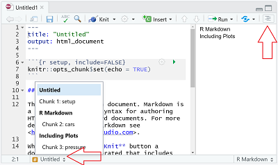

```{r setup, include=FALSE}
library(learnr)
library(gradethis)
library(knitr)

tutorial_options(exercise.timelimit = 60, exercise.checker = gradethis::grade_learnr)
knitr::opts_chunk$set(echo = FALSE, warning = FALSE, message = FALSE)

# Ensure that library is loaded.
library(tidyverse)
```

```{r, context="data", include=FALSE}
# Ensure that the data is loaded for the remainder of this tutorial.
Glasgow <- UsingRTutorials::Glasgow
```

<!-- Define programming tip style -->
<style>
.tip {
  background-color: #f5f5f5;
}
</style>

<!-- Define question style -->
<style>
.question {
  color: #5A9DDB;
}
</style>

## Inspect Help for a Data Set

Today, we use a data set containing information about friendships, tobacco, alcohol, and substance use among 160 students, who were followed over their second, third and fourth year at a secondary school in Glasgow (*Teenage Friends and Lifestyle Study* research project).

The data set, named `Glasgow`, is available within this tutorial, so you do not have to load it. 

<div class="question" >
Have a look at the variables using the help function.
</div>

```{r loadData, exercise=TRUE}

```

<div id="loadData-hint">
__Hint:__ You can also use RStudio to find the information. In the __Packages__ tab, click on the name of the package _UsingRTutorials_ and click on _Glasgow._
Note that the help file may open in your browser (under Windows), not within the tutorial.
</div>

```{r loadData-solution}
?Glasgow
```

```{r loadData-check} 
#, warning=FALSE}
gradethis::grade_code()
```


## Piping

The `tidyverse` approach to data wrangling can be summarized as follows:

- Transform data with functions: data frame → new data frame.
- Breakdown transformations into logical steps.
- Chain transformations into a pipe `%>%`): Use resulting data of previous step as input data of next step.

```{r}
data.frame(
  Function = c("filter(): select cases", 
               "arrange(): sort cases", 
               "select(): select variables", 
               "mutate(): compute new variables", 
               "summarise(): aggregate (collapse) data", 
               "group_by(): split by group"),
  Goal = c("I want to focus on part of my cases.", 
           "I want to rearrange my cases.", 
           "I want to focus on some of my variables.", 
           "I want to change variables.", 
           "I want summary statistics.", 
           "I want summaries or changed variables for each group.")
  ) %>%
  knitr::kable(
    caption = "Main data transformation functions",
    booktab = TRUE
    ) %>% 
  kableExtra::kable_styling(
    bootstrap_options = "striped"
    )
```

<div class="question" >
Apply the `tidyverse` approach to the code below: Start with the data set and join all transformations in one pipe such that the result is shown on the screen.
</div>

```{r pipe, exercise = TRUE, eval=FALSE}
helpData1 <- filter(Glasgow, money >= 0)
helpData2 <- group_by(helpData1, sex, student)
helpData3 <- summarise(helpData2, n_rom = sum(romantic == "yes", na.rm = TRUE))
helpData4 <- ungroup(helpData3)
count(helpData4, sex, n_rom)
```

<!-- To hide the solution, use a textual hint. -->
<div id="pipe-hint">
__Hint:__ In a pipe, the data frame originating from a previous step is automatically the data frame used for the next step. You don't have to save an intermediary data frame or specify its name in a pipe. And don't forget to add the pipe symbol!
</div>

```{r pipe-solution, echo=FALSE}
Glasgow %>% filter(money >= 0) %>% group_by(sex, student) %>% summarise(n_rom = sum(romantic == "yes", na.rm = TRUE)) %>% ungroup() %>% count(sex, n_rom)
```

```{r pipe-check}
gradethis::grade_code(
  incorrect = "Don't mind the `Error occured while checking the submission` message."
)
```

Note: While checking transformed code, you may receive an `Error occured while checking the submission` message. This merely means that the computer does not have suggestions for you.

<div class="tip" >
__Programming Tip__

For readability, formulate a comment explaining what each step in the pipe does or is meant to do to the data.

For example:

```{r, eval=FALSE, echo=TRUE}
myData %>% 
  #we only want to look at girls in the first wave
  filter(sex == "girl" & wave == "t1") %>%
  #for whom we want to know the average number of friends (but missings may appear!)
  summarise(avg_friends = mean(friendships, na.rm = TRUE))
```

</div>

## A Frequency Table

```{r summary1-shown}
Glasgow %>%
  # we need summarizing numbers for each number of friendships, so group first
  # grouping automatically sorts on the variable, so the cumulation works fine
  group_by(friendships) %>%
  # summary statistics: note that a new variable can be used immediately
  summarise(
    Freq = n(),
    Perc = 100 * Freq / nrow(Glasgow)
  ) %>%
  mutate(
    CumPerc = cumsum(Perc)
  )
```

<div class="question" >
Create the above table with the absolute frequencies (raw counts), relative frequencies (percentages), and cumulative relative frequencies of the number of friendships per student in the `Glasgow` data set.
</div>

As always, use tidyverse functions and join all functions in one pipe.

```{r summary1, exercise = TRUE}

```

<!-- To hide the solution, use a textual hint. -->
<div id="summary1-hint">
__Hint:__ You must group the data before you summarise.

__Hint:__ For relative frequencies, divide the raw counts by the number of cases (nrow(Glasgow)). 

__Hint:__ Use the [cheat sheet](https://www.rstudio.org/links/data_transformation_cheat_sheet) to find cumulative functions.
</div>

```{r summary1-check}
gradethis::grade_result(
  pass_if(
      ~ {nrow(.result) == 13 && ncol(.result) == 4 && identical(names(.result), c("friendships", "Freq", "Perc", "CumPerc")) && round(.result[[1, 3]]) == 13  && round(.result[[2, 4]]) == 25 },
    # function(x) {nrow(x) == 13 && ncol(x) == 4 && names(x) == c("friendships", "Freq", "Perc", "CumPerc") && round(x[[1, 3]]) == 13  && round(x[[2, 4]]) == 25 },
    "You correctly gouped and summarised the number of friendships, using the exact same variable names as in the presented table. And you did not forget to create percentages instead of proportions."),
  fail_if(~ nrow(.result) != 13, "How can you get one row for each number of friendships?"),
  fail_if(~ ncol(.result) != 4, "Did you summarize the frequencies, the percentages, and the cumulative percentages? Use `summarize()` to calculate the frequencies and percentages; this will give you one row for each number of friendships. Next, use `mutate()` to get the cumulative percentages. Now you want to retain all rows, so you don't use `summarize()`."),
  fail_if(~ !(identical(names(.result), c("friendships", "Freq", "Perc", "CumPerc"))), "Use the names of new variables exactly as they are used in the presented table."),
  fail_if(~ round(.result[[1, 3]]) != 13, "Did you notice that we need percentages, not proportions? Use `Perc = 100 * Freq / nrow(Glasgow)`."),
  fail_if(~ round(.result[[2, 4]]) != 25, "Did you use the `cumsum()` function to get the cumulative percentages?")
)
```

<div class="tip" >
__Programming Tip__

- The current version of __summarise()__ by default undoes the last grouping. Hence the message in the console "`summarise()` ungrouping output (override with `.groups` argument)". 
- This is the safe option. It is easy to forget that data are grouped, but results on grouped data can be very different from what you expect or want. 
</div>

## Recoding and Grouping

Some useful functions for recoding or grouping variables have been added to 'tidyverse' since the publication of the book _R for Data Science_: 

- `ntile(x, n)`: Group variable `x` into `n` bins, each containing approximately the same number of cases.
- `case_when(criterion ~ new value, criterion ~ new value, ...)`: Replace sets of old values (criterion) by new values.
- `na_if(x, y)`: replace a specific value `y` on variable `x` with NA.

<div class="question" >
Create a new variable `money_class` dividing the Glasgow students into three groups containing more or less the same number of cases. For now, act as if value -1 is an acceptable value.

Send the results to the screen.
</div>

```{r binning, exercise = TRUE}

```

<!-- To hide the solution, use a textual hint. -->
<div id="binning-hint">
__Hint:__ Use __mutate()__ to create the new variable.
</div>

```{r binning-solution}
Glasgow %>% mutate(money_class = ntile(x = money, n = 3))
```

```{r binning-check}
gradethis::grade_code(
  correct = "", 
  incorrect = "Please, specify argument names."
  )
```

<div class="question" >
Create a new variable `money_class2` with the following groups for the Glasgow students' pocket money: 

- group 0: 0 (no pocket money), 
- group 1: 1 - 10, 
- group 2: more than 10 pounds per month.

Send the results to the screen.
</div>

```{r recodemoney, exercise = TRUE}

```

<!-- To hide the solution, use a textual hint. -->
<div id="recodemoney-hint">
__Hint:__ Use __>=__ and __<=__ for "larger or equal" and "smaller or equal".
</div>

```{r eval=FALSE}
Glasgow %>% mutate(
  money_class2 = case_when(
    money == 0 ~ 0,
    money > 0 & money <= 10 ~ 1,
    money > 10 ~ 2 #if omitted, -1 (and all other codes not covered) become NA
  )
)
#NOTE: Values outside the groups (here: all negative values) are set to NA. NA itself cannot be assigned as target value because it is considere a logical variable; instead NA_real_ can be assigned.
```

```{r recodemoney-solution}
mutate(Glasgow, money_class2 = case_when( money == 0 ~ 0, money > 0 & money <= 10 ~ 1, money > 10 ~ 2))
```

```{r recodemoney-check}
gradethis::grade_code(
  correct = "You correctly delimited the classes. Because negative values are not covered by the classes, they are automatically set to missing (__NA__).", 
  incorrect = "Values outside the groups are automatically set to, so you don't have to treat them in a special way."
  )
```

<div class="question" >
Which value has `money_class2` if the original score on `money` was `-1`?

Finally, set `-1` on variable `money` to missing (change the `money` variable). A negative number of pounds as pocket money cannot be correct.

Send the results to the screen.
</div>

```{r recodemissing, exercise = TRUE}

```

<!-- To hide the solution, use a textual hint. -->
<div id="recodemissing-hint">
__Hint:__ Don't forget to specify the variable inside the __na_if()__ function.
</div>

```{r recodemissing-solution}
Glasgow %>% mutate(money = na_if(x = money, y = -1))
```

```{r recodemissing-check}
gradethis::grade_code(
  correct = "", 
  incorrect = ""
  )
```

## Missing Values

### How are missing values treated?

The `alcohol` variable in the `Glasgow` data set has missing values. 

<div class="question" >
What happens with the missing values in the following commands?
</div>

```{r quizNA}
quiz(
  caption = "",
  question("`Glasgow %>% filter(alcohol == \"1 none\")`",
    answer("Missing values are included."),
    answer("Missing values are ignored.", correct = TRUE),
    answer("The result is a missing value.")
  ),
  question("`Glasgow %>% select(alcohol)`",
    answer("Missing values are included.", correct = TRUE),
    answer("Missing values are ignored."),
    answer("The result is a missing value.")
  ),
  question("`Glasgow %>% summarise(no_alcohol = sum(alcohol == \"1 none\"))`",
    answer("Missing values are included."),
    answer("Missing values are ignored."),
    answer("The result is a missing value.", correct = TRUE)
  ),
  question("`Glasgow %>% summarise(no_alcohol = sum(alcohol == \"1 none\", na.rm = TRUE))`",
    answer("Missing values are included."),
    answer("Missing values are ignored.", correct = TRUE),
    answer("The result is a missing value.")
  )
)
```

<div class="tip" >
__Programming Tip__

- If you are not sure about what some code exactly does, run it (on a dataset) and check the results.
- Use the code box below to check the commands of the above questions.
</div>

```{r quizNAcode, exercise = TRUE}
#Copy code from the questions here...

```

### Dealing with missing values

<div class="question" >
Correct the code below to count the number of missing values on the `alcohol` variable in the `Glasgow` data set.
</div>

```{r countNA, exercise = TRUE, eval=FALSE}
summarise(Glasgow, alcohol_NA = (alcohol == NA))
```

<!-- To hide the solution, use a textual hint. -->
<div id="countNA-hint">
__Hint:__ We cannot use `== NA`. Check page 2 of the Data Transformation with `dplyr` cheat sheet for a function to work with missing values (`NA`). Oh, and with how many rows do you want to end up?
</div>

```{r countNA-solution}
summarise(Glasgow, alcohol_NA = sum(is.na(alcohol)))
```

```{r countNA-check}
gradethis::grade_code()
```

The previous exercise does not use a pipe because we apply just one transformation. Here, a pipe is perhaps a bit too much.

<div class="tip" >
__Programming Tip__

It is very easy to mix up __=__ and __==__.

- __=__ means the same as __<-__ in R, namely "becomes". __y = 0__ means that data object __y__ becomes zero.
- __==__ means "is equal to". __y == 0__ checks if __y__ equals zero, which is either true or false.
</div>

## New Variables from Equations

In a previous exercise, you saw this code: `Glasgow %>% summarise(no_alcohol = sum(alcohol == "1 none"))`. The part `sum(alcohol == "1 none")` is weird, isn't it? How can we sum an equation?

Let us inspect the relation between the new variable and the original `alcohol` variable to understand the new variable. 

<div class="question" >
Instead of summarizing, use `mutate()` to create a variable named `whats_this` that is the equation `(alcohol == "1 none")`. Only retain the old variable `alcohol` and the new variable `whats_this` and sort on both variables. Then scroll through the result: What is the relation between `whats_this` and `alcohol`? 
</div>

```{r conditions1, exercise = TRUE}

```

```{r eval=FALSE}
# correct code
Glasgow %>% 
  select(alcohol) %>%
  mutate(whats_this = (alcohol == "1 none")) %>%
  arrange(alcohol, whats_this)
```

```{r conditions1-check}
gradethis::grade_result(
  pass_if(~ 
    { ncol(.result) == 2 &&
      nrow(.result) == 480 &&
      "alcohol" %in% names(.result) && "whats_this" %in% names(.result) &&
      (identical(.result[[1,1]], "1 none") | identical(.result[[1,2]], "1 none") ) &&
      sum(.result$whats_this, na.rm = TRUE) == 16
    }, "You have correctly created a new variable, selected the two required variabls, and sorted the cases."),
  # too many variables
  fail_if(~ ncol(.result) != 2, "Select only the requested variables."),
  # too few cases
  fail_if(~ nrow(.result) != 480, "Don't aggregate cases (don't use `summarise()`)."),
  # wrong variable selected or wrong name for new variable
  fail_if(~ !("alcohol" %in% names(.result) && "whats_this" %in% names(.result)), "Select the requested variables and use the suggested variable name."),
  # not sorted
  fail_if(~ !(identical(.result[[1,1]], "1 none") | identical(.result[[1,2]], "1 none") ), "Sort by the two variables."),
  # new variable not correctly calculated
  fail_if(~ sum(.result$whats_this, na.rm = TRUE) != 16, "The new variable was not correctly calculated. Use the code in the above question.")
)
```

<div class="tip" >
__Programming Tip__

- If you want to understand code, split the code in the smallest steps and inspect the results of each step.
- Send the results to the screen or (especially in RStudio) pipe them into the `View()` command (note the first capital letter).
</div>

###

In the current example, `sum(alcohol == "1 none")` does two things: it creates a new variable with `(alcohol == "1 none")`, which has `TRUE` or `FALSE` as values, and it sums the values of this variable. 

### Counting combinations

For results checking, scrolling through an entire data set is not ideal, especially not if the data set is large. 

For understanding the relation between the old (`alcohol`) and new variable (`whats_this`), we only have to see all combinations of values on the two variables that occur. 

<div class="question" >
So, let us present one row per combination and count the number of times each combination occurs. Use the `count()` function.
</div>

```{r eval=FALSE}
# correct code
Glasgow %>% 
  select(alcohol) %>%
  mutate(whats_this = (alcohol == "1 none")) %>%
  group_by(alcohol, whats_this) %>%
  summarise(n = n())
# shorter code
Glasgow %>% 
  mutate(whats_this = (alcohol == "1 none")) %>%
  count(alcohol, whats_this)
```

```{r conditions2, exercise = TRUE}

```

```{r conditions2-check}
gradethis::grade_result(
  pass_if(~ 
    { ncol(.result) == 3 &&
      nrow(.result) == 6 &&
      "alcohol" %in% names(.result) && "whats_this" %in% names(.result) &&
        "n" %in% names(.result) &&
      .result$whats_this[[1]] == TRUE &&
      .result$n[[1]] == 16
    }, "You have correctly counted each combination of the alcohol and whats_this variables."),
  # too many (or) few cases
  fail_if(~ nrow(.result) != 6, "You have to retain one row for each alcohol-whats_this combination. Use `count()` or `summarise()`."),
  # too many variables
  fail_if(~ ncol(.result) != 3, "Did you forget to calculate the whats_this variable or `count()`or `summarise()` the data?"),
  # wrong variable selected or wrong names for new variables
  fail_if(~ !("alcohol" %in% names(.result) && "whats_this" %in% names(.result) && "n" %in% names(.result)), "Use the suggested variable names."),
  # new variable not correctly calculated
  fail_if(~ .result$whats_this[[1]] != TRUE, "The whats_this variable was not correctly calculated. Use the code in the above question."),
# new variable not correctly calculated
  fail_if(~ .result$n[[1]] != 16, "The count variable was not correctly calculated.")
)
```

<div class="question" >
Which name did `count()` give to the variable counting the number of times a combination of values occurs?

In which situations does count assign a missing value (`NA`) to the new variable `whats_this`? Is this as you want it to be?
</div>

<div class="tip" >
__Programming Tips__

- Use `count()` (which is equal to `group_by()` and `summarise(n = n())`) to better understand a variable or a combination of two or more variables.
- Pay special attention to (combinations that involve) missing values. Missing values may create more missing values in data transformation steps because every transformation involving a missing value results in a missing value.
</div>

### Mock test data

Finally, how does R treat a logical variable if we `sum()` it? Time for another little trick: Use the RStudio console or the code box below to test what a function does. 

<div class="question" >
Create a small input data set and predict the output of the function. Change the code below a few times until you are certain about what `sum()` does with logical values (`TRUE`or `FALSE` or `NA`).
</div>

```{r conditions3, exercise = TRUE, eval=FALSE}
sum(c(TRUE, TRUE, FALSE, FALSE, NA))
```

Perhaps, it helps understanding if you also use `mean()` instead of `sum()`.

<div id="conditions3-hint">
__Hint:__ Actually, the help on `sum()` tells you how logicals are treated.
</div>

```{r conditions3-check}
gradethis::grade_result(
  fail_if(~ is.na(.result), "Don't forget to add `na.rm=TRUE` to ignore missing values."),
  pass_if(~ { .result > 0 && .result < 1 }, "How many times do `TRUE` and `FALSE` occur? Which values must `TRUE` and `FALSE` have to get this mean score?"),
  pass_if(~ TRUE, "How many times does `TRUE` occur? Which values must `TRUE` and `FALSE` have to get this sum score?")
)
```

<div class="tip" >
__Programming Tip__

- In R, `c()` creates a __vector__, which is a series of values (of the same type). It is used when we have to pass more than one value to a function argument. For example, `ggplot()` uses it a lot.
</div>

## Multi-Case Functions

With `mutate()`, we usually calculate the score on a new variable from the scores on one or more other variables for the same case or row in a data matrix. For example, we calculate a new variable telling us whether or not the alcohol score equals `1 none` for each student (see the preceding exercises).

There are special functions, however, that use several cases to calculate the value on a new variable for each case. These are listed under **OFFSETS**, **CUMULATIVE AGGREGATES**, and **RANKINGS** on the [`dplyr` cheat sheet](https://www.rstudio.org/links/data_transformation_cheat_sheet). We have used an example in the construction of a frequency table, namely, `cumsum()`.

Let us now see what happens if we use such a function in combination with data sorting (`arrange()`) and grouping (`group_by()`).

The `Glasgow` data set contains the number of friendships of each student in three successive waves (t1, t2, and t3). 

<div class="question" >
Calculate two new variables:

- `prev_friendships` containing the number of friendships in the preceding wave (if any);
- `change` that expresses the increase or decrease in a student's number of friendships from one wave to the next. 

Retain only the variables `student`, `wave`, `friendships`, `prev_friendships`, and `change`, so it easy to inspect the results.
</div>

```{r change, exercise = TRUE}

```

```{r eval=FALSE}
# correct code
Glasgow %>%
  #sort on student and wave within student
  arrange(student, wave) %>%
  #group by student, so data for the same student is used only
  group_by(student) %>%
  #use lag() to calculate the difference
  mutate( 
    prev_friendships = lag(friendships), #number of friendships in the preceding wave (if any); this command can be included in the next
    change = friendships - prev_friendships #difference: later minus earlier
    ) %>%
  select(student, wave, friendships, prev_friendships, change)
```

```{r change-check}
gradethis::grade_result(
  pass_if(~ {
    #required variables created (named) and retained
    "student" %in% names(.result) && "wave" %in% names(.result) &&
       "friendships" %in% names(.result) && "prev_friendships" %in% names(.result) &&
       "change" %in% names(.result) &&
    #only required variables selected
    ncol(.result) == 5 &&
    #correctly sorted
    identical(.result$student[1], "s001") && identical(.result$wave[1], "t1") &&
    #prev_friendships correctly calculated
    identical(.result$prev_friendships, transmute(group_by(arrange(Glasgow, student, wave), student), prev_friendships = lag(friendships))$prev_friendships) &&
    #change correctly calculated
    identical(.result$change, .result$friendships - .result$prev_friendships)
    }, 
    "You correctly sorted and grouped the data before taking the preceding value of friendships as the value for prev_friendships, which you used to calculate change."),
  fail_if(~ !("student" %in% names(.result) && "wave" %in% names(.result) &&
       "friendships" %in% names(.result) && "prev_friendships" %in% names(.result) &&
       "change" %in% names(.result)), 
       "Did you create the two new variables with the right names and retain the required variables in the data set?"),
  fail_if(~ ncol(.result) != 5, 
       "Did you select only the required variables in the data set at the end?"),
  fail_if(~ !(identical(.result$student[1], "s001") && identical(.result$wave[1], "t1")), 
        "Sort the data on student and wave before you create the new variables."),
  fail_if(~ !(identical(.result$prev_friendships, transmute(group_by(arrange(Glasgow, student, wave), student), prev_friendships = lag(friendships))$prev_friendships)), 
       "Did you group the data by student? Did you use the `lag()` function to create a new variable containing the number of friendships in the preceding wave?"),
  fail_if(~ !(identical(.result$change, .result$friendships - .result$prev_friendships)), 
        "You did not calculate the change in number of friendships correctly from `friendships` and `prev_friendships`. Did you subtract the wrong variable?")
)
```

<div id="change-hint">
__Hint:__ Sort the data such that the cases for a student are together and in temporal order. Consult the [cheat sheet](https://www.rstudio.org/links/data_transformation_cheat_sheet) to find the right function for using information from the preceding case. Use help on a function if the description on the cheat sheet is not clear to you.
</div>

If you managed to create the right data in the preceding exercise, you can inspect the table to see what happens if you use a multi-case function with grouping: `mutate()` only uses the cases (rows) within a group to calculate a new value. 

As a result, the `prev_friendships` value of the first case for a student is missing. The code correctly decides that the value of the preceding case is not relevant.

<div class="tip" >
__Programming Tip__

- If you use a multi-case function with grouping, check that the function correctly restarts for a new group. Pay special attention to the first and last value within a group: are these values as they should be?
</div>

## Missing Observations

In the preceding exercise, you calculated the change in number of friendships between waves. If we have information for each wave for each student, we have calculated the increase or decrease in number of friendships from wave t1 to wave t2, and from wave t2 to wave t3.

What if we do not have data for a student for a wave? Perhaps a student did not complete the questionnaire in wave t2, so we have no data? In that case, we may have the change in friendships from wave t1 to wave t3 instead of from wave t1 to wave t2. The data are not what we think they are, so our conclusions are wrong.

In addition, there can be coding mistakes, for example, a student has two t2 scores but no t3 score.

For this reason, it is important to check that we have data for each student for each wave. We prefer not to do this by eye-balling the sorted data. Instead, we try to do this with code.

The first step is formulating the precise conditions that we want to check:

1. For every student, we should have exactly three observations (rows).
2. The three observations per student should have different wave values.
3. Only wave values 't1', 't2', and 't3' should occur.

In the second step, we translate the conditions into R code, which typically contains aggregations (with `summarise()`) and selection of cases that violate the conditions (with `filter()`).

<div class="question" >
Use functions `group_by()`, `summarise()`, and `n_distinct()` to calculate the number of observations and the number of distinct wave values per student (in this order, name the variables: `n_obs` and `n_dist`). Only retain the cases that violate any of the first two conditions.
</div>

```{r eval=FALSE}
# correct code
Glasgow %>%
  #for each student...
  group_by(student) %>%
  #count the number of different waves in the data
  summarise(
    n_obs = n(),
    n_dist = n_distinct(wave)
    ) %>%
  #filter cases with n_obs != 3 or n_dist != 3
  filter( n_obs != 3 | n_dist != 3)
```

```{r missingObs, exercise = TRUE}

```

Do we have exactly one observation for each wave for each student? In other words, are there no cases that violate the first two conditions?

```{r missingObs-solution}
Glasgow %>% group_by(student) %>% summarise(n_obs = n(), n_dist = n_distinct(wave)) %>% filter( n_obs != 3 | n_dist != 3)
```

```{r missingObs-check}
gradethis::grade_code(
  correct = "You correctly summarised per student and then filtered on cases with a number of observations or distinct wave values different from three. No cases remain, so no cases offend the (first two) conditions.", 
  incorrect = "Group, summarise, and filter cases in the right order. If no cases remain, your code may be correct."
  )
```

<div id="missingObs-hint">
__Hint:__ Group by student before you summarize. Use function __n()__ to count the number of observations (rows). Logical OR is represented by __|__ and __!=__ means "is not equal to". If no cases remain, your code may be correct. 
</div>


```{r eval=FALSE}
# correct code
Glasgow %>%
  #count the different waves in the data
  count(wave)
```

<div class="question" >
Check the wave values separately in a frequency table. Do we only have values `t1`, `t2`, and `t3`?
</div>

```{r missingObs2, exercise = TRUE}

```

```{r missingObs2-check}
gradethis::grade_result(
  pass_if(~ identical(.result, count(Glasgow, wave)), "Indeed, we only have values `t1`, `t2`, and `t3`."),
  fail_if(~ !identical(.result, count(Glasgow, wave)), "Use `count()` to create a frequency table of wave values.")
)
```

<div class="tip" >
__Programming Tip__

- Never assume that data are complete. Formulate which regularities you expect in the data and use code to check them.
</div>

## Fancy Stuff

### Nice tables

R has several packages for creating tabular output. In a later session, we will discuss some packages for tabulating statistical output.

Here, we present a function in a basic package for tabular output (`knitr`), which works very well with piping and RMarkdown (discussed later in this tutorial). In addition, we use the `kableExtra` function to fine-tune tables created with `kable()`.

### 

Let's start by noting that we must have the data in the required shape before we create a table. In other words, `kable()` does not do any counting or summarizing for us. It only displays our data.

```{r tableExample}
Glasgow %>%
  #table groups: wave by sex
  group_by(sex, wave) %>%
  #calculate proportion using tobacco
  summarise(tobacco_prop = mean(tobacco != "1 none", na.rm = TRUE)) %>%
  kable(
    digits = 2,
    col.names = c("Sex", "Wave", "Proportion using tobacco"),
    align = "lcc",
    caption = "Proportion of Glasgow students using tobacco.",
    booktabs = TRUE
  )
```

```{r kable-hint-1}
# How to get the numbers that you want to show:
Glasgow %>%
  #table groups: wave by sex
  group_by(sex, wave) %>%
  #calculate proportion using tobacco
  summarise(tobacco_prop = mean(tobacco != "1 none", na.rm = TRUE))
```

```{r kable-hint-2}
# Pipe the result into the `kable()` function:
Glasgow %>%
  #table groups: wave by sex
  group_by(sex, wave) %>%
  #calculate proportion using tobacco
  summarise(tobacco_prop = mean(tobacco != "1 none", na.rm = TRUE)) %>%
  kable()
```

```{r kable-hint-3}
# And set the arguments to the `kable()`function; see the help on this function (`?kable`).
```

<div class="question" >
Try to reproduce this table using the code box below, piping the wrangled data into the `kable()` in package `knitr` (which is automatically loaded in the tutorial).
</div>

Mind the details: header, column headings, column alignment, number of decimal places.

```{r kable, exercise = TRUE}

```

###

The above table is not particularly pretty, so let us improve it with the help of package `kableExtra`.

```{r tableExampleExtra}
library(kableExtra)
Glasgow %>%
  #table groups: wave by sex
  group_by(sex, wave) %>%
  #calculate proportion using tobacco
  summarise(tobacco_prop = mean(tobacco != "1 none", na.rm = TRUE)) %>%
  ungroup() %>%
  #drop sex
  select(-sex) %>% 
  #create table
  kable(
    digits = 2,
    col.names = c("Wave", "Proportion using tobacco"),
    align = "lcc",
    caption = "Proportion of Glasgow students using tobacco."
  ) %>%
  kableExtra::kable_classic(full_width = FALSE) %>%
  kableExtra::pack_rows("Boys", 1, 3) %>%
  kableExtra::pack_rows("Girls", 4, 6)
```

<div class="question" >
Reproduce this table using the code box below. Again, mind the details. Check out the options offered by `kableExtra` on the [package website](https://cran.r-project.org/web/packages/kableExtra/vignettes/awesome_table_in_html.html).
</div>

<div id="kableExtra-hint">
__Hint:__ Use `kable_classic()` and `pack_rows()` as additional steps in the pipe after the `kable()` function. Note that you have to specify the number of the first and last row that you want to group.

__Hint:__ To get rid of the `sex` column, ungroup the summarised data and use `select()`. If `sex`is no longer part of the summarized data, it should not appear in the `col.names` argument of the `kable()` function.
</div>

```{r kableExtra, exercise = TRUE}

```

### Adding summaries to plots

If you store summary information about a data set in a data object, it is easy to use the summary information in `ggplot()` along with the original data. Every geom can have its own data argument, so specify the data object with summaries in a geom that visualizes the summary information.

The below graph, for example, shows the number of friendships for boys and girls over the three waves (with jitter) as well as their average number of friends.

```{r summaryPlot, fig.cap="Distribution of number of friends over the three waves for boys and girls with their average number of friends within each wave."}
#Calculate and save average number of friends.
averages <- Glasgow %>%
  #group waves by sex
  group_by(sex, wave) %>%
  #calculate mean, ignoring missing values
  summarise(mean_friends = mean(friendships, na.rm = TRUE))
#Create plot
ggplot() +
  #add individual friendship score with jitter
  geom_jitter(data = Glasgow, aes(x = wave, y = friendships, color = sex)) +
  #add mean scores as large boxes
  geom_point(data = averages, aes(x = wave, y = mean_friends, color = sex), shape = "square", size = 4) +
  #add lines to link the means: note the `group` argument
  geom_line(data = averages, aes(x = wave, y = mean_friends, group = sex, color = sex))
```

<div class="question" >
Try to reproduce this plot using the code box below.
</div>

```{r sumPlot-hint-1}
#Calculate and store the average number of friends per sex per wave.
averages <- Glasgow %>%
  #group waves by sex
  group_by(sex, wave) %>%
  #calculate mean, ignoring missing values
  summarise(mean_friends = mean(friendships, na.rm = TRUE)) 
```

```{r sumPlot-hint-2}
#Create plot of individual friendship score with jitter. 
ggplot() +
  geom_jitter(data = Glasgow, aes(x = wave, y = friendships, color = sex))
```

```{r sumPlot-hint-3}
#add mean scores as large boxes
  geom_point(data = averages, aes(x = wave, y = mean_friends, color = sex), shape = "square", size = 4)
```

```{r sumPlot-hint-4}
#add lines to link the means: note the `group` argument
  geom_line(data = averages, aes(x = wave, y = mean_friends, group = sex, color = sex))
```

```{r sumPlot, exercise = TRUE}

```

## RMarkdown: Reproducible Research {#RMarkdown}

For both the weekly problem sets and your Data Project, you will be working with RMarkdown. RMarkdown combines R code, displays of R code results (tables, plots, and so on), and the report text. Eve`R`ything in one place.

### R project

While RMarkdown combines all symbolic stuff (code, displays, text), you also have to organize all the physical stuff: the files containing data, RMarkdown, and so on. An R project organizes all files that belong together.

<div class="question" >
In RStudio, create an R project for your Data Project. Compare the working directory to the directory displayed in the RStudio _Files_ tab.
</div>

```{r wd, exercise = TRUE}
#Run this command in RStudio to get the working directory.
getwd()
```

All files in the working directory are directly accessible to the code in the project. Store the data files in this directory.

### 

While you are working on a project, R collects information, creates data objects, and so on. Everything in R’s memory is called the workspace. Part of the workspace is shown in RStudio’s _Environment_ panel.

The workspace can be saved (RStudio menu: _Session > Save Workspace As..._; R command: `save.image("filename.RData")`) and loaded (RStudio menu: _Session > Load Workspace..._; R command: `load("filename.RData")`).

RStudio's standard settings save and load the workspace when you close and open a project. This is risky. It is better to have a clean, reproducible workspace without data from previous runs.

<div class="question" >
So, adjust the global settings of RStudio:

- Go to _Tools>Global Options_,
- Uncheck _Restore .RData into workspace at startup_,
- Select _Never_ for _Save workspace to .RData on exit_.
</div>

Global settings need to be set only once.

### RMarkdown YAML

<div class="question" >
Open a new RMarkdown document in RStudio.

Adjust the first part of the document, called YAML (title, authors, date) and add a table of contents. 
</div>

__Hint:__ You can set some YAML options in RStudio with _Output Options_ under the settings button (to the right of the Knit button). Alternatively, use the cheat sheet (RStudio: _Help > Cheatsheets > R Markdown Cheat Sheet_).

<div class="tip" >
__Programming Tip__

For reproducible research, create one (RMarkdown) document containing all steps from data to results:

-	Commands to clean and analyze data.
-	Comments to explain steps in data cleaning and analysis.
-	Text, graphs, and tables presenting the research to the reader.
</div>

### 

It is good practice to load all required libraries and set all global settings in the first code chunk.

If you create a new RMarkdown document in Rstudio, the first code chunk contains the settings command `knitr::opts_chunk$set(echo = TRUE)`. The recommended global settings as default for all code chunks:

-	`knitr::opts_chunk$set(eval = TRUE, echo = FALSE, warning = FALSE, message = FALSE)`

<div class="question" >
Adjust the settings in your RMarkdown document and load the tidyverse package.
</div>

Check out the meaning of these settings with the RMarkdown cheat sheet (`RStudio: Help > Cheatsheets > R Markdown Cheat Sheet`) or at the [`knitr` web page](https://yihui.org/knitr/options/#chunk-options). Or change the settings, knit (render) the document to HTML (with the `Knit` button at the top of the RMarkdown screen), and search for differences.

###

The code chunks in a new RMarkdown document created within Rstudio have names (labels). 

<div class="question" >
Which names?
</div>

```{r chunkName, exercise = TRUE}
"Enter the chunk names as text (within these quotes): "
```

<div id="chunkName-hint">
**Hint:** If you receive the error message _object not found_, the names are not entered as strings, that is, between quotes.
</div>

```{r chunkName-check}
#Note that entering names not as strings yields a parse error.
gradethis::grade_result(
  pass_if(
    function(x) {stringr::str_detect(x, "setup") &&
        stringr::str_detect(x, "cars") &&
        stringr::str_detect(x, "pressure")}, 
    "The names are indeed setup, cars, and pressure."),
  fail_if(
    function(x) {stringr::str_detect(x, "setup") +
        stringr::str_detect(x, "cars") +
        stringr::str_detect(x, "pressure") < 3}, 
    "We need three correct names."),
  fail_if(~ TRUE, "Check the chunk options at https://yihui.org/knitr/options/#chunk-options.")
)
```

Note that a code chunk name may be used only once within an RMarkdown document. Duplicate code chunk names throw an error when the document is knitted.

Informative chunk names are handy because they are listed in RStudio's code outline (button at the bottom left of the RMarkdown screen), which shows both text headers and code chunk names. Thus, you can quickly navigate to a code chunk or text section.



For a table of contents of the sections and sub-sections in your RMarkdown document, press the document outline button (at the top right), which shows headers but not code chunk names.

### Load your data

<div class="question" >
Download the Data Project data file marked for initial practice from Canvas to your project directory. Or: Each team member downloads a different Data Project data file.
</div>

This would be a good moment to delete the text and code chunks from the standard Rmarkdown document created in RStudio, add a header to start the section on data description (and cleaning), and add your first code chunk (use the _Insert_ button at the top of the RMarkdown screen) in which you import this data file with `read_csv()`. Save the data as a data object: You are going to work with the data!

<div class="question" >
Add a code chunk, name it, and import your data file into a data object with `read_csv()`.
</div>

Note that `read_csv()` is part of the `readr` package, which is automatically loaded by the `tidyverse` package.

### 

This function has some important features:

-	`read_csv()` uses the first row as variable names.
- It guesses variable type: character, integer, double, ...
- It reports variable types as a `col_types` argument.
-	Files ending in .gz, .bz2, .xz, or .zip are automatically uncompressed.
-	Files starting with http://, https://, ftp://, or ftps:// are automatically downloaded.

<div class="question" >
We don't like guesses; we want to be sure that the variable type is correct. Check the variable types reported when the data was read against the original data set. Then use the `col_types` argument in your `read_csv()` command to read the data with the right variable types. 
</div>

Now, you are sure that the data will be read in the right way.

__Hint:__ Add the `col_types =` argument to the `read_csv()` function and copy the guessed variable types (`cols( ... )`) behind the equals sign.

<div class="tip" >
__Programming Tips__

- Always assume that things go wrong, so you have to convince yourself that your code produces the right results.
- Use comments abundantly. Explain why you do things in a particular way. It helps your group members and your future self to understand the code.
- In RStudio, press Ctr/Cmd-Enter to run the command in which your cursor is positioned.
</div>

### R Script

A file (with extension `.R`) containing R code, is called a script file.

We are not going to use script files because we embed all our code within the RMarkdown document.

### RMarkdown plot

<div class="question" >
Add one of the plots created in the Data Project part of the previous session in a separate code chunk.
</div>

Main options for a code chunk creating a plot (book p. 465-467, {28.7.1, 28.7.2}):

-	`fig.cap = ""`: Add a caption to the plot.
-	`fig.asp = 0.6`: Set the ratio of plot height to plot width.
-	`out.width = "75%"`: Set plot width as a percentage of text width.

<div class="question" >
Add a caption to the plot and change the plot to a square layout. Knit the document to check the results.
</div>

<div class="tip" >
__Programming Tips__

- Carefully inspect a knitted RMarkdown document for the presence and layout of plots and tables and for unwanted code or R messages.
- Don't worry about code or output created by code that you may not need in the end. It is easy to skip a code chunk and not displaying its results by setting the code chunk option `eval=` to `FALSE`. Preserving (but hiding) unnecessary code prevents you from creating the code again later on.
</div>

### 

<div class="question" >
Now, add a description of the plot or data file for the reader of the document.
</div>

Use RMarkdown text formatting options if needed, see _Help>Markdown Quick Reference_ in RStudio for the main options.

### Knitting to PDF

Knitting an RMarkdown document to HTML is fastest. Always knit to HTML first, to check the results.

For a paper version of the document, you have to knit to PDF or Word. PDF output is supported better than Word, but it requires the installation of a TeX package (see the [online book on RMarkdown](https://bookdown.org/yihui/rmarkdown/installation.html)). 

<div class="question" >
Knit your RMarkdown document to PDF to check that it works and LaTeX package is correctly installed. 
</div>

### 

If you want to fine-tune your PDF document:

- Add `keep_tex: TRUE` to the document YAML, like this (mind the indentation):

```{r echo = TRUE, eval = FALSE}
output:
  pdf_document: 
    keep_tex: TRUE
```

- `keep_tex: TRUE` saves the TeX file (extension `.tex`), which you can open in a TeX editor, for example [overleaf](https://www.overleaf.com/) or [Texmaker](https://www.xm1math.net/texmaker/).

## Data Project

Start working on the R Markdown document for your Data Project in RStudio. Decide with your group members how you are going to collaborate on one RMarkdown document.

Use the `filter()`, `arrange()`, `select()`, `group_by()`, `mutate()`, and `summarise()` functions to explore your complex data set. For example, check for missing values, inspect frequency distributions.

Put and run the code in code chunks within your R Markdown document. Add plenty of comments to your code.

Use `ggplot()` to visualize the remarkable features. Copy the code of interesting plots that you created in Tutorial 1 into code chunks of your R Markdown document.

Describe remarkable features of your data in the R Markdown document (outside the code chunks: for the reader). 