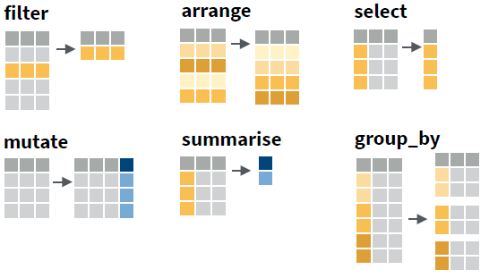
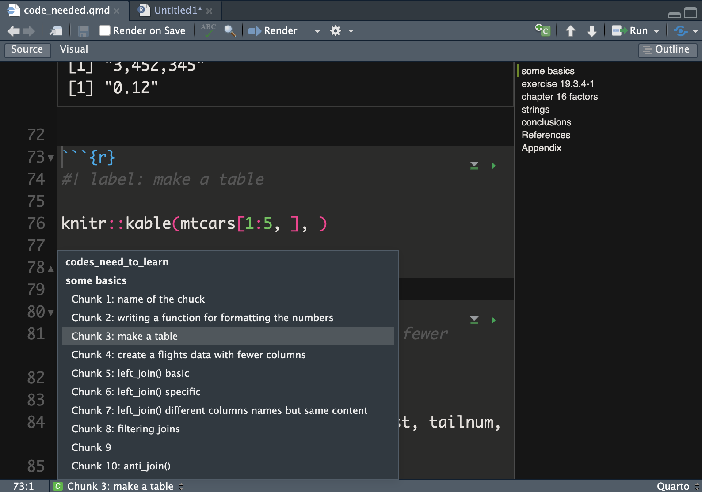
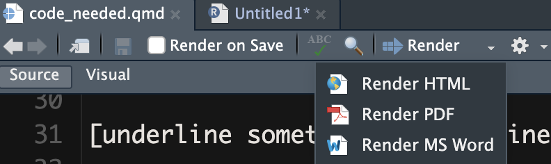

```{r setup, include=FALSE}
library(learnr)
library(gradethis)
library(knitr)

tutorial_options(exercise.timelimit = 60, exercise.checker = gradethis::grade_learnr)
knitr::opts_chunk$set(echo = FALSE, warning = FALSE, message = FALSE)

# Ensure that library is loaded.
library(tidyverse)
```

```{r, context="data", include=FALSE}
# Ensure that the data is loaded for the remainder of this tutorial.
Glasgow <- UsingRTutorials::Glasgow
```

<!-- Define programming tip style -->

```{=html}
<style>
.tip {
  background-color: #f5f5f5;
}
</style>
```
<!-- Define question style -->

```{=html}
<style>
.question {
  color: #5A9DDB;
}
</style>
```
<!-- Define emphasis style -->

```{=html}
<style>
.emphasis {
  color: #e8301b;
}
</style>
```
## Overview

-   Q&A
-   Data Wrangling with `dplyr::`
-   Quarto basics: Integrating text and data for reproducible research

## Q&A

-   Any questions about the organization of the course?
-   Any questions about last tutorial's topics?
-   Any new topics that must receive attention today?

## Data Wrangling with `dplyr::`

### 

Data wrangling: Transforming (raw) data into (useful) information.

::: tip
**Programming Tip**

-   You are responsible that the transformations are correct.
-   So **check** every transformation step.
:::

### 

**Example Dataset: Glasgow**

Today, we use a data set containing information about friendships, tobacco, alcohol, and substance use among 160 students, who were followed over their second, third and fourth year at a secondary school in Glasgow (*Teenage Friends and Lifestyle Study* research project).

The data set, named `Glasgow`, is available within this tutorial, so you do not have to load it.

-   **student**: respondent ID, as a character string.
-   **age**: respondent age, in years with one decimal digit.
-   **sex**: respondent sex, boy or girl.
-   **smoking_at_home**: any smokers at home, yes or no.
-   **smoking_parents**: smoking by at least one parent, yes or no.
-   **smoking_siblings**: smoking by at least one sibling, yes or no.
-   **wave**: time of observation, starting in February 1995, when the pupils were aged 13, and ending in January 1997.
-   **alcohol**: respondent alcohol consumption: 1 (none), 2 (once or twice a year), 3 (once a month), 4 (once a week) and 5 (more than once a week).
-   **cannabis**: respondent cannabis consumption: 1 (none), 2 (tried once), 3 (occasional) and 4 (regular).
-   **tobacco**: respondent tobacco consumption: 1 (none), 2 (occasional) and 3 (regular, i.e. more than once per week).
-   **money**: respondent's pocket money per month, in British pounds.
-   **romantic**: whether the student had a romantic relation, yes or no.
-   **friendships**: number of friendship nominations received by other respondents.

### Piping

The `tidyverse` approach to data wrangling can be summarized as follows:

-   Transform data with functions: data frame → new data frame.
-   Breakdown transformations into logical steps.
-   Chain transformations into a pipe `|>`): Use resulting data of previous step as input data of next step.

**Why use pipes?**

-   much more concise;
-   no intermediary data objects that clutter your environment;
-   no intermediary data objects must be specified as argument;
-   no risk of inadvertently overwriting an intermediary data object.

### 

```{r}
data.frame(
  Function = c("filter(): select cases", 
               "arrange(): sort cases", 
               "select(): select variables", 
               "mutate(): compute new variables", 
               "summarise(): aggregate (collapse) data", 
               "group_by(): split by group"),
  Goal = c("I want to focus on part of my cases.", 
           "I want to rearrange my cases.", 
           "I want to focus on some of my variables.", 
           "I want to change variables.", 
           "I want summary statistics.", 
           "I want summaries or changed variables for each group.")
  ) |>
  knitr::kable(
    caption = "Main data transformation functions",
    booktab = TRUE
    ) |> 
  kableExtra::kable_styling(
    bootstrap_options = "striped"
    )
```

### 

Or, visually:

```{r, out.width="50%"}

```

### 

::: question
Apply the `tidyverse` approach to the code below: Start with the data set and join all transformations in one pipe such that the result is shown on the screen.
:::

```{r pipe, exercise = TRUE, eval=FALSE}
helpData1 <- filter(Glasgow, money >= 0)
helpData2 <- group_by(helpData1, sex, student)
helpData3 <- summarise(helpData2, n_rom = sum(romantic == "yes", na.rm = TRUE))
count(helpData3, sex, n_rom)
```

```{r pipe-hint-1}
# In a pipe, the data frame originating from a previous step is automatically
# the data frame used for the next step. You don't have to save an intermediary
# data frame or specify its name in a pipe. And don't forget to add the pipe
# symbol!
```

```{r pipe-hint-2}
# A pipe for the first function:
Glasgow |> 
  filter(money >= 0)
```

```{r pipe-hint-3}
# Have a look at the result of this pipe with View().
Glasgow |> 
  filter(money >= 0) |> View()
# Note that the View window may be hidden behind your RStudio screen.
```

```{r pipe-hint-4}
# A pipe for the first two functions:
Glasgow |> 
  filter(money >= 0) |>
  group_by(sex, student)
# Note that group_by() does not change the result.
# It's effect is that subsequent functions are applied to each group 
# instead of to the whole data set.
```

```{r pipe-hint-5}
# See the impact of group_by on the summarise() function:
Glasgow |> 
  filter(money >= 0) |>
  group_by(sex, student) |> 
  summarise(n_rom = sum(romantic == "yes", na.rm = TRUE)) |> View()
# Run the code also without group_by() to see the difference.
```

```{r pipe-hint-6}
# You can now finish this pipe on your own, right?
```

```{r pipe-solution, exercise.reveal_solution = FALSE}
Glasgow |> filter(money >= 0) |> group_by(sex, student) |> summarise(n_rom = sum(romantic == "yes", na.rm = TRUE)) |> count(sex, n_rom)
```

```{r pipe-check}
gradethis::grade_code(
  incorrect = "Don't mind an `Error occured while checking the submission` message."
)
```

### 

::: tip
**Programming Tip**

For readability, formulate a comment explaining what each step in the pipe does or is meant to do to the data.

For example:

```{r, eval=FALSE, echo=TRUE}
myData  |>  
  #we only want to look at girls in the first wave
  filter(sex == "girl" & wave == "t1")  |> 
  #for whom we want to know the average number of friends (but missings may appear!)
  summarise(avg_friends = mean(friendships, na.rm = TRUE))
```
:::

::: question
Add a comment to every step of the solution to the previous exercise, explaining the purpose of the code in this step.
:::

## A Frequency Table

Frequency tables count how often values appear in the data: counts per group.

A count is a summary: We replace all cases within a group by one case containing the number of cases in that group.

```{r summary1-shown}
Glasgow |>
  # we need summarizing numbers for each number of friendships, so group first
  # grouping automatically sorts on the variable, so the cumulation works fine
  group_by(friendships) |>
  # summary statistics: note that a new variable can be used immediately
  summarise(
    Freq = n(),
    Perc = 100 * Freq / nrow(Glasgow)
  )
```

::: question
Create the above table with the absolute frequencies (raw counts) and relative frequencies (percentages) of the number of friendships per student in the `Glasgow` data set.
:::

As always, use tidyverse functions and join all functions in one pipe.

```{r summary1, exercise = TRUE}

```

```{r summary1-hint-1}
# You must group the data before you summarise.
Glasgow |>
  group_by( ??? )
# Which variable provides the groups?
# In other words: The values of which variable are counted?
```

```{r summary1-hint-2}
# Use summarise() with the n() function to count the number of cases per group. 
Glasgow |>
  group_by( ??? ) |>
  summarise(
    Freq = n()
  )
# Instead of summarise(Freq = n()), we can use the function count().
```

```{r summary1-hint-3}
# For relative frequencies, divide the raw counts by the number of cases. 
Glasgow |>
  group_by( ??? ) |>
  summarise(
    Freq = n(),
    Perc = ??? / nrow(Glasgow)
  )
# Note that we can use the data set again within a pipe step!
```

```{r summary1-check}
gradethis::grade_result(
  pass_if(
      ~ {nrow(.result) == 13 && ncol(.result) == 3 && identical(names(.result), c("friendships", "Freq", "Perc")) && round(.result[[1, 3]]) == 13  && round(.result[[2, 3]]) == 12 },
    # function(x) {nrow(x) == 13 && ncol(x) == 4 && names(x) == c("friendships", "Freq", "Perc", "CumPerc") && round(x[[1, 3]]) == 13  && round(x[[2, 4]]) == 25 },
    "You correctly gouped and summarised the number of friendships, using the exact same variable names as in the presented table. And you did not forget to create percentages instead of proportions."),
  fail_if(~ nrow(.result) != 13, "How can you get one row for each number of friendships?"),
  fail_if(~ ncol(.result) != 3, "Did you summarize the frequencies and the percentages? Use `summarize()` to calculate the frequencies and percentages; this will give you one row for each number of friendships."),
  fail_if(~ !(identical(names(.result), c("friendships", "Freq", "Perc"))), "Use the names of new variables exactly as they are used in the presented table."),
  fail_if(~ round(.result[[1, 3]]) != 13, "Did you notice that we need percentages, not proportions? Use `Perc = 100 * Freq / nrow(Glasgow)`.")
)
```

::: tip
**Programming Tip**

-   The current version of **summarise()** by default undoes the last grouping. Hence the message in the console "`summarise()` ungrouping output (override with `.groups` argument)".
-   This is the safe option. It is easy to forget that data are grouped, but results on grouped data can be very different from what you expect or want.
:::

## Recoding and Grouping

Some useful functions for recoding or grouping variables have been added to `tidyverse` since the publication of the book *R for Data Science*:

-   `recode(x, old = new, old = new, ...)`: Replace single old values by new values in variable `x`.

```{r eval=FALSE, echo=TRUE}
# School year instead of wave indicator.
Glasgow |> mutate(schoolyear = 
    recode(wave,  "t1" = 2,
                  "t2" = 3,
                  "t3" = 4))
# Note that the old value is named first.
```

-   `case_when(criterion ~ new value, criterion ~ new value, ...)`: Replace sets of old values (according to a criterion) by new values.

```{r eval=FALSE, echo=TRUE}
# Group number of friends.
Glasgow  |>  
  mutate(friends_class = case_when(
    friendships == 0 ~ "No friends", 
    friendships < 5 ~ "1 - 4 friends", 
    TRUE ~ "6+ friends"))
# The condition is left to the tilde, the new value to the right.
# Note the importance of the steps: persons without friends 
# are excluded from the group with less than 5 friends.
```

-   `ntile(x, n)`: Group variable `x` into `n` bins, each containing approximately the same number of cases.

```{r eval=FALSE, echo=TRUE}
# Group number of friends in three (more or less) equally large groups.
Glasgow |> 
  mutate(friends_bin = ntile(friendships, 3))
```

-   `na_if(x, y)`: replace a specific value `y` on variable `x` with `NA`.

```{r eval=FALSE, echo=TRUE}
# Set -1 friends to missing.
Glasgow |> 
  mutate(friends_nonmissing = na_if(friendships, -1))
```

### 

Now, do it yourself.

::: question
Create a new variable `money_class` dividing the Glasgow students into three groups containing more or less the same number of cases.

Send the results to the screen.
:::

```{r binning, exercise = TRUE}

```

```{r binning-hint-1}
# Use __mutate()__ to create the new variable.
Glasgow |> mutate(money_class = ??? )
# Which of the recoding and grouping functions should you use?
```

```{r binning-solution, exercise.reveal_solution = FALSE}
Glasgow |> mutate(money_class = ntile(x = money, n = 3))
```

```{r binning-check}
gradethis::grade_code(
  correct = "", 
  incorrect = "Please, specify argument names."
  )
```

### 

::: question
Create a new variable `money_class2` with the following groups for the Glasgow students' pocket money:

-   group -1: values below 0 (negative pocket money?),
-   group 0: 0 (no pocket money),
-   group 1: 1 - 10,
-   group 2: more than 10 pounds per month.

Send the results to the screen.
:::

```{r recodemoney, exercise = TRUE}

```

```{r recodemoney-hint-1}
# Use mutate().
Glasgow |> mutate(
  money_class2 = ???()
)
# Which of the recoding and grouping functions should you use?
```

```{r recodemoney-hint-2}
# Indeed, use case_when().
Glasgow |> mutate(
  money_class2 = case_when(
    
  )
)
# How do you specify the conditions and new values?
```

```{r recodemoney-hint-3}
# What is the condition for groups -1 (negative pocket money) and 0 (no pocket money)? 
# Use __==__, __>__, or __<__ for "equals", "larger than", and "smaller than".
Glasgow |> mutate(
  money_class2 = case_when(
    money ?? ~ -1,
    money ?? ~ 0
  )
)
```

```{r recodemoney-hint-4}
# What is the condition for group 1: 1 - 10? 
# Use __>=__ and __<=__ for "larger or equal" and "smaller or equal".
Glasgow |> mutate(
  money_class2 = case_when(
    money < 0 ~ -1,
    money == 0 ~ 0,
    ??? ~ 1
  )
)
```

```{r recodemoney-hint-5}
# What is the condition for group 2: more than 10 pounds per month? 
# You can assign all remaining cases to this group.
Glasgow |> mutate(
  money_class2 = case_when(
    money < 0 ~ -1,
    money == 0 ~ 0,
    money <= 10 ~ 1,
    ??? ~ 2
  )
)
```

```{r recodemoney-solution, exercise.reveal_solution = FALSE}
Glasgow |> mutate(money_class2 = case_when(money < 0 ~ -1, money == 0 ~ 0, money <= 10 ~ 1, TRUE ~ 2))
```

### 

::: tip
**Programming Tip**

-   Use `count()` (which is equal to `group_by()` \|\> `summarise(n = n())`) to better understand a variable or a combination of two or more variables.
-   Check a recoded variable: Pipe the original and recoded variable into the count() function.
-   Example: \|\> count(money_class2, money)
-   Browse the frequency table: are the original values linked to the correct groups on the new variable?
-   Pay special attention to (combinations that involve) missing values. Missing values may create more missing values in data transformation steps because every transformation involving a missing value results in a missing value.
:::

### 

::: question
Instead of grouping the values, set `-1` on variable `money` to missing (change the `money` variable). A negative number of pounds as pocket money cannot be correct.
:::

Send the results to the screen.

```{r recodemissing, exercise = TRUE}

```

```{r recodemissing-hint-1}
# Use mutate().
Glasgow |> mutate(
  money = ???()
)
# Which of the recoding and grouping functions should you use?
```

```{r recodemissing-hint-2}
# Indeed, the na_if() function.
# Check out the help for this function to see which arguments you have to use.
```

```{r recodemissing-solution, exercise.reveal_solution = FALSE}
Glasgow |> mutate(money = na_if(x = money, y = -1))
```

```{r recodemissing-check}
gradethis::grade_code(
  correct = "", 
  incorrect = ""
  )
```

## Missing Values

### 

In R, missing values are indicate by `NA`.

### How are missing values treated?

The `alcohol` variable in the `Glasgow` data set has missing values.

::: question
What happens with the missing values in the following commands?
:::

```{r quizNA}
quiz(
  caption = "",
  question("`Glasgow |> filter(alcohol == \"1 none\")`",
    answer("Missing values are included."),
    answer("Missing values are ignored.", correct = TRUE),
    answer("The result is a missing value.")
  ),
  question("`Glasgow |> select(alcohol)`",
    answer("Missing values are included.", correct = TRUE),
    answer("Missing values are ignored."),
    answer("The result is a missing value.")
  ),
  question("`Glasgow |> summarise(no_alcohol = sum(alcohol == \"1 none\"))`",
    answer("Missing values are included."),
    answer("Missing values are ignored."),
    answer("The result is a missing value.", correct = TRUE)
  ),
  question("`Glasgow |> summarise(no_alcohol = sum(alcohol == \"1 none\", na.rm = TRUE))`",
    answer("Missing values are included."),
    answer("Missing values are ignored.", correct = TRUE),
    answer("The result is a missing value.")
  )
)
```

::: tip
**Programming Tip**

-   If you are not sure about what some code exactly does, run it (on a dataset) and check the results.
-   You can use the code box below to check the commands of the above questions.
:::

```{r quizNAcode, exercise = TRUE}
#Copy code from the questions here...

```

### Dealing with missing values

Missing values are special: we cannot use them like other values.

::: question
Correct the code below to count the number of missing values on the `alcohol` variable in the `Glasgow` data set.
:::

```{r countNA, exercise = TRUE, eval=FALSE}
summarise(Glasgow, alcohol_NA = (alcohol == NA))
```

<!-- To hide the solution, use a textual hint. -->

::: {#countNA-hint}
**Hint:** We cannot use `== NA`. Check page 2 of the Data Transformation with `dplyr` cheat sheet for a function to work with missing values (`NA`). Oh, and with how many rows do you want to end up?
:::

```{r countNA-solution}
summarise(Glasgow, alcohol_NA = sum(is.na(alcohol)))
```

```{r countNA-check}
gradethis::grade_code()
```

The previous exercise does not use a pipe because we apply just one transformation. Here, a pipe is perhaps a bit too much.

::: tip
**Programming Tip**

It is very easy to mix up **=** and **==**.

-   **=** means the same as **\<-** in R, namely "becomes". **y = 0** means that data object **y** becomes zero.
-   **==** means "is equal to". **y == 0** checks if **y** equals zero, which is either true or false.
:::

### Mock test data

Finally, how does R treat a logical variable if we `sum()` it?

Time for another little trick:

-   Create a small input data set.
-   Use it to test what a function does.

::: question
Predict the output of the function. Change the code below a few times until you are certain about what `sum()` does with logical values (`TRUE`or `FALSE` or `NA`).
:::

```{r conditions3, exercise = TRUE, eval=FALSE}
sum(c(TRUE, TRUE, FALSE, FALSE, NA))
```

Perhaps, it helps understanding if you also use `mean()` instead of `sum()`.

::: {#conditions3-hint}
**Hint:** Actually, the help on `sum()` tells you how logicals are treated.
:::

```{r conditions3-check}
gradethis::grade_result(
  fail_if(~ is.na(.result), "Don't forget to add `na.rm=TRUE` to ignore missing values."),
  pass_if(~ { .result > 0 && .result < 1 }, "R replaces `TRUE` by `1` and `FALSE` by `0` when it calculates with a logical variable."),
  pass_if(~ TRUE, "R replaces `TRUE` by `1` and `FALSE` by `0` when it calculates with a logical variable.")
)
```

::: tip
**Programming Tip**

-   In R, `c()` creates a **vector**, which is a series of values (of the same type).
-   A variable in a data frame is a vector.
-   `c()` is also used when we have to pass more than one value to a function argument.
:::

## Multi-Case Functions

### 

`mutate()` - **Ordinary use**: Calculate a new variable value for each case from the case's 'own' value on one or more variables. *Example: grouping a variable*.

-   **Special use**: Calculate a new variable value for each case from the values on a variable *for other cases*.

`dplyr` cheat sheet:

-   **OFFSETS**: use values from a preceding (`lag()`) or successive (`lead()`) case in the data frame;
-   **CUMULATIVE AGGREGATES**: compute the sum (etc.) of all preceding cases;
-   **RANKINGS**: assign rank to value in comparison to all other values.

### 

What if we use these function with:

-   data sorting (`arrange()`),
-   and grouping (`group_by()`)?

The `Glasgow` data set contains the number of `friendships` of each student in three successive `wave`s (t1, t2, and t3).

::: question
Calculate two new variables:

-   `prev_friendships`: the number of friendships in the preceding wave (if any);
-   `change`: the increase or decrease in a student's number of friendships from one wave to the next.

Retain only the variables `student`, `wave`, `friendships`, `prev_friendships`, and `change`, so it easy to inspect the results.
:::

```{r change, exercise = TRUE}
Glasgow |>
  #sort on student and wave within student
  arrange( ____ ) |>
  #group by student, so data for the same student is used only
  group_by( ____ ) |>
  #use a special function to calculate the difference
  mutate( 
    prev_friendships = ____(____), #number of friendships in the preceding wave (if any)
    change = ____ #difference: current minus previous
    ) |>
  select( _____ )

```

```{r eval=FALSE}
# correct code
Glasgow |>
  #sort on student and wave within student
  arrange(student, wave) |>
  #group by student, so data for the same student is used only
  group_by(student) |>
  #use lag() to calculate the difference
  mutate( 
    prev_friendships = lag(friendships), #number of friendships in the preceding wave (if any); this command can be included in the next
    change = friendships - prev_friendships #difference: later minus earlier
    ) |>
  select(student, wave, friendships, prev_friendships, change)
```

```{r change-check}
gradethis::grade_result(
  pass_if(~ {
    #required variables created (named) and retained
    "student" %in% names(.result) && "wave" %in% names(.result) &&
       "friendships" %in% names(.result) && "prev_friendships" %in% names(.result) &&
       "change" %in% names(.result) &&
    #only required variables selected
    ncol(.result) == 5 &&
    #correctly sorted
    identical(.result$student[1], "s001") && identical(.result$wave[1], "t1") &&
    #prev_friendships correctly calculated
    identical(.result$prev_friendships, transmute(group_by(arrange(Glasgow, student, wave), student), prev_friendships = lag(friendships))$prev_friendships) &&
    #change correctly calculated
    identical(.result$change, .result$friendships - .result$prev_friendships)
    }, 
    "You correctly sorted and grouped the data before taking the preceding value of friendships as the value for prev_friendships, which you used to calculate change."),
  fail_if(~ !("student" %in% names(.result) && "wave" %in% names(.result) &&
       "friendships" %in% names(.result) && "prev_friendships" %in% names(.result) &&
       "change" %in% names(.result)), 
       "Did you create the two new variables with the right names and retain the required variables in the data set?"),
  fail_if(~ ncol(.result) != 5, 
       "Did you select only the required variables in the data set at the end?"),
  fail_if(~ !(identical(.result$student[1], "s001") && identical(.result$wave[1], "t1")), 
        "Sort the data on student and wave before you create the new variables."),
  fail_if(~ !(identical(.result$prev_friendships, transmute(group_by(arrange(Glasgow, student, wave), student), prev_friendships = lag(friendships))$prev_friendships)), 
       "Did you group the data by student? Did you use the `lag()` function to create a new variable containing the number of friendships in the preceding wave?"),
  fail_if(~ !(identical(.result$change, .result$friendships - .result$prev_friendships)), 
        "You did not calculate the change in number of friendships correctly from `friendships` and `prev_friendships`. Did you subtract the wrong variable?")
)
```

::: {#change-hint}
**Hint:**

-   Sort the data such that the cases for a student are together and in temporal order. Consult the *Data Transformation with dplyr* cheat sheet to find the right function for using information from the preceding case.
-   Use help on a function if the description on the cheat sheet is not clear to you.
:::

::: tip
**Programming Tip**

-   If you use a multi-case function with grouping, check that the function correctly restarts for a new group.
-   Pay special attention to the first and last value within a group: are these values as they should be?
:::

### 

### 

::: question
What happens if you use the multi-case function without grouping? Comment out the grouping step in the previous answer box and inspect the results.
:::

## Missing Observations

### 

What if we calculate the change in friendships for a student missing an observation for a wave?

::: question
Manually calculate the change in number of friends of student s998 in the below example data fragment. What does the result mean?
:::

```{r}
#Example of observation missing for one student.
data.frame(
  student = c("s997", "s998", "s998", "s999"),
  wave = c("t3", "t1", "t3", "t1"),
  friendships = c(4, 2, 3, 6)
  ) |>
  knitr::kable(booktab = TRUE) |> 
  kableExtra::kable_styling(bootstrap_options = "striped", full_width = FALSE)
```

### 

Don't assume that your data are perfect! Use code to check your data.

Step 1 - Formulate the precise conditions that you want to check:

1.  For every student, we should have exactly three observations (rows).
2.  The three observations per student should have different wave values.
3.  Only wave values 't1', 't2', and 't3' should occur.

Step 2 - Translate the conditions into R code.

1.  Use aggregation: `count()` or `group_by()`and `summarise()`.
2.  Use `filter()` to select cases that violate the conditions.

::: question
-   Add comments to the below code that explain how this code checks the first two conditions specified above.
-   Are there any cases that violate the first two conditions?
:::

```{r eval=FALSE}
# correct code
Glasgow |>
  #for each student...
  group_by(student) |>
  #count the number of different waves in the data
  summarise(
    n_obs = n(),
    n_dist = n_distinct(wave)
    ) |>
  #filter cases with n_obs != 3 or n_dist != 3
  filter( n_obs != 3 | n_dist != 3)
```

```{r missingObs, exercise = TRUE, exercise.lines = 13}
Glasgow |>
  group_by(student) |>
  summarise(
    n_obs = n(),
    n_dist = n_distinct(wave)
    ) |>
  filter( n_obs != 3 | n_dist != 3)
```

::: {#missingObs-hint}
**Hint:** Group by student before you summarize. Use function **n()** to count the number of observations (rows). Logical OR is represented by **\|** and **!=** means "is not equal to". If no cases remain, your code may be correct.
:::

### 

```{r eval=FALSE}
# correct code
Glasgow |>
  #count the different waves in the data
  count(wave)
```

::: question
Check the third condition (above) using `count()` (or `group_by()` and `summarize()`).
:::

```{r missingObs2, exercise = TRUE}

```

```{r missingObs2-check}
gradethis::grade_result(
  pass_if(~ identical(.result, count(Glasgow, wave)), "Indeed, we only have values `t1`, `t2`, and `t3`."),
  fail_if(~ !identical(.result, count(Glasgow, wave)), "Use `count()` to create a frequency table of wave values.")
)
```

::: tip
**Programming Tip**

-   Never assume that data are complete. Formulate which regularities you expect in the data and use code to check them.
:::


## Quarto Basics: Integrating text and data for reproducible research

From this point on in this tutorial, you are supposed to work in RStudio.

Everything you do within one R Session is stored in your R Workspace. If you close RStudio, you lose everything you did in that session, unless you save it. You can choose to save your work in different file types. We will discuss:

-   R Projects
-   R Scripts
-   Quarto

### R project

An R Project keeps all the files relevant to one project in the same place.

::: question
-   Create a new project for your Data Project: *File\>New Project...*
    -   **New Directory**. Start a project in a brand new working directory; or
    -   **Existing Directory**. Create a new project in an existing directory.
    -   Select a suitable directory name (which is also the project name.)
:::

The project directory is the working directory.

-   This is where R looks for your (data) files, unless you specify otherwise.
-   This directory is displayed in the RStudio *Files* tab.

::: question
Store the Data Project data files in this directory.
:::

### R Script

-   R version of SPSS syntax.
-   A file with extension `.R`, containing R code.
-   Similar to answer boxes in this tutorial.

We are not going to use script files because we embed all our code within the Quarto document (next topic).

### Quarto: Reproducible Research

You will be working with Quarto to complete your group project.

A Quarto file contains all steps from data to results:

-   Commands to clean and analyze data.
-   Comments to explain steps in data cleaning and analysis.
-   Text, graphs, and tables presenting the research to the reader.

::: emphasis
Eve`R`ything in one place!
:::

#### Quarto YAML

::: question
Open a new Quarto document in RStudio.

Adjust the first part of the document, called YAML (title, authors, date) and add a table of contents.
:::

::: tip
**Tips:**

-   You can set some YAML options in RStudio with *Output Options* under the settings button (to the right of the Render button).
-   Alternatively, use the cheat sheet (RStudio: *Help \> Cheat Sheets \> Browse cheat Sheets*).
:::

#### First code chunk

Good practice:

-   Load all required libraries in the first code chunk.
    -   Example: `library(tidyverse) #load the tidyverse packages`
-   Set all global settings in the first code chunk.
    -   Recommended global settings for (knitting/rendering) code chunks: `eval : TRUE, echo : FALSE, warning : FALSE, message : FALSE)`

::: question
Adjust the settings in your Quarto document and load the tidyverse package.
:::

#### Code chunk names

A code chunk may have a name (label), e.g., `chunk 3: make a table` in the pic below):

-   May only occur once in an Quarto document.
-   Informative chunk names are handy: quickly navigate via RStudio's code outline (button at the bottom left of the Quarto screen).

{width="397"}

Another option for quick navigation:

-   Open a table of contents of the sections and sub-sections: document outline button (at the top right).

#### Load your data

To work with your data, they must be loaded.

::: question
-   Download the Data Project data file marked for initial practice from Canvas to your project directory. Or: Each team member downloads a different Data Project data file.
-   Get rid of the text and code chunks from the standard Quarto document.
-   Add a header to start the section on data description.
-   Add your first code chunk (use the *Insert* button at the top of the Quarto screen).
:::

### 

All Data Project data sets are in `csv` format.

::: question
Add a code chunk, name it, and import your data file into a data object with `read_csv()`.
:::

Note that `read_csv()` is part of the `readr` package, which is automatically loaded by the `tidyverse` package.

### 

This function has some important features:

-   `read_csv()` uses the first row as variable names.
-   It guesses variable type: character, integer, double, ...
-   It reports variable types as a `col_types` argument.
-   Files ending in .gz, .bz2, .xz, or .zip are automatically uncompressed.
-   Files starting with <http://>, <https://>, <ftp://>, or ftps:// are automatically downloaded.

We don't like guesses; we want to be sure that the variable type is correct.

::: question
-   Check the variable types reported when the data was read against the original data set.
-   Add the `col_types` argument to your `read_csv()` command and copy the reported (guessed) variable types (`cols( ... )`) behind the equals sign.
:::

Now, you are sure that the data will be read in the right way.

### 

::: tip
**Programming Tips**

-   Always assume that things go wrong, so you have to convince yourself that your code produces the right results.
-   Use comments abundantly. Explain why you do things in a particular way. It helps your group members and your future self to understand the code.
-   In a code chunk, press Ctr/Cmd-Enter to run the command in which your cursor is positioned.
:::


#### Render to PDF

Render an Quarto with the Render button.

{width="397"} Render to HTML:

-   Is fastest.
-   Always render to HTML first, to check the results.

Render to a paper document:

-   render to PDF or Word.
-   PDF output is supported better than Word,
-   but requires the installation of a TeX package (see Canvas page "Welcome to Using R!")

::: question
Render your Quarto document to PDF to check that it works and LaTeX package is correctly installed.
:::

### 

If you want to fine-tune your PDF document:

-   Add `keep_tex: TRUE` to the document YAML, like this (mind the indentation):

```{r echo = TRUE, eval = FALSE}
format:
  pdf: 
    keep_tex: TRUE
```

YAML option `keep_tex: TRUE` saves the TeX file (extension `.tex`), which you can open in a TeX editor, for example [overleaf](https://www.overleaf.com/) or [Texmaker](https://www.xm1math.net/texmaker/).

## That's it for today.

-   Study course content
-   Meet your study buddy
-   Next steps group project:
    -   Sprint 1: Review & Retrospective
    -   Sprint 2: Planning
-   Some inspiration for planning:
    -   You can already: organize your group work in a Quarto file and practice data wrangling skills
    -   Plan in some time to start data tidying after Session 3.
    -   Plan in some time for everybody to practice with ggplot() on the Data Project.
-   **Sprint 2 SCRUM masters: Keep your team on course!**
