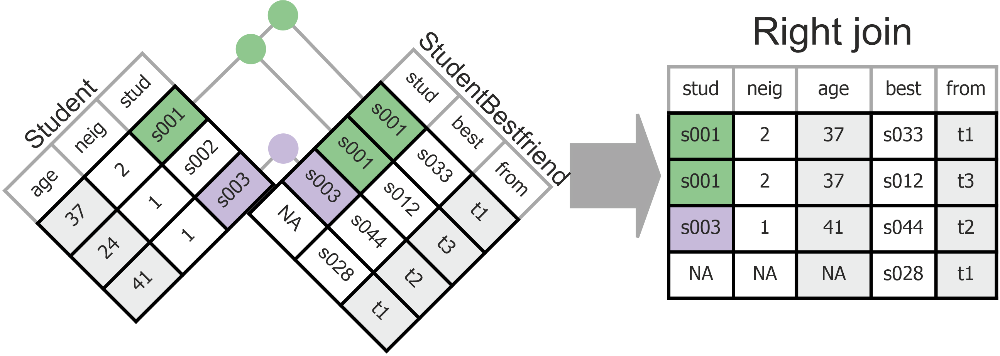
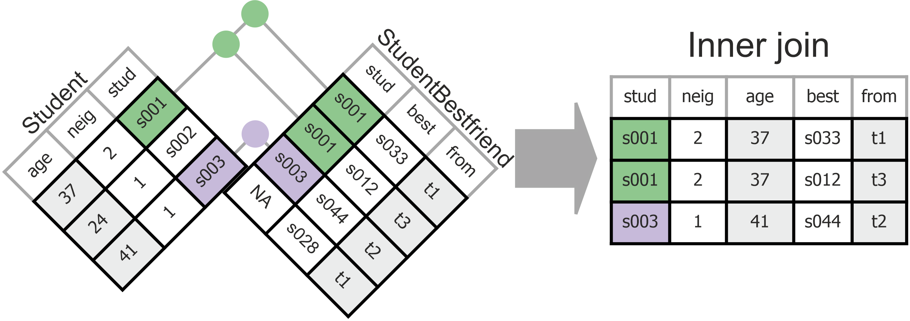
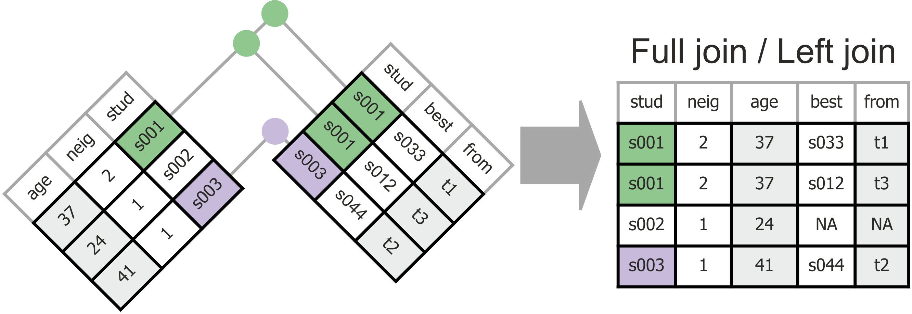
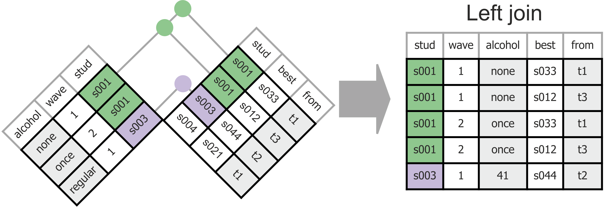

```{r setup, include=FALSE}
# Ensure that libraries are loaded.
library(tidyverse)
library(learnr)
library(gradethis)
library(knitr)
library(kableExtra)

tutorial_options(exercise.timelimit = 60, exercise.checker = gradethis::grade_learnr)
knitr::opts_chunk$set(echo = FALSE, warning = FALSE, message = FALSE)
```

```{r, context="data", include=FALSE}
# Ensure that the data is loaded for the remainder of this tutorial.
GlasgowFriends <- UsingRTutorials::GlasgowFriends
```

<!-- Define programming tip style -->
<style>
.tip {
  background-color: #f5f5f5;
}
</style>

<!-- Define question style -->
<style>
.question {
  color: #5A9DDB;
}
</style>

## Variables and Cases

R originated from a language for statistical analysis (the S language), so it should not come as a surprise that data are conceptualized primarily as variables in R. More precisely, a variable is called an _atomic vector_: a sequence of values of the same type (logical, integer, double, character, complex, raw).

###

R does not require that variables are joined in a data matrix. 

<div class="question" >
Use the `runif()` function to create a vector `var1` of 100 random numbers between 12 and 18. Use the same function to create a second vector (`var2`) of 100 random numbers between 1 and 10. Finally, calculate the Spearman correlation between the two vectors with the `stats::cor()` function. Is the rank correlation between two random variables zero?
</div>

```{r atomic_answer_hidden, eval=FALSE}
var1 <- runif(n = 100, min = 12, max = 18)
var2 <- runif(n = 100, min = 1, max = 10)
cor(var1, var2, method = "spearman")
```

```{r atomic, exercise = TRUE}

```

<!-- To hide the solution, use a textual hint. -->
<div id="atomic-hint">
__Hint:__ No piping now; we cannot pipe atomic vectors, we can only pipe data frames. The `stats` package, like the `base` package, is automatically loaded when R starts.
</div>

```{r atomic-check}
gradethis::grade_result(
  pass_if(~ !identical(.result, 0), "With random variables, the result will vary but most of the times there is a weak positive or negative rank correlation. By the way, I cannot check if you used the Spearman method."),
  fail_if(~ identical(.result, 0), "In the first line, create the first vector, in the second line the second vector, and in the third line calculate the correlation.")
)
```

###

The two vectors `var1` and `var2` that you have just created are of equal length. Function `cor()` produces an error if you attempt to calculate a correlation between two vectors of unequal length. You may check this by changing the above code. This is because R links the first element (number) of vector `var1` to the first element (number) of vector `var2`. It assumes that these two numbers refer to the same case. For example, `var1` may express a student's age and `var2` may express their grade for an IQ test.

<div class="question" >
What happens to the rank correlation between `var1` and `var2` if you first sort each vector? Copy the code from the previous code box as your starting point.
</div>

Note: We cannot use the tidyverse function `arrange()` because tidyverse functions work on data frames, not on individual atomic vectors. For once, use the `base::sort()` function.

```{r atomicsorted_answer_hidden, eval=FALSE}
var1 <- sort(runif(n = 100, min = 12, max = 18))
var2 <- sort(runif(n = 100, min = 1, max = 10))
cor(var1, var2, method = "spearman")
```

```{r atomicsorted, exercise = TRUE}

```

```{r atomicsorted-check}
gradethis::grade_code(
  correct = "", 
  incorrect = ""
  )
gradethis::grade_result(
  pass_if(~ .result > 0.999, "Because both variables are sorted from small to large, there is (nearly) perfect rank correlation. Cases with lower scores on one variable are matched to case with lower scores on the other variable."),
  fail_if(~ .result <= 0.999, "Create data objects for the two sorted vectors before you calculate the correlation. Did you use Spearman's correlation?")
)
```

### Data frames, tibbles, tables

Working with individual atomic vectors, then, is hazardous. If the order of cases differs between vectors, the wrong values are linked, and the results are incorrect.

For this reason, atomic vectors of the same length are usually combined into data frames or in tibbles, which are data frames with easy printing (few cases to screen) and no sneaky changes. Note that vectors are the columns in a data frame or tibble. R is column oriented!

Tidyverse functions produce tibbles, base R functions produce data frames. If you have to use functions outside of the tidyverse suite, you may have to change your tibble back into a data frame.

<div class="question" >
Check that you understand tibbles: Create the tibble depicted below with one command (no piping). Mind the details!
</div>

```{r tibbleShown}
tibble(
  var1 = c("a", "b", NA, "d"),
  `standard normal random number` = rnorm(4, mean = 0, sd = 1),
  numbers12_15 = seq(from = 12, to = 15, by = 1),
  success = c( FALSE, FALSE, TRUE, FALSE)
)
```

```{r tibble, exercise = TRUE}
tibble( 
  var1 = c(), 
  standard normal random number = rnorm(), 
  numbers12_15 = seq(), 
  success = c() 
  )
```

<!-- To hide the solution, use a textual hint. -->
<div id="tibble-hint">
__Hint:__ How can we use a variable name with spaces? See Chapter 7.

__Hint:__ Look up a function in RStudio help or n the book if you don't understand it.
</div>

```{r tibble-solution}
tibble( var1 = c("a", "b", NA, "d"), `standard normal random number` = rnorm(4, mean = 0, sd = 1), numbers12_15 = seq(from = 12, to = 15, by = 1), success = c( FALSE, FALSE, TRUE, FALSE) )
```

```{r tibble-check}
gradethis::grade_code(
  correct = "", 
  incorrect = "(If you used `12:15` or `c(12, 13, 14, 15)` instead of `seq()` to create the third variable, that is OK.)"
  )
```

<div class="tip" >
__Tip__

In the world of database management, data frames or tibbles are called __tables__.
</div>

## Tidy Data: EveRything In One Place

Rules for optimal data structure (efficiency and consistency):  

1. Each type of case must have its own tibble.  
    + Is the same information repeated in different rows?  
    + Split the tibble; transfer the info on each type of case to a separate tibble.  
    + The book _R for Data Science_ does not discuss this much.

2. Each observation must have its own row.  
    + Do different variables address the same information?  
    + Stack repeated information.  
    + Don't allow values as columns.

3. Each variable must have its own column.  
    + Is there a variable with values that should be variables by themselves? 
    + Don't stack different types of information in the same column.
    + Spread information over different columns.

4. Each value must have its own cell.  
    + Does a variable contain more than one piece of information?
    + Don't cram more than one piece of information in a cell.  
    + Split the variable.

The next four sections of this tutorial discuss these four rules.

## 1. Each type of case must have its own tibble

The data set for this tutorial, `GlasgowFriends` is very untidy. Let us tidy it up in steps to check that you understand the concept of tidy data and are able to tidy your Data Project data.

Data arising from practical sources or research designs other than the most simple ones usually contain information about different types of cases. For example, a data set may contain information that belongs to a person, to an organization, to a particular moment in time. In addition, there can be information that describes a combination of case types, for example, information on a person at a particular moment in time.

For understanding and tidying your data, it is paramount to identify the types of cases in your data.

<div class="question" >
Use help on `GlasgowFriends` to guess different types of cases in this data set. For each variable, ask yourself the question: What thing has this characteristic?
</div>

```{r GlasgowFriends, exercise = TRUE}
?GlasgowFriends
```

### Primary key

You have probably identified _student_ as one type of cases in `GlasgowFriends`. _Neighbourhood_ seems to be a different type of cases, with characteristics (variables) that are different from the characteristics of a student. And then there is this variable `wave`, which is a characteristic of neither a student nor a neighbourhood.

For identifying types of cases, it is helpful to find the smallest set of variables for which every case (row in the data matrix) has a unique combination of values. This smallest set of variables is called the _primary key_.

Imagine that a data matrix contains only information about a person, such as the person's name, year of birth, address, social security number, and best friend's name. We only need the social security number to uniquely identify a person. If we know this number, we can look up a person's name, year of birth, and so on. 

If we would have two cases with the same social security number, we suspect that there is an error in the data or that there is no unique row for a person. The latter situation arises if there are more types of cases in the data than just persons. An additional variable that we must add to the social security number for getting a primary key points us in the direction of other types of cases.

<div class="tip" >
__Tip__

Identifying the primary key of a data frame or tibble:

1. From the data description, select variables that you think identify types of cases.
2. Select these variables with `select()`.
3. Use the function `anyDuplicated()` to check if there is a case (row) with the same values on the selected variables as a preceding case.
    + If there is a duplicate, add a variable to the key (go to Step 1).
    + If there are no duplicates, see if you can remove a variable and still have no duplicates (and go to Step 2).
</div>

<div class="question" >
Write code that identifies the primary key of tibble `GlasgowFriends`. You may have to try out different combinations of variables; submit only the final code for checking. </div>

```{r primarykeyhidden, eval=FALSE}
# primary key: this seems to be the only option with four variables
GlasgowFriends %>%
  select(student, wave, bestfriend, bfperiod) %>%
  anyDuplicated()
```

```{r primarykey, exercise = TRUE}
# Add the variables in the select() function that you think 
# represent different types of units.
GlasgowFriends %>% 
  select(  ) %>% 
  anyDuplicated()
```

```{r primarykey-solution}
GlasgowFriends %>% select(student, wave, bestfriend, bfperiod) %>% anyDuplicated()
```

```{r primarykey-check}
gradethis::grade_code(
  correct = "", 
  incorrect = " Well, maybe you just entered the variables in another order than I expected. If the result is 0 and you use just four variables, your have the correct primary key."
  )
```

Don't worry if you cannot find the primary key. Press the _Continue_ button for a strategy that you can use to find the primary key.

### Finding the primary key

If you have checked help on function `anyDuplicated()`, you have seen that this function reports the number of the first case (row) that duplicates a preceding row. It doesn't report which preceding row is duplicated, however.

If it is difficult to find the primary key, use the data wrangling techniques that you learned in Session 2 to select cases (rows) with a combination of values on the selected variables that is not unique. Compare rows that are not unique: Which variable has different values? This is the variable that you should add to the primary key.

<div class="question" >
1. Use the code below to find out which variable must be added because it has different values for the first pair of cases that have the same `student` and `wave` values.
2. Add this variable to the code below. Any variable that must still be added to obtain a primary key?
</div>

```{r primarykey2, exercise = TRUE}
# Display cases with the same provisional primary key as consecutive cases.
GlasgowFriends %>%
  # for each combination of selected primary key variables...
  group_by( student, wave ) %>%
  # ...calculate and add the number of cases with the same values
  mutate(n_identical = n()) %>%
  # retain only cases that are not unique on the selected variables
  filter(n_identical > 1) %>%
  # sort the cases, so duplicates are next to each other
  arrange( student, wave ) %>% 
  # show only the first two cases that are duplicates
  ungroup() %>%
  slice(1:2)
```

### Finding the type of cases for a variable 

Every variable in your primary key and every combination of these variables may represent a different type of cases. 

In case the primary key consists of the variables `student` and `wave`, the types of cases can be:

- Student/person,
- Wave/time point or period,
- Student per wave or, equivalently, wave per student.

For practical purposes, it suffices to identify types of cases for which there are at least two variables in the tibble. In tibble `GlasgowFriends` we have the following variables for each type of cases:

- Student or person: `student`, `neighbourhood`, `age`, `sex`, and several more, which represent student characteristics that do not change between waves.
- Wave or time point/period: only `wave`.
- Student per wave or, equivalently, wave per student: `alcohol`, `cannabis`, `tobacco`, and several more, which represent student characteristics that may change between waves.

If we have only one variable describing the data collection wave, we do not have to consider this as a separate type of cases. In contrast, student and student per wave are relevant types of cases here.

Student characteristics that do not change between waves must have the same values for a student across all waves. So characteristics (variables) that always have the same value for a student belong to the student type of cases. These variables should eventually be split off into a tibble with one case (row) per student.

In contrast, student characteristics that change between waves belong to the student-per-wave type of cases and should have their own tibble. 

<div class="tip" >
__Tip__

Finding the type of cases for a variable:

1. Use common sense: The variable is a characteristic of what?
2. Check that the variable has the same value for each value of the variables that identify a type of cases (use the code below). If so, the variable is a characteristic of this type of cases or of a simpler type of cases, see Step 3.
3. If Step 2 is true and the type of cases is identified by more than one variable, for example, student per wave, repeat Step 2 for each subset of the identifying variables.
4. The variable belongs to the simplest type of cases (identified by fewest variables) satisfying the check in Step 2.
</div>

<div class="question" >
For each variable in `GlasgowFriends` determine to which type of case it belongs.
</div>

```{r casetype, exercise = TRUE}
# Code to check that a variable .var. always has the same value for each value
# of the selected type of case .type. . Replace .var. by a variable name and
# replace .type. by the variable(s) that define the type of case.
GlasgowFriends %>%
  # For each value of the selected type of case...
  group_by( .type. ) %>%
  # ... calculate the number of distinct values of the selected variable.
  summarise(n_distinct = n_distinct( .var. ), .groups = "drop") %>%
  # Count number of distinct variable values per type of case (grouping has been
  # dropped): should always be 1.
  count(n_distinct)
```

```{r casetype-hint-1}
# Example: Checking that variable age is unique for each student-wave combination.
GlasgowFriends %>%
  # For each value of the selected type of case...
  group_by( student, wave ) %>%
  # ... calculate the number of distinct values of the selected variable.
  summarise(n_distinct = n_distinct( age ), .groups = "drop") %>%
  # Count number of distinct variable values per type of case (grouping has been
  # dropped): should always be 1.
  count(n_distinct)
# In the output of this code, 'n_distinct' gives the number of different ages
# encountered per student per wave. Column 'n' gives the number (frequency) of
# student per wave combinations.
```

```{r casetype-hint-2}
# If 'age' is unique for each student-wave combination, it can also be unique for each student. If so, 'age' belongs to the student type of case, not the student per wave type of case.
# Example: Checking that variable age is unique for each student-wave combination.
GlasgowFriends %>%
  # For each value of the selected type of case...
  group_by( student ) %>%
  # ... calculate the number of distinct values of the selected variable.
  summarise(n_distinct = n_distinct( age ), .groups = "drop") %>%
  # Count number of distinct variable values per type of case (grouping has been dropped): should always be 1.
  count(n_distinct)
# In the output of this code, 'n_distinct' gives the number of different ages encountered per student. Column 'n' gives the number (frequency) of students.
```

<div class="tip" >
__Programming Tip__

- Be systematic and precise!
- For example, if a primary key is defined as _the smallest set of variables for which every case has a unique combination of values_, check both parts of the definition: 
    (1) Every case has a unique combination of values,
    (2) and this is the smallest set of variables for which 1 holds.
</div>

### Splitting a tibble

Now that we have identified the types of cases in the data set and assigned the variables to types of cases, we can start tidying the data set. We are going to create a separate tibble for each type of case and we remove duplicates from each new tibble. We get rid of repeated information!

Why do we do that? Because this way, each piece of information is stored only once:

- No notational variations, e.g., a person's social security number cannot be different in different cases.
- Easy editing/updating: change/add a value only in one place.
- Max storage efficiency: no repetition of information.
- Information is stored by type of cases: easier to find.
- Any multilevel structure of the data (for statistical analysis) is clear from the presence of different tibbles.

<div class="question" >
Use your data wrangling skills from Session 2 and the [data transformation cheatsheet](https://www.rstudio.org/links/data_transformation_cheat_sheet) to create a tibble for each type of case in `GlasgowFriends` and name these tibbles `Student`, `StudentWave`, and `StudentBestfriend`.
</div>

```{r studenttable, exercise = TRUE, exercise.lines = 8}
# Your code to create a tibble for student information without duplicates.
Student <- GlasgowFriends %>% 
  # select the relevant variables
  select() %>% 
  # only keep cases that are distinct (not identical)
  distinct()
# Use View(Student) if you want to view the contents of the tibble that you created.
# But note that the code checker won't work if you add this command.
```

<!-- To hide the solution, use a textual hint. -->
<div id="studenttable-hint">
__Hint:__ For now, include the neighbourhood variables in the Student tibble.
</div>

```{r studenttable-solution}
Student <- GlasgowFriends %>% select(student, neighbourhood, schooldist, hoodname, age, sex, smoking_at_home, smoking_parents, smoking_siblings) %>% distinct()
```

```{r studenttable-check}
gradethis::grade_code(
  correct = "", 
  incorrect = " However, if you selected 9 variables and the new tibble contains 160 rows, your code is fine. You probably selected the variables in a different order."
  )
```


```{r studentwavetable, exercise = TRUE, exercise.lines = 8}
# Your code to create a tibble for student per wave information without duplicates.
StudentWave <- GlasgowFriends %>% 
  # select the relevant variables
  select() %>% 
  # only keep cases that are distinct (not identical)
  distinct()
# Use View(StudentWave) if you want to view the contents of the tibble that you
# created.
# But note that the code checker won't work if you add this command.
```

<!-- To hide the solution, use a textual hint. -->
<div id="studentwavetable-hint">
__Hint:__ It is a good custom to use the primary key variables as the first variables in a tibble.
</div>

```{r studentwavetable-solution, exercise.setup = "studenttable-solution"}
StudentWave <- GlasgowFriends %>% select(student, wave, alcohol, cannabis, money, romantic, friend_1, friend_2, friend_3, friend_4, friend_5, friend_6 ) %>% distinct()
```

```{r studentwavetable-check}
gradethis::grade_code(
  correct = "", 
  incorrect = " However, if you selected 12 variables and the new tibble contains 480 rows, your code is fine. You probably selected the variables in a different order."
  )
```

```{r bestfriendstable, exercise = TRUE, exercise.lines = 8}
# Your code to create a tibble for best friends information without duplicates.
StudentBestfriend <- GlasgowFriends %>% 
  # select the relevant variables
  select() %>% 
  # only keep cases that are distinct (not identical)
  distinct()
# Use View(StudentBestfriend) if you want to view the contents of the tibble
# that you created.
# But note that the code checker won't work if you add this command.
```

<!-- To hide the solution, use a textual hint. -->
<div id="bestfriendstable-hint">
__Hint:__ Include the `student` variable, otherwise we don't know who nominated the best friend.
</div>

```{r bestfriendstable-solution}
StudentBestfriend <- GlasgowFriends %>% select(student, bestfriend, bfperiod, bfwave ) %>% distinct()
```

```{r bestfriendstable-check}
gradethis::grade_code(
  correct = "", 
  incorrect = " However, if you selected 4 variables and the new tibble contains 519 rows, your code is fine. You probably selected the variables in a different order."
  )
```

### 

Not all repeated information can be found with the help of the primary key. If you look carefully at the student tibble that you split off from tibble `GlasgowFriends`, you may notice that neighbourhood information is repeated. This suggests that neighbourhood is a type of cases that should be split off into a separate tibble.

```{r showStudentTable}
GlasgowFriends %>% select(student, neighbourhood, schooldist, hoodname, age, sex, smoking_at_home, smoking_parents, smoking_siblings) %>% distinct() %>% arrange(neighbourhood, student)
```

<div class="question" >
Split off the neigbourhood information into a tibble called `Neighbourhood`. Use one pipe.
</div>

```{r hoodtable, exercise = TRUE, exercise.lines = 8, exercise.setup = "studenttable-solution" }
# Your code to create a tibble for neighbourhood information without duplicates.
Neighbourhood <- Student %>% 
  # select the relevant variables
  select() %>% 
  # only keep cases that are distinct (not identical)
  distinct()
# Use View(Neighbourhood) if you want to view the contents of the tibble that
# you created.
# But note that the code checker won't work if you add this command.
```

<!-- To hide the solution, use a textual hint. -->
<div id="hoodtable-hint">
__Hint:__ Use the `Student` tibble as your starting point..
</div>

```{r hoodtable-solution, exercise.setup = "studenttable-solution"}
Neighbourhood <- Student %>% select(neighbourhood, schooldist, hoodname) %>% distinct()
```

```{r hoodtable-check}
gradethis::grade_code(
  correct = "", 
  incorrect = " However, if you selected 3 variables and the new tibble contains 4 rows, your code is fine. You probably selected the variables in a different order."
  )
```

###

<div class="question" >
Find the primary key of the `Neighbourhood` tibble.
</div>

```{r hoodtablekey, exercise = TRUE, exercise.setup = "hoodtable-solution"}
# Your code to identify the primary key of the neighbourhood tibble.

```

<!-- To hide the solution, use a textual hint. -->
<div id="hoodtablekey-hint">
__Hint:__ Use code presented earlier in this tutorial as your starting point.
</div>

```{r hoodtablekey-solution}
Neighbourhood %>% select(neighbourhood) %>% anyDuplicated()
```

```{r hoodtablekey-check}
gradethis::grade_code(
  correct = "", 
  incorrect = "Review the subsections 'Primary key' and `Finding the primary key` in this tutorial."
  )
```

###

<div class="question" >
Remove the neighbourhood information from the `Student` tibble except the variable(s) that constitute(s) the primary key of the `Neighbourhood` tibble.
</div>

```{r student2table, exercise = TRUE, exercise.lines = 4, exercise.setup = "studenttable-solution"}
# Your code to remove the superfluous neighbourhood variables from the Student tibble.
Student <- Student %>% 
  ????()
```

<!-- To hide the solution, use a textual hint. -->
<div id="student2table-hint">
__Hint:__ Which tidyverse function lets you __select__ variables?

__Hint:__ It is more efficient to specify the variables that must be dropped (use the `-` sign) than the ones that must be retained.
</div>

```{r student2table-solution}
Student <- Student %>% select(-schooldist, -hoodname)
```

```{r student2table-check}
gradethis::grade_code(
  correct = "", 
  incorrect = " However, if you the new Student tibble contains 7 variables and (still) 160 rows, your code is probably fine. You may have selected the variables in a different way."
  )
```

### Foreign key, one-to-many vs. many-to-many relations

The primary key of the `Neighbourhood` tibble must remain in the `Student` tibble, otherwise we no longer know a student's neighbourhood if we stop using the `GlasgowFriends` tibble. Do we stop using the `GlasgowFriends` tibble? Sure, because it is untidy.

The primary key of the `Neighbourhood` tibble is called a _foreign key_ in the `Student` tibble. With primary keys and foreign keys, we can join information from different tibbles. Actually, we could reconstruct the `GlasgowFriends` tibble from the split-off tibbles.

In case you wonder why the primary key of the `GlasgowFriends` tibble gave us the student, student-per-wave, and best-friend types of cases but not the neighbourhood type of cases, here is an important distinction:

1. _One-to-many relation_: A student is living in only one neighbourhood (at least in this data set) even though many students can live in the same neighbourhood. As a consequence, a student has only one score on the `neighbourhood` variable, just like they have only one score on the `sex`variable (at least in this data set). So we cannot distinguish between a real student characteristic like sex and a different type of cases, such as neighbourhood by looking at variation in scores per student.

2. _Many-to-many relation_: A student may appear in many waves (actually, three in this data set) and a wave may include many students. If the data set contains a separate case for each wave for each student, we have variation in waves across students (and the other way around). The primary key picks this up.

However, not every many-to-many relation is picked up by the primary key. This is the next topic in this tutorial.

But first: Enjoy that you have come so far. You have covered quite a lot of ground. The insights and skills you have gained may prove very valuable during your career.

## 2. Each observation must have its own row.

There is something fishy about the friends in the `StudentWave` tibble. For each student in each wave, up to six friends could have been registered. 

```{r showfriends}
GlasgowFriends %>% 
  select(student, wave, friend_1, friend_2, friend_3, friend_4, friend_5, friend_6 ) %>% 
  distinct() %>%
  slice(1:6) %>%
  kable(booktabs = TRUE) %>%
  kableExtra::kable_classic(full_width = FALSE) %>%
  kableExtra::column_spec(4, color = c("red", "black", "black", "red", "black", "black")) %>%
  kableExtra::column_spec(5, color = c("black", "black", "red", "black", "black", "black"))
```

- If less then six friends were nominated, the cells contain missing values (`NA`). That is a waste of space.
- The same student may appear in each of the six friendship variables. We have the same type of information (friendship) in different variables. That is a pain if we want to know how many times a student was chosen as a friend.
- The variable names contain a number (`friend_1`, `friend_2`, and so on). But numbers are values (first mentioned friend, second mentioned friend, ...). We should not allow values as columns.

The tidy solution is to gather (stack) repeated information. We want to have one row (observation) per student per wave per nominated friend.

<div class="question" >
Use the tidyverse `gather()` function to create a new tibble named `StudentWaveFriend` containing one row (observation) per student per wave per nominated friend. The tibble should only contain these three variables.
</div>

```{r gatherfriends, exercise = TRUE, exercise.setup = "studentwavetable-solution"}
StudentWaveFriend <- StudentWave %>% 
  gather() %>%
  select()
```

```{r gatherfriends-solution}
StudentWaveFriend <- StudentWave %>% gather(key = "friendnumber", value = "friend", friend_1:friend_6, na.rm = TRUE) %>% select(student, wave, friend)
```

```{r gatherfriends-check}
gradethis::grade_result(
  fail_if(~ nrow(StudentWaveFriend) > 1600, "Did you remove the rows with missing values for the friend variable? These rows are superfluous. Use an argument in the `gather()` function to remove the rows."),
  fail_if(~ ("alcohol" %in% names(StudentWaveFriend)) | ("cannabis" %in% names(StudentWaveFriend)) | ("money" %in% names(StudentWaveFriend)) | ("romantic" %in% names(StudentWaveFriend)), "Drop the student characteristics that have only one value per student per wave: alcohol, cannabis, and so on. Why are they untidy in the new tibble?"),
  fail_if(~ ncol(StudentWaveFriend) > 3, "Function `gather()` creates two new variables: key and value. One of the two is pretty useless in this particular case. Drop it."),
  fail_if(~ ncol(StudentWaveFriend) < 3, "Did you select the relevant variables in the end: student, wave, and friend?"),
  pass_if(~ TRUE, "You only retained the three variables that matter: the student who nominated a friend, the wave at which the nomination was made, and the student code of the nominated friend. And you dropped missing values, which reduces the number of rows considerably.")
)
```

###

<div class="question" >
Oh, and remove the friendship data from tibble `StudentWave`.
</div>

```{r gatherfriends2, exercise = TRUE, exercise.setup = "studentwavetable-solution"}
StudentWave <- StudentWave %>% 
  ???
```

```{r gatherfriends2-solution, eval=FALSE}
StudentWave <- StudentWave %>% select(student:romantic)
```

```{r gatherfriends2-check}
gradethis::grade_result(
  fail_if(~ str_starts(names(StudentWave)[ncol(StudentWave)], "friend"), "There is still a friendship variable in the `StudentWave` tibble. Did you not overwrite this tibble?"),
  pass_if(~ ncol(StudentWave) == 6, "")
)
```

###

The `gather()` and `spread()` functions are being replaced by the `pivot_longer()` and `pivot_wider()` functions in tidyverse. The new functions are more flexible. For example, `pivot_longer()` can spread more than one variable. This is very useful if you have panel survey data in which a battery of questions is repeated in different waves.

```{r createGlasgowWide}
# create a tibble with waves as different columns
GlasgowWide <- UsingRTutorials::Glasgow %>%
  pivot_wider(id_cols = student:smoking_siblings, names_from = wave, values_from = alcohol:friendships)
```

Tibble `GlasgowWide` contains the original panel wave data in panel wave format. (This tibble is loaded in this tutorial.)

<div class="question" >
Use the `pivot_longer()` function to gather the information measured per wave in tibble `GlasgowWide`. 
</div>

Note: Send the gathered tibble to the screen, do not store it in a new data object (so the code checker can do its work).

```{r pivotlonger, exercise = TRUE}

```

```{r pivotlonger-hint-1}
# Read the vignette: Issue the R command `vignette("pivot")`. 
# Look for the part on multiple observations per row.
```

```{r pivotlonger-solution}
GlasgowWide %>% pivot_longer(cols = alcohol_t2:friendships_t1, names_to = c(".value", "wave"), names_sep = "_")
```

```{r pivotlonger-check}
gradethis::grade_code(
  correct = "", 
  incorrect = "Carefully read the part on multiple observations per row in the pivot vignette."
  )
```

<div class="tip" >
__Programming Tip__

- Use `pivot_longer()` and `pivot_wider()` rather than `gather()` and `spread()`.
</div>

## 3. Each variable must have its own column.  

Inspect the tibble `StudentBestfriend` that you created previously. 

<div class="question" >
Is there a variable with values that should be variables by themselves?
</div>

```{r owncolumn, eval = TRUE, echo = FALSE}
GlasgowFriends %>% 
  select(student, bestfriend, bfperiod, bfwave ) %>% 
  distinct()%>%
  slice(1:10) %>%
  kable(booktabs = TRUE) %>%
  kableExtra::kable_classic(full_width = FALSE)
```

###

The values `from` and `to` in variable `bfperiod` actually refer to variables: the wave at which the student mentioned a peer as best friend for the first time (`from`)  or for the last time (`to`). The actual value for `from` and `to` are stored in the `bfwave` variable.

In a tidy data set, we do not stack different types of information in the same column, so we have to spread the information over different columns. We want a tibble with variables `from`and `to` instead of `bfperiod` and `bfwave`.

```{r owncolumn2, eval = TRUE, echo = FALSE}
GlasgowFriends %>% 
  select(student, bestfriend, bfperiod, bfwave ) %>% 
  distinct()%>%
  # students without best friend are dropped
  filter(!is.na(bestfriend)) %>%
  # spread the bfperiod values into new variables
  pivot_wider(id_cols = student:bestfriend, names_from = bfperiod, values_from = bfwave) %>%
  slice(1:10) %>%
  kable(booktabs = TRUE) %>%
  kableExtra::kable_classic(full_width = FALSE)
```

<div class="question" >
Replace the `StudentBestfriend` tibble by a tibble with variables `from`and `to` instead of `bfperiod` and `bfwave`.
</div>

```{r gatherBestfriend-solution}
StudentBestfriend <- StudentBestfriend %>% filter(!is.na(bestfriend)) %>% pivot_wider(id_cols = student:bestfriend, names_from = bfperiod, values_from = bfwave)
```

```{r gatherBestfriend-hint-1}
# You have to spread variables with the pivot_wider() function.
```

```{r gatherBestfriend, exercise = TRUE, eval=FALSE, exercise.setup = "bestfriendstable-solution"}
StudentBestfriend <- StudentBestfriend %>%
  # students without best friend are dropped
  ???() %>%
  # spread the bfperiod values into new variables
  pivot_wider()
```

```{r gatherBestfriend-check}
gradethis::grade_result(
  fail_if(~ "NA" %in% names(StudentBestfriend), "Missing values become a new variable too. Remove them first."),
  fail_if(~ !("from" %in% names(StudentBestfriend)), "I guess that you spread the wrong variable. It should be `bfperiod`."),
  fail_if(~ !("t1" %in% StudentBestfriend$from), "Did you retrieve the values of the new variables from `bfwave`?"),
  pass_if(~ TRUE, "You removed missing values correctly and spread the `bfperiod` variable, using `bfwave`for the new values.")
)
```

## 4. Each value must have its own cell. 

Finally, variables sometimes contain more than one piece of information. If this is the case, we should split the variable.

The Glasgow data only contain a rather trivial example. The `alcohol` and `cannabis` variables contain both a numeric code and a text label. For example: `1 none`. It can be easier just to work with the numeric codes, that is, as long as we recognize that the numbers stand for ordinal measurement level in this example.

<div class="question" >
Write tidyverse code to split the `alcohol` variable in the `StudentWave` tibble into a numeric variable `alcohol_code` and a character variable `alcohol_label`.
</div>

Note: Send the results to the screen, do not store it in a new data object (so the code checker can do its work).

```{r separate, exercise = TRUE, exercise.setup = "studentwavetable-solution"}
StudentWave %>% separate()
```

```{r separate-solution}
StudentWave %>% separate(col = alcohol, into = c("alcohol_code", "alcohol_label"), sep = 2)
```

```{r separate-check}
gradethis::grade_code(
  correct = "", 
  incorrect = "You cannot split on a particular character, such as a blank, because you would get more than two parts. Only the first part of the alcohol label will be used. Separate on position number: At which character number do you want to split?"
  )
```

This concludes data tidying.

## Combining Data From Different Tibbles

As a result of tidying the `GlasgowFriends` tibble, we now have several tibbles: `Student`, `StudentWave`, `StudentWaveFriend`, `StudentBestfriend`, `Neighbourhood`.

Every piece of information is now stored in just one spot, which is efficient and least error prone.

However, when we want to analyze data, we may need information from different tibbles. To this end, tidyverse offers us four join functions:

- `left_join()`
- `right_join()`
- `full_join()`
- `inner_join()`

These functions may yield different results, most notably, different numbers of cases. 

```{r eval=FALSE}
Student %>% left_join(StudentBestfriend, by = "student") %>% nrow()
Student %>% right_join(StudentBestfriend, by = "student") %>% nrow()
Student %>% full_join(StudentBestfriend, by = "student") %>% nrow()
Student %>% inner_join(StudentBestfriend, by = "student") %>% nrow()
StudentBestfriend %>% inner_join(Student, by = "student") %>% nrow()
```

<div class="question" >
Use the below code box to join the `Student` and `StudentBestfriend` tibbles with each of the four joins. Count the number of cases that result (the base function `nrow()` is handy). Can you explain the differences between the results?
</div>

```{r join1, exercise = TRUE}

```

```{r join1-hint-1}
# Join the two tibbles, using `student` as key.
Student %>% left_join(StudentBestfriend, by = "student")
```

```{r join1-hint-2}
# Using `nrow()` to count the number of cases.
Student %>% left_join(StudentBestfriend, by = "student") %>% nrow()
```

```{r join1-hint-3}
# Compare the sizes of the original tibbles.
nrow(Student)
nrow(StudentBestfriend)
# Which number of cases reappears with which join? Why not with the other joins?
```

###

Two of the joins produce a tibble with more cases than the largest tibble used for the join. This happens in the following circumstances:

1. The key used to join the tibbles is not a primary key in both tibbles.
2. Not every value of the join key appears in both tibbles.
3. The join key has missing values in at least one tibble.

```{r joinquiz}
quiz(
  caption = "",
  question("Is the key used to join the tibbles a primary key in neither of the two tibbles?",
    answer("Yes", message = "Check if student is a primary key in a tibble with anyDuplicated()."),
    answer("No", correct = TRUE)
  ),
  question("Does every value of the key used to join the tibbles appears in both tibbles?",
    answer("Yes", message = "You can check this with the anti_join() function. See below."),
    answer("No", correct = TRUE, message = "You can check this with the anti_join() function. See below.")
  ),
  question("Does the join key have missing values in at least one tibble?",
    answer("Yes", message = "You can check this with summarise(n_missing = sum(is.na(student)))."),
    answer("No", correct = TRUE, message = "You can check this with summarise(n_missing = sum(is.na(student))).")
  )
)
```

### Checking join key overlap: `anti_join()`

Variable `student` is a primary key without missing values in tibble `Student`. The reason that some joins create a tibble with more observations than the number of observations in either `Student` or `StudentBestfriend` is that not all students registered in one table are also registered in the other table.

```{r antijoin, eval=FALSE}
# Checking join key overlap.
# Not all student IDs in tibble `Student` appear in tibble `StudentBestfriend`.
Student %>% anti_join(StudentBestfriend, by = "student") %>% nrow()
# But all student IDs in tibble `StudentBestfriend` appear in tibble `Student`.
StudentBestfriend %>% anti_join(Student, by = "student") %>% nrow()
```

<div class="question">
Use the `anti_join()` function to find the students registered in one tibble but not in the other.
</div>

```{r join2, exercise = TRUE}

```

<!-- To hide the solution, use a textual hint. -->
<div id="join2-hint">
__Hint:__ The order of tibbles in the anti_join() function matters. Try both orders: matching `Student` to `StudentBestfriend` and the other way around. 
</div>

```{r join2-solution}
Student %>% anti_join(StudentBestfriend, by = "student")
```

```{r join2-check}
gradethis::grade_code(
  correct = "All students in tibble `StudentBestfriend` appear in tibble `Student`, but not the other way around.", 
  incorrect = "Swap the order of tibbles. Perhaps that may work."
  )
```

### 

As noted before, variable `student` is a primary key without missing values in tibble `Student`. Therefore, adding the information from this tibble to the `StudentBestfriend` tibble (with `student` as join key) adds one neighbourhood code, one age, sex, and so on to each observation in tibble `StudentBestfriend`. The resulting number of observations equals the number of observations in tibble `StudentBestfriend`. 

This happens with the following joins:

- A left join that joins `Student` to `StudentBestFriend`:
    `StudentBestfriend %>% left_join(Student, by = "student")`
```{r out.width="80%"}
knitr::include_graphics("images/Leftjoin.png")
```
    

- A right join that joins `StudentBestFriend` to `Student`:
    `Student %>% right_join(StudentBestfriend, by = "student")`
```{r out.width="80%"}

```

- An inner join that joins `StudentBestFriend` to `Student` or the other way around:
    `Student %>% inner_join(StudentBestfriend, by = "student")`
    `StudentBestfriend %>% inner_join(Student, by = "student")`
```{r out.width="80%"}

```
    

It does not happen with a left or right join with the order of tables reversed or a full join. Now, the students from the `Student` tibble that do not appear in the `StudentBestfriend` tibble are preserved.

```{r out.width="80%"}

```

Can you explain the number of cases if we use a full join on the tibbles `Student` and `StudentBestfriend`?

This is not super simple.

### Joining on non-primary keys

<div class="question" >
How many rows (observations) do we get when we join the `StudentWave` and `StudentBestfriend` tibbles? Can you predict this number or explain it afterwards?
</div>

```{r out.width="80%"}

```

###

Actually, it is very hard to predict the number of cases that will result from a join on two keys that are not primary keys. 

- For every value on the join key, the number of cases in the first tibble is multiplied by the number of cases in the second tibble. Note that this also applies to missing values on the join key: Every `NA` in the first table is linked to every `NA` in the second table. This is usually not what you want.
- Depending on the type of join, cases in the first and/or second tibble that do not have a match in the other tibble are included or excluded in the resulting tibble.

Instead of predicting and checking the number of cases, inspect the tibble resulting from a join between two non-primary keys. Check what happened to observations that have no match in the other tibble and if there are missing values on the join key variable(s).

### Recognizing untidy data tidying or incorrect joins

<div class="tip" >
__Programming Tip__

- If the number of observations for a variable is larger than you should expect given the description of the data, you probably have to split tibbles.
</div>

If the data description says that there are 160 students participating in the study but you count 480 boys and girls, your expectations about the type of cases in the tibble are incorrect. This actually addresses the question for which type of cases measurements (variable values) are unique. With untidy data, you are bound to count the same measurement more than once, for example, count a student's sex for each panel wave. This would invalidate statistical significance tests.

<div class="tip" >
__Programming Tip__

- If your R code is complicated when you want to do a simple thing, your data are probably in wide format, while tidy data are in long format.
</div>

R is very good at manipulating columns (variables) but it is not so good at manipulating information within a row. For this reason, we want repeated measurements in different rows rather than in different columns.

<div class="tip" >
__Programming Tip__

- Check if the variable(s) used to join two tibbles contain missing values. In joins, missing values are treated as if they are ordinary values on which observations can be matched.
</div>

If the join key variable(s) contain(s) missing values in one tibble, they are included in the joined tibble with a full join, and a left or right join if the missing values are in the first and second tibble respectively. With other joins, they are excluded.

If the join key contains missing values in both tibbles, you probably do not want to link observations because they have missing join key values. Remove the observations before the join.

<div class="tip" >
__Programming Tip__

- The number of observations in a join depends on the nature of the variable(s) used to join two tibbles: Are they primary keys?
</div>

If the join variable(s) is/are a primary key in both tibbles, there is a one-to-one relation. You should ask yourself: Why are the data in different tibbles?

If the join variable(s) is/are a primary key in one of the two tibbles, there is a one-to-many relation. The number of observations in the joined tibble should be equal to the number of observations in the 'many' tibble (where the join key is not a primary key) or this number plus the number of observations in the 'one' tibble (where the join is on a primary key) that are not matched in the 'many' tibble. The latter situation arises in a full join and in a left or right join of the 'one' table is the first or second tibble respectively.

If the join variable(s) is/are not a primary key in both tibbles, there is a many-to-many relation. It is hard to predict the number of resulting observations except that this number is usually (much) larger than the largest tibble involved in the many-to-many relation.
    
## Fancy Stuff

### Contingency tables (crosstabs)

Another application of spreading: cross-tabulation. A contingency table of two variables has variable values in rows and columns. 

```{r crosstabs1-shown}
# alcohol use by wave crosstabs from original dataset
GlasgowFriends %>%
  # only keep unique rows
  distinct(student, wave, alcohol) %>%
  # count alcohol values per wave
  count( wave, alcohol ) %>%
  # spread wave to get columns for waves
  pivot_wider(names_from = wave, values_from = n)# %>%
  #kable(booktab = TRUE)
```

<div class="question" >
Create the above contingency table using the tidyverse `count()` and `pivot_wider()` functions.
</div>

```{r crosstabs1-setup}
Student <- GlasgowFriends %>% 
  select(student, neighbourhood, schooldist, hoodname, age, sex, smoking_at_home, smoking_parents, smoking_siblings) %>% 
  distinct()
StudentWave <- GlasgowFriends %>% 
  select(student, wave, alcohol, cannabis, money, romantic, friend_1, friend_2, friend_3, friend_4, friend_5, friend_6 ) %>% 
  distinct()
```

```{r crosstabs1, exercise = TRUE}

```

```{r crosstabs1-hint-1}
# You have to use data from two tables, so join them first.
StudentWave %>% left_join(Student, by = "student")
```

```{r crosstabs1-hint-2}
# Inspect the results of count() by piping them into `View()` or showing them on
# the screen.
StudentWave %>% left_join(Student, by = "student") %>% count( wave, alcohol ) %>% View()
```

```{r crosstabs1-hint-3}
# Use pivot_wider() to change one variable into the columns of the contingency
# table.
```

```{r crosstabs1-solution}
StudentWave %>% left_join(Student, by = "student") %>% count( wave, alcohol ) %>% pivot_wider(names_from = wave, values_from = n)
```

```{r crosstabs1-check}
gradethis::grade_code(
  correct = "", 
  incorrect = "Did you use two variables in the `count()` function?"
  )
```

###

Let us go one step further. Use your knowledge about the `kableExtra` package from Session 2.

```{r crosstabs2-shown}
# alcohol use by wave crosstabs from original dataset
GlasgowFriends %>% 
  # only keep unique rows
  distinct(student, sex, wave, alcohol) %>%
  # count alcohol values per wave
  count( sex, wave, alcohol ) %>%
  # spread sex and wave to get columns
  pivot_wider(names_from = c(sex, wave), values_from = n, values_fill = 0) %>%
  kable(booktab = TRUE, col.names = c("Alcohol Usage", "wave 1", "wave 2", "wave 3", "wave 1", "wave 2", "wave 3")) %>%
  add_header_above(c(" " = 1, "Boys" = 3, "Girls" = 3)) %>%
  kable_paper(full_width = FALSE)
```

<div class="question" >
Create the above contingency table using the tidyverse `count()` and `pivot_wider()` functions.
</div>

```{r crosstabs2, exercise = TRUE, exercise.setup = "studentwavetable-solution"}

```

````{r crosstabs2-hint}
# For the layout, use the kableExtra webpage
# (https://cran.r-project.org/web/packages/kableExtra/vignettes/awesome_table_in_html.html)
# Column names are partly defined in the `kable()` function and partly in a
# `kableExtra` function.
```

```{r crosstabs2-solution, exercise.setup = "studentwavetable-solution"}
StudentWave %>% left_join(Student, by = "student") %>% count( sex, wave, alcohol ) %>% pivot_wider(names_from = c(sex, wave), values_from = n, values_fill = 0) %>% kable(booktab = TRUE, col.names = c("Alcohol Usage", "wave 1", "wave 2", "wave 3", "wave 1", "wave 2", "wave 3")) %>% add_header_above(c(" " = 1, "Boys" = 3, "Girls" = 3)) %>% kable_paper(full_width = FALSE)
```

```{r crosstabs2-check}
gradethis::grade_code(
  correct = "", 
  incorrect = "Check help on the functions that you are using."
  )
```

### Networks

Many-to-many relations can be visualized as networks. Friendship nominations among students can be depicted with nodes representing students and arrows showing friendship nominations.

The `StudentWaveFriend` tibble contains all the information that we need to draw a friendship network for the Glasgow data. Variable `student` in this tibble represents the student nominating a friend, variable `friend` represents the student nominated, and the simple fact that the nominator and nominee are in the same observation represents the arrow. A line in a network is just a pair of nodes!

There are many R packages for network visualization and network analysis or modelling, consult [CRAN Task View: gRaphical Models in R](https://cran.r-project.org/web/views/gR.html). [Network visualization with R](https://kateto.net/network-visualization) offers a tutorial on some R packages for network visualization. The examples below use the 'igraph` package.

<div class="question" >
Use the tutorial referenced above and the `igraph` documentation to play around with the friendship network in wave1.
</div>

```{r network1-setup}
#preparing data tables for network
Student <- GlasgowFriends %>% select(student, neighbourhood, schooldist, hoodname, age, sex, smoking_at_home, smoking_parents, smoking_siblings) %>% distinct()
StudentWave <- GlasgowFriends %>% select(student, wave, alcohol, cannabis, money, romantic, friend_1, friend_2, friend_3, friend_4, friend_5, friend_6 ) %>% distinct()
StudentWaveFriend <- StudentWave %>% 
  gather(key = "friendnumber", value = "friend", friend_1:friend_6, na.rm = TRUE) %>%
  select(student, wave, friend)
```


```{r network1, exercise = TRUE, exercise.lines = 20, exercise.eval = TRUE, fig.asp=0.5, out.width="100%", fig.cap="Figure: Friendship nominations at the first wave. Mutual nominations are black, unilateral nominations are orange."}
# Install the igraph package (once).
# install.packages("igraph")
# Load the igraph package.
library(igraph)
# Retrieve the friendship nominations in the first wave and ensure that the
# first two columns are the sender and receiver of the nomination.
arrows_wave1 <- StudentWaveFriend %>%
  filter(wave == "t1") %>%
  select(student, friend)
#add color variable for sexes
nodes_wave1 <- Student %>%
  mutate(sex_color = ifelse(sex == "boy", "steelblue1", "tomato1"))
# Create an igraph object: a list of nodes (=vertices) combined with a list of lines/arrows.
net_wave1 <- igraph::graph_from_data_frame(d=arrows_wave1, vertices=nodes_wave1, directed=TRUE)

# Create a layout: positioning of the nodes.
set.seed(35546)
layout_1 <- igraph::layout_with_fr(net_wave1)
# Spread out the network horizontally.
layout_1 <- igraph::norm_coords(layout_1, ymin=-1, ymax=1, xmin=-2, xmax=2)
# Plot the network.
par(mar = c(0, 0, 0, 0))
plot(net_wave1, 
     vertex.label = NA, #hide node labels
     vertex.size = 8, #vertex size
     vertex.color = V(net_wave1)$sex_color,
     edge.arrow.size=.4, # arrowhead size
     #give reciprocal arrows (edges) a different colour than unilateral arrows:
     edge.color = ifelse(which_mutual(net_wave1), "gray40", "tan1"),
     rescale = FALSE, #don't rescale to square network
     layout = layout_1 #use the previously created node coordinates
     )
legend("topleft", c("Boys", "Girls"), pch=21, col="#777777", pt.bg=c("steelblue1", "tomato1"), pt.cex=2, cex=.8, bty="n", ncol=1)
```

### Relational database diagram

Talking about networks: A relational database is a network of tables (tibbles) and joins between tables. To the best of my knowledge, packages for network analysis cannot display tables. The R package `DiagrammeR`, which uses [graphviz](http://www.graphviz.org/), can do this.

```{r diagram1, exercise = TRUE, exercise.eval = TRUE}
#After installing the DiagrammeR package, load it.
# install.packages("DiagrammeR")
library(DiagrammeR)

DiagrammeR::grViz("
digraph database {
graph [
rankdir = 'LR'
];
node [
fontsize = '16'
shape = 'ellipse'
];
edge [
];
'node1' [
label = 'Student | <f1> student | <f2> neighbourhood | age | sex |smoking_at_home | smoking_parents | smoking_siblings'
shape = 'record'
];
'node2' [
label = 'Neighbourhood | <f1> neighbourhood | schooldist | hoodname'
shape = 'record'
];
'node3' [
label = 'StudentBestfriend | <f1> student | bestfriend | from | to'
shape = 'record'
];
'node4' [
label = 'StudentWave | <f1> student | <f2> wave | alcohol | cannabis | money | romantic'
shape = 'record'
];
'node5' [
label = 'StudentWaveFriend | <f1> student | <f2>wave | friend'
shape = 'record'
];
'node1':f2 -> 'node2':f1;
'node1':f1 -> 'node3':f1;
'node1':f1 -> 'node4':f1;
'node1':f1 -> 'node5':f1;
'node4':f2 -> 'node5':f2;
}
")
```

With this concise definition of the tables, it is not possible to change the background colour of a the first table row indicating the table name or use underlining to mark the variables that constitute the primary key of a table.

For such fine-tuning, we have to use HTML code.

```{r diagram2, exercise = TRUE, exercise.eval = TRUE}
library(DiagrammeR)
DiagrammeR::grViz("
digraph database {
    graph [rankdir = LR]
    node [
      shape=plaintext
      fontname = 'Helvetica'
    ]
    Student [label=<
<TABLE BORDER='0' CELLBORDER='1' CELLSPACING='0'>
  <TR><TD BGCOLOR='black'><FONT COLOR='white'>Student</FONT></TD></TR>
  <TR><TD PORT='f1'><U>student</U></TD></TR>
  <TR><TD PORT='f2'>neighbourhood</TD></TR>
  <TR><TD>age</TD></TR>
  <TR><TD>sex</TD></TR>
  <TR><TD>smoking_at_home</TD></TR>
  <TR><TD>smoking_parents</TD></TR>
  <TR><TD>smoking_siblings</TD></TR>
</TABLE>>];
    Neighbourhood [label=<
<TABLE BORDER='0' CELLBORDER='1' CELLSPACING='0'>
  <TR><TD BGCOLOR='black'><FONT COLOR='white'>Neighbourhood</FONT></TD></TR>
  <TR><TD PORT='f1'><U>neighbourhood</U></TD></TR>
  <TR><TD>schooldist</TD></TR>
  <TR><TD>hoodname</TD></TR>
</TABLE>>];
    StudentBestfriend [label=<
<TABLE BORDER='0' CELLBORDER='1' CELLSPACING='0'>
  <TR><TD BGCOLOR='black'><FONT COLOR='white'>StudentBestfriend</FONT></TD></TR>
  <TR><TD PORT='f1'><U>student</U></TD></TR>
  <TR><TD>bestfriend</TD></TR>
  <TR><TD>from</TD></TR>
  <TR><TD>to</TD></TR>
</TABLE>>];
    StudentWave [label=<
<TABLE BORDER='0' CELLBORDER='1' CELLSPACING='0'>
  <TR><TD BGCOLOR='black'><FONT COLOR='white'>StudentWave</FONT></TD></TR>
  <TR><TD PORT='f1'><U>student</U></TD></TR>
  <TR><TD PORT='f2'><U>wave</U></TD></TR>
  <TR><TD>alcohol</TD></TR>
  <TR><TD>cannabis</TD></TR>
  <TR><TD>money</TD></TR>
  <TR><TD>romantic</TD></TR>
</TABLE>>];
    StudentWaveFriend [label=<
<TABLE BORDER='0' CELLBORDER='1' CELLSPACING='0'>
  <TR><TD BGCOLOR='black'><FONT COLOR='white'>StudentWaveFriend</FONT></TD></TR>
  <TR><TD PORT='f1'><U>student</U></TD></TR>
  <TR><TD PORT='f2'><U>wave</U></TD></TR>
  <TR><TD><U>friend</U></TD></TR>
</TABLE>>];
    Student:f2 -> Neighbourhood:f1;
    Student:f1 -> StudentBestfriend:f1;
    Student:f1 -> StudentWave:f1;
    Student:f1 -> StudentWaveFriend:f1;
    StudentWave:f2 -> StudentWaveFriend:f2
}
")
```


## Data Project

For one or more of your complex data sets, ask yourself:

1. Does the data set contain info on more than one type of unit?
    Or: Are some variable combinations always the same?
    If so, transfer the info on each type of unit to a separate tibble.
2. Do different variables address the same information?
    If so, gather repeated information into one variable.
3. Is there a variable with values that should be variables by themselves?
    If so, spread the values into variables.
4. Does a variable contain more than one piece of information?
    If so, separate the pieces into different variables.

Include the code to check your data and the code to tidy the data in the RMarkdown file of your group's Data Project.

Checking and tidying your data is an important part of the group effort in the Data Project. Get it done as soon as possible, so you can use tidy data to find the topic of your visualization.

APPLY YOUR VISUALIZATION AND WRANGLING SKILLS TO YOUR PROJECT DATA TO HONE YOUR SKILLS AND GET TO KNOW YOUR DATA


