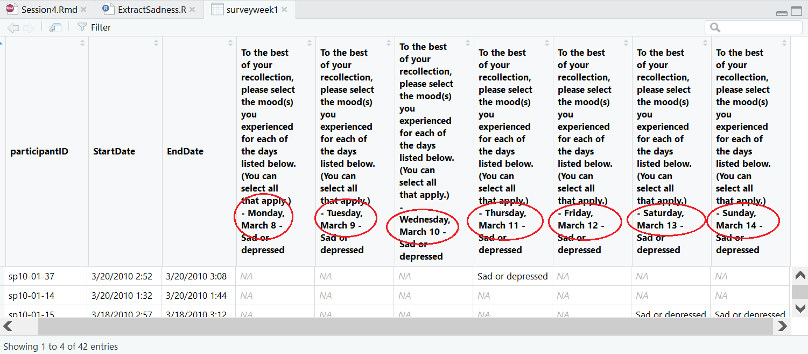

```{r setup, include=FALSE}
# Ensure that libraries are loaded.
library(tidyverse)
# includes stringr:: for string manipulation 
# includes forcats:: for factor manipulation
# includes readr:: for (importing and) parsing data
# does not include broom:: for presenting statistical results
library(lubridate) # for date&time manipulation
library(learnr)
library(gradethis)
library(knitr)
library(kableExtra)
# New packages (must be installed before taking this tutorial)
# library(tm) # to create & handle text corpora
# library(wordcloud) # for word clouds
# library(RColorBrewer) # color palettes (for word clouds; also loaded by wordcloud package)
# library(topicmodels) # topic modelling

tutorial_options(exercise.timelimit = 60, exercise.checker = gradethis::grade_learnr)
knitr::opts_chunk$set(echo = FALSE, warning = FALSE, message = FALSE)
```

```{r, context="data", include=FALSE}
# Ensure that the data is loaded for the remainder of this tutorial.
Brexit <- UsingRTutorials::Brexit
surveyweek1 <- UsingRTutorials::surveyweek1
```

<!-- Define programming tip style -->
<style>
.tip {
  background-color: #f5f5f5;
}
</style>

<!-- Define question style -->
<style>
.question {
  color: #5A9DDB;
}
</style>

<!-- Define emphasis style -->
<style>
.emphasis {
  color: #e8301b;
}
</style>

## Overview

First 1.5 hours: Course content

-   Data Tidying: Expert meeting
-   Factors
-   Dates & Times
-   Strings

Second 1.5 hours: Data project

-   Sprint 2: Retrospective & Review
-   Sprint 3: Planning, Update Project Backlog
-   Updates of the Sprint 2 Scrum-Masters

## Meet the experts

-   Team up with the experts of your topic.
-   Each expert:
    +   Describes the tidy data principle in 1-2 sentences.
    +   Shows one example from their complex dataset to the group of experts.
-   Each expert group:
    +   Makes a power point presentation.
    +   1 slide with the best description of the principle the group can come up with.
    +   1 slide per expert:
      +   Screenshot of original variable;
      +   Screenshot of code to tidy the variable;
      +   Screenshot of end result

<div class="emphasis" >
-   Instructions are available on Canvas.
</div>

### 

### Tidying tasks (reminder)

For your complex datasets, ask yourself one of the following:

1.    Does the data set contain info on more than one type of cases?
      +   Or: Is the same information repeated in different rows?
      +   If so, transfer the info on each type of unit to a separate table.
      
2.    Do different variables address the same information?
      +   If so, gather (pivot_longer()) repeated information into one variable.

3.    Is there a variable with values that should be variables by themselves?
      +   If so, spread (pivot_wider) the values into variables.

4.    Does a variable contain more than one piece of information?
      +   If so, separate the pieces into different variables.

## Factors  

-   Factor: R data type for a categorical (nominal or ordinal measurement level) variable. 

### 

### Character variables

-   R treats a character variable as a categorical variable (nominal measurement level).

Example data set `Brexit`: 600 articles about Brexit from the (former) news website nujij.nl.

<div class="question" >
Create a frequency table of the variable `category` in the `Brexit`dataset.
</div>

```{r freqtable, exercise = TRUE}

```

```{r freqtable-hint}
# Use the count() function and a pipe.
count()
```

```{r freqtable-solution, exercise.reveal_solution = FALSE}
Brexit |> count(category)
```

```{r freqtable-check}
gradethis::grade_code(
  correct = "That wasn't hard, was it?", 
  incorrect = ""
  )
```

###

Note the order of values in this frequency table: alphabetical. 

In addition, note the negligible number of observations for media, etc.

### Character variable in statistical analysis

-   A character variable is usually converted to dummies in statistical analysis. 
-   Regression models in R do this automatically.

Below are the results of a regression model predicting the number of votes for a post from the post category.

```{r regression, exercise = TRUE, exercise.eval = TRUE}
# Linear regression: more in Session 6.
lm(votes ~ category, data = Brexit) |>
  broom::tidy() |> #retrieving the main results
  kable(digits = c(0,2,2,2,3),
               col.names = c("Parameter", "b", "SE", "t", "p"),
               align = "lrrrr") |>
  kableExtra::kable_classic(full_width = FALSE)
```

###

```{r quiz}
question("What is the reference category here?",
  answer("(Intercept)"),
  answer("Algemeen", correct = TRUE),
  answer("Economie"),
  answer("Media"),
  answer("Overig"),
  answer("Politiek"),
  answer("Showbizz"),
  answer("Wetenschap")
)
```

-   Want another reference category or reorder the categories? Create a factor.

<div class="tip" >
__Programming Tip__

- Having the values in another order than alphabetically is the main reason for using a factor instead of a character variable.
</div>

### Create a factor   

<div class="question" >
Create a factor called `cat_fact` from the variable `category` and add it to tibble `Brexit`.
</div>

```{r factor, exercise = TRUE}
Brexit <- Brexit |> 
```

```{r factor-hint-1}
# Use mutate().
Brexit <- Brexit |> mutate()
```

```{r factor-hint-2}
# Use the (base::) `factor()` function.
factor(x = )
```

```{r factor-solution, exercise.reveal_solution = FALSE}
Brexit <- Brexit |> mutate(cat_fact = factor(x = category))
```

```{r factor-check}
gradethis::grade_code(
  correct = "", 
  incorrect = ""
  )
```

###

Have a close look at the description of the new factor:

```{r factorinfo, exercise = TRUE, exercise.setup = "factor-solution", exercise.eval = TRUE}
# Info shown in Environment tab if you work in RStudio.
str(Brexit$cat_fact)
```

-   Factor: a set of labels (levels) plus a set of integer values.
-   In contrast to SPSS, we must use the labels, we cannot use the integer values!

### Change the first factor category 

-   By default, The first category of a character variable or factor is the reference group.
-   Reset the first category to change the reference group. 

<div class="question" >
Use the previously created factor `cat_fact` to add a new factor called `cat_new` to tibble `Brexit` in which `Economie` (_Economy_) is the first category.
</div>

```{r relevel, exercise = TRUE, exercise.setup = "factor-solution"}

```

```{r relevel-hint-1}
# Use `fct_relevel()`, which is part of the `forcats` package, 
# which is loaded by the `tidyverse` package.
fct_relevel()
```

```{r relevel-hint-2}
# Oh yes, use mutate() again. You should know that by now.
Brexit <- Brexit |> 
  mutate()
```

```{r relevel-solution, exercise.reveal_solution = FALSE}
Brexit <- Brexit |> mutate(cat_new = fct_relevel(cat_fact, "Economie"))
```

```{r relevel-check}
gradethis::grade_code(
  correct = "", 
  incorrect = "There are more ways of getting the result but we want you to use the function you learned in the book."
  )
```

###

<div class="question" >
Now check that `Economie` is the reference category in a regression model. 
</div>

```{r relevelmodel-init}
Brexit <- Brexit |> 
  mutate(cat_fact = factor(x = category), 
         cat_new = fct_relevel(cat_fact, "Economie")
         )
```

```{r relevelmodel, exercise = TRUE, exercise.setup = "relevelmodel-init", exercise.lines = 6}
# Adapt the code for a regression model from a previous exercise. 
# Use only the `lm()` function, which will send the results to the screen. 
# That suffices for checking the reference category.

```

<div id="relevelmodel-hint">
__Hint:__ Regression function: lm(y ~ x, data = ).
</div>

```{r relevelmodel-solution}
lm(votes ~ cat_new, data = Brexit)
```

```{r relevelmodel-check}
gradethis::grade_code(
  correct = "Details on statistical analysis in R follow in Session 6.", 
  incorrect = ""
  )
```

Notes:

-   We save the changes in the `Brexit` tibble because we want to use the reordered factor later on in this tutorial. 
-   We use a new name for the new variable, so the original variable is preserved.

### Recode factor levels

-   Categories `Media`, `Overig` (_Other_), `Showbizz`, and `Wetenschap` (_Science_) contain only one observation. 

<div class="question" >
Merge these with category `Algemeen` (_General_) in a new variable `cat_fact2` in tibble `Brexit`. Inspect the result.</div>

```{r recodefactor, exercise = TRUE, exercise.setup = "factor-solution"}

```

```{r recodefactor-hint-1}
# Use variable `cat_fact` as your starting point.
```

```{r recodefactor-hint-2}
# Use function `fct_recode()`.
mutate(cat_fact2 = fct_recode(cat_fact, ))
```

```{r recodefactor-solution, exercise.reveal_solution = FALSE}
Brexit <- Brexit |> mutate(cat_fact2 = fct_recode(cat_fact, Algemeen = "Media", Algemeen = "Overig", Algemeen = "Showbizz", Algemeen = "Wetenschap"))
```

```{r recodefactor-check}
gradethis::grade_code(
  correct = "In the `fct_recode()`function, the new value is to the left, the old value is to the right. As in y <- x.", 
  incorrect = "Perhaps your order of factor values is different but your result can be OK. The code checker can only deal with one order. Poor soul that it is."
  )
```

### Grouping a numeric variable into a factor

-   Variable `reactions`: the number of reactions that a post received. 
-   We want a new variable that groups the number of reactions into three bins. 
-   Each bin should contain more or less the same number of observations (posts).

Unfortunately, variable `reactions` is not numeric.

<div class="question" >
Use function `parse_number()` to create a new numeric variable `react_num` in tibble `Brexit`, which gives us the number of reactions to a post. Check the results with a frequency table of `reactions` - `react_num`combinations.
</div>

```{r groupreactions1, exercise = TRUE}
# 
Brexit <- Brexit |> mutate( ____ )
Brexit |> count()
```

```{r groupreactions1-hint-1}
# Remember the structure of mutate:
mutate(new_var = function(old_var))
```

```{r groupreactions1-hint-2}
# Function `parse_number()` is part of the `readr` package, which is loaded by
# the `tidyverse` package.
# Use help on function parse_number() if you need it.
```

```{r groupreactions1-hint-3}
# Select two variables to be counted in count().
```

```{r groupreactions1-solution, exercise.reveal_solution = FALSE}
Brexit <- Brexit |> mutate(react_num = parse_number(reactions))
Brexit |> count(reactions, react_num)
```

```{r groupreactions1-check}
gradethis::grade_code(
  correct = "We use `parse_number()` to extract the (first) number from a string. Your first string manipulation in this tutorial! More to follow.", 
  incorrect = "Use tidyverse code with piping! And don't forget to adapt the second line of code."
  )
```

###

<div class="question" >
Group the number of reactions in three bins with (nearly) the same number of cases and store this variable as a factor named `react_cat` in tibble `Brexit`.
</div>

```{r orderedfactor, exercise = TRUE, exercise.setup = "groupreactions1-solution"}

```

```{r orderedfactor-hint-1}
# There are two steps. In the first step, bin the numeric variable.
ntile()
```

```{r orderedfactor-hint-2}
# In the second step, create a factor from the bins. 
# The two steps can be performed in one `mutate()` function. It is even possible
# to use the same name for the new variable in both steps.
mutate(
  react_cat = ntile(react_num, 3), 
  react_cat = factor()
  )
```

```{r orderedfactor-solution, exercise.reveal_solution = FALSE}
Brexit <- Brexit |> mutate(react_cat = ntile(react_num, 3), react_cat = factor(react_cat, levels = c(1, 2, 3), labels = c("low", "medium", "high")))
```

```{r orderedfactor-check}
gradethis::grade_code(
  correct = "", 
  incorrect = "Note the `levels` (sets the order) and `labels` (sets the label/value) arguments of the `factor()` function."
  )
```

The three reactions bins should be labeled "low", "medium", "high". But the substantive order from low to high does not match the alphabetical order. The bins variable must therefore be a factor.

###

<div class="question" >
Plot a bar chart of the factor representing the reactions bins. Are the bins in the desired order?
</div>

```{r binplot-ini, exercise.setup = "groupreactions1-solution"}
Brexit <- Brexit |> mutate(react_cat = ntile(parse_number(reactions), 3), react_cat = factor(react_cat, levels = c(1, 2, 3), labels = c("low", "medium", "high")))
```


```{r binplot, exercise = TRUE, exercise.setup = "binplot-ini"}

```

```{r binplot-hint-1}
# Use ggplot() and geom_bar().
```

```{r binplot-solution, exercise.reveal_solution = FALSE}
ggplot(data = Brexit, mapping = aes(x = react_cat)) + geom_bar()
```

```{r binplot-check}
gradethis::grade_code(
  correct = "The bins are in the right order: low - medium - high. And yes indeed, all three bins have the same number of observations (posts).", 
  incorrect = "Maybe you specified aes(x) in the geom_bar() step. That is OK.
  )
```

<div class="tip" >
__Programming Tip__

- An ordered factor assigns ordinal measurement level. In a regression model, no ordinary dummy variables are created for an ordered factor. So avoid ordered factors, unless you really need an ordinal variable.
</div>

## Dates and Times  

### Date-time data object

Example: Publication date of post on _nujij.nl_ in tibble `Brexit`.

```{r POSIXct, echo=FALSE}
str(Brexit$pubDate, "%B %d, %Y %H:%M:%S")
```

Date plus time of day is a character string here.

To work with dates and times change to `POSIXct` data type.

- Number of seconds since the beginning of 1970.
- Shown in the standard format (of your computer locale).

### String to date-time  

-   `Brexit`, variable `pubDate`: date and time an article was posted as a string, e.g., "`r Brexit$pubDate[1]`". 

<div class="question" >
Create a date-time variable `pubDateTime` in tibble `Brexit` using a parse function in package `readr` (p. 297 {Ch. 17.2.1}). Check the results with a frequency table.
</div>

```{r pubDate1, exercise = TRUE}
# Create and add the date-time variable.
Brexit <- Brexit |> ____
# Check the results
Brexit |> _____
```

```{r pubDate1-hint-1}
# The parse function is `parse_datetime()`.
parse_datetime(pubDate, format = "")
```

```{r pubDate1-hint-2}
# Carefully specify the date and time formatting codes. 
# See help for `strptime()` under __Details__.
```

```{r pubDate1-solution, exercise.reveal_solution = FALSE}
Brexit <- Brexit |> mutate(pubDateTime = parse_datetime(pubDate, format = "%B %d, %Y %H:%M:%S"))
Brexit |> count(pubDate, pubDateTime)
```

```{r pubDate1-check}
gradethis::grade_code()
```

###

<div class="question" >
Now do the same with the `lubridate` package (p. 298 {Ch. 17.2.2}), storing the results as a new variable `pubDateTime2` in tibble `Brexit`.
</div>

```{r pubDate2, exercise = TRUE}
Brexit <- Brexit |> 
  mutate(____)
```

```{r pubDate2-hint-1}
# Select the correct function. Check out help for `ymd_hms()`.
```

```{r pubDate2-solution, exercise.reveal_solution = FALSE}
Brexit <- Brexit |> mutate(pubDateTime2 = mdy_hms(pubDate))
```

```{r pubDate2-check}
gradethis::grade_code(
  correct = "Again, compare the new variable to the original publication date variable: Is the new variable correct?", 
  incorrect = ""
  )
```

- Package `lubridate` simplifies the identification of date/time elements.
- Date and time formatting codes are also used for displaying dates and times.

<div class="tip" >
__Programming Tip__

- Especially when you let `readr` guess the date and time format, the results can be wrong. Always compare the new date-time variable to the original string variable.
</div>

### Retrieve info from date-time

It is easy to get the date from a date-time (POSIXct) variable with the `lubridate` package.

<div class="question" >
Add a variable `date` to the `Brexit` tibble; derive it from the recently created variable `pubDateTime`.
</div>

```{r Date, exercise = TRUE, exercise.setup = "pubDate1-solution"}
Brexit <- Brexit |> 
  mutate(____)
```

```{r Date-hint-1}
# How about the `date()` function in package lubridate?
```

```{r Date-solution, exercise.reveal_solution = FALSE}
Brexit <- Brexit |> mutate(date = date(pubDateTime))
```

```{r Date-check}
gradethis::grade_code(
  correct = "", 
  incorrect = ""
  )
```

###

<div class="question" >
Inspect the dates of the posts with a frequency polygon.
</div>

```{r datePlot-init}
Brexit <- Brexit |> mutate(date = date(parse_datetime(pubDate, format = "%B %d, %Y %H:%M:%S")))
```


```{r datePlot, exercise = TRUE, exercise.setup = "datePlot-init"}

```

```{r datePlot-hint-1}
# Pay attention to the `stat` argument in `geom_freqpoly().
# Look the value up under __Computed Variables__ in the RStudio help on
?geom_freqpoly()
```

```{r datePlot-solution, exercise.reveal_solution = FALSE}
Brexit |> ggplot(aes(x = date)) + geom_freqpoly(stat = "count")
```

```{r datePlot-check}
gradethis::grade_code(
  correct = "If you do not use the stat = 'count' argument, geom_freqpoly bins the dates, so you won't get counts for separate days.", 
  incorrect = "The aesthetics for the horizontal axis can be specified in the `ggplot()` function or in the `geom_freqpoly()` geom. Both are OK."
  )
```

###

- Note that there is a `date` variable type in R. It behaves just like a `date-time` variable.
- `date()` is also a base R function. When you load the `lubridate` package, the base R `date()` function is overriden.

###

It is also easy to get the weekday with the `lubridate` package.

<div class="question" >
Use the `pubDateTime` variable to calculate the weekday at which a post was published as a new variable `weekday` containing the names of the weekdays. Store it in the `Brexit` tibble and inspect a frequency table of the `weekday` variable.
</div>

```{r weekday, exercise = TRUE, exercise.setup = "pubDate1-solution"}
# This time, start from scratch...

```

<!-- To hide the solution, use a textual hint. -->
<div id="weekday-hint">
__Hint:__ How about the `wday()` function?
</div>

```{r weekday-solution}
Brexit |> mutate(weekday = wday(pubDateTime, label=TRUE)) |> select(weekday)
```

```{r weekday-check}
gradethis::grade_code(
  correct = "", 
  incorrect = ""
  )
```

###

```{r plotweekday, echo=FALSE}
Brexit  |> mutate(weekday = lubridate::wday(parse_datetime(pubDate, "%B %d, %Y %H:%M:%S"), label=TRUE)) |> ggplot(aes(weekday)) + geom_bar()
```

Variable `weekday` must be a factor. How can you tell?

###  

-   It is tricky to get the time of day because R has no time data type. 
-   The book offers a trick (Chapter 17, Section Setting Components {17.3.3}).

<div class="question" >
Apply this trick to the `pubDateTime` variable in tibble `Brexit` to create a variable `time`. Show the variable as an area plot; don't save it. Put all code in one pipe!
</div>

```{r time, exercise = TRUE, exercise.setup = "pubDate1-solution"}
Brexit |> 
  mutate(____) |>
  ggplot(____)
```

```{r time-hint-1}
# Use the `update()` function.
update()
```

```{r time-hint-2}
# Use `geom_area()`.
ggplot(aes(time)) 
  + geom_area()
```

```{r time-hint-3}
# And use `scale_x_datetime` to set the labels of the horizontal axis to hour.
ggplot(aes(time))
  + geom_area()
  + scale_x_datetime()
```

```{r time-solution, exercise.reveal_solution = FALSE}
Brexit |> mutate(time = update(pubDateTime, yday = 1)) |> ggplot(aes(time)) + geom_area(stat = "bin", bins = 30) + scale_x_datetime(date_labels = "%H")
```

```{r time-check}
gradethis::grade_code(
  correct = "", 
  incorrect = ""
  )
```

### Calculating with date-time

-   Let us have a look at the time span between successive posts. 
-   How long does it take for a new post to appear?

<div class="question" >
Subtract the `pubDateTime` of the previous post from the `pubDateTime` of the current post and store the result as variable `lapse` in tibble `Brexit`.
</div>

```{r timelapse, exercise = TRUE, exercise.setup = "pubDate1-solution"}
Brexit <- Brexit |> 
  arrange(____) |>
  mutate(____)
```

```{r timelapse-hint-1}
# Sort the data to be sure that they are in chronological order before you
# calculate the time lapse.
```

```{r timelapse-hint-2}
# Use the `lag()` function.
lag()
```

```{r timelapse-solution, exercise.reveal_solution = FALSE}
Brexit <- Brexit |> arrange(pubDateTime) |> mutate(lapse = pubDateTime - lag(pubDateTime, n = 1L))
```

```{r timelapse-check}
gradethis::grade_code(
  correct = "", 
  incorrect = ""
  )
```

###

```{r timelapseplot, echo=FALSE}
#Show publication date-time and lapse for first few observations.
Brexit |> 
  mutate(pubDateTime = parse_datetime(pubDate, "%B %d, %Y %H:%M:%S")) |>
  arrange(pubDateTime) |> mutate(lapse = pubDateTime - lag(pubDateTime, n = 1L)) |> 
  select(pubDateTime, lapse) |>
  slice(1:6)
```

-   The time difference between subsequent postings are clearly in seconds (see above table). 
-   What if we use the dates of publications?

<div class="question" >
Show the difference in days (dates) between subsequent posts (new variable `lapse2`) for the first six posts in a table.
</div>

```{r daylapse, exercise = TRUE, exercise.setup = "datePlot-init"}
Brexit |> 
  arrange(____) |> 
  mutate(____) |> 
  select(___) |> 
  ____(____)
```

```{r daylapse-hint-1}
# Don't save the new variable lapse2, just show it in a table.
```

```{r daylapse-hint-2}
# Show only date and lapse2 in the table.
```

```{r daylapse-hint-3}
# Use slice() to select the first six rows.
```

```{r daylapse-solution, exercise.reveal_solution = FALSE}
Brexit |> arrange(date) |> mutate(lapse2 = date - lag(date, n = 1L)) |> select(date, lapse2) |> slice(1:6)
```

```{r daylapse-check}
gradethis::grade_code(
  correct = "", 
  incorrect = ""
  )
```

###

-   Now the difference is expressed in days. 

Subtracting two date-times:

-   yields data type `difftime`; 
-   which can have several time units; 
-   namely, the largest time unit that is smaller than the smallest measured time difference.

<div class="emphasis" >
We don't like unpredictable results!
</div>

Data type `duration`: 

-   Always expresses time differences in seconds.
-   Change `difftime` into `duration` with the `as.duration()` function. See the book for more details.

<div class="tip" >
__Programming Tips__

- Work with data type `duration` instead of `difftime` unless you have to take into account daylight saving and leap seconds.
- Note: For minutes, hours, days, and weeks, a `duration` can be divided (ignoring leap seconds) by the appropriate number of seconds.
</div>

## Strings  

### String manipulation  

Main applications:  
  
1. Change string into another type (factor, date, number) that is more convenient for analysis.  
    - Examples in previous topics of this tutorial (string to factor or date-time).  
2. Query and quantify natural text contents.  
    - Find texts with particular contents.  
    - Change content characteristics into variables.

Topic 2 is esp. relevant for students working on a complex data set including text (natural language): Alcohol Posts and Use, German Chancellor Debate    .

### Change variable names

Friends & Families weekly survey: nasty variable names. Use `rename()`? 

```{r imagesurvey, out.width="100%"}

```
 
- Data sets in the wild often contain troublesome variable names.
- We can use `rename()` to change each name one by one.
- Instead, let's handle variable names as string data and use string manipulation techniques to simplify the variable names.

###

Objective: Simplify the variable name to the date for which the sad/depressed score was entered.

<div class="tip" >
__Programming Tip__

-   If possible, first create code that works for one example. Next, extend the code to deal with all cases.
</div>

-   First example of a troublesome variable name in tibble `surveyweek1`. 

```{r getvar, exercise=TRUE, exercise.eval = TRUE}
# Get a variable name as a character variable with the names() function.
names(surveyweek1)[4]
# [4] selects item 4 from the vector of variable names
```

### Manipulate one variable name

Step 1: Remove all up to (and including) the first " - ".

<div class="question" >
Run the below code and inspect the intermediary results to check that you understand what each line of code does. For example, why is there `+ 1` within the `str_sub()` function?
</div>

```{r step1, exercise = TRUE, exercise.lines = 15}
# Store variable name in a data object, so we can use it.
varname <- names(surveyweek1)[4]
# Show result to check that the code works.
varname # Intermediary result. Comment out in your Data Project code!

# Find the first position of " - ".
# Show results for understanding before using it below.
str_locate(varname, " - ") #start and end position!
# Intermediary result. Comment out in your Data Project code!

# Select everything after the end position of " - ".
varname <- str_sub(varname, start = str_locate(varname, " - ")[2] + 1)

# Show result to check that the code works.
varname # Intermediary result. Comment out in your Data Project code!
```
###

The book focuses on finding and replacing particular strings/words:

- `str_locate()` with `str_sub()` are nice for cutting up a string.
- `[2]` behind str_locate() selects the second item of the vector: the end position.

### 

We now have: 

```{r step1result}
str_sub(names(surveyweek1)[4], start = str_locate(names(surveyweek1)[4], " - ")[2] + 1)
```

```{r step2-ini}
varname <- str_sub(names(surveyweek1)[4], start = str_locate(names(surveyweek1)[4], " - ")[2] + 1)
```

Step 2: Get rid of the weekday name, so remove all up to (and including)  ", ".

<div class="question" >
Run the below code and inspect the intermediary results to check that you understand what each line of code does.
</div>

```{r step2, exercise = TRUE, exercise.setup = "step2-ini", exercise.lines = 6}
# Select substring after the end position of ", ".
varname <- str_sub(varname, start = str_locate(varname, ", ")[2] + 1)
# Show result: see the difference. 
varname # Intermediary result. Comment out in your Data Project code!
```

###

```{r step3-ini}
varname <- str_sub(names(surveyweek1)[4], start = str_locate(names(surveyweek1)[4], " - ")[2] + 1)
varname <- str_sub(varname, start = str_locate(varname, ", ")[2] + 1)
```

Step 3: Get rid of the "Sad or depressed" part, so remove all from (and including)  " - ".

<div class="question" >
Run the below code and inspect the intermediary results to check that you understand what each line of code does.
</div>

```{r step3, exercise = TRUE, exercise.setup = "step3-ini", exercise.lines = 6}
# Show the name that we start with.
varname
# Select substring up to start position of " - ".
varname <- str_sub(varname, end = str_locate(varname, " - ")[1] - 1)
# Show result: see the difference.
varname
```

This is the variable name that we were after.

<div class="tip" >
__Programming Tip__

- It is good practice to check intermediary results, so you know that your code performs as expected.
- It is equally good practice to comment out code that is only used for checking intermediary results when the code is definitive.
</div>

### (for code experts...)

Note that `start` and `end` arguments can be combined in `sub_str()`. Steps 2 and 3 can thus be done in one command.

<div class="question" >
Write the `str_sub()`function that combines Steps 2 and 3. 
</div>

```{r step2and3, exercise = TRUE, exercise.setup = "step2-ini"}
str_sub(varname, )
```

<!-- To hide the solution, use a textual hint. -->
<div id="step2and3-hint">
__Hint:__ You should be able to figure this out. Use help on the `str_sub()` and `str_locate()` functions.
</div>

```{r step2and3-solution}
str_sub(varname, start = str_locate(varname, ", ")[2] + 1, end = str_locate(varname, " - ")[1] - 1)
```

```{r step2and3-check}
gradethis::grade_code(
  correct = "You added the `end` argument at the correct position.", 
  incorrect = ""
  )
```

### Manipulate all variable names

Let us apply the commands to all relevant variables (sequence 4 to 10).

<div class="question" >
Run the below code. What do `names()` and `str_locate()` produce now?
</div>

```{r strlocate1, exercise = TRUE, exercise.lines = 7}
# Get all selected variable names.
varname <- names(surveyweek1)[4:10] 
# Check result.
varname

# Get the start and end positions.
str_locate(varname, " - ")
```

###

-   `str_locate()` creates a matrix with start and end position columns for each variable. 
-   Instead of a single value, we must select a column to get start or end positions.
    +   Start positions: first column `[,1]`;
    +   End positions: second column `[,2]`.

```{r strlocate2-ini}
# Get all selected variable names.
varname <- names(surveyweek1)[4:10]
```

```{r strlocate2, exercise = TRUE, exercise.setup = "strlocate2-ini"}
# Get the end positions from the matrix.
str_locate(varname, " - ")[,2]
```

### 

<div class="question" >
Adjust the commands that we have created for changing one variable name to changing the names of all relevant variables.
</div>

```{r changeall, exercise = TRUE}
# Store variable name in a data object, so we can use it.
varname <- names(surveyweek1)[4]
# Select everything after the end position of " - ".
varname <- str_sub(varname, start = str_locate(varname, " - ")[2] + 1)
# Select substring after the end position of ", ".
varname <- str_sub(varname, start = str_locate(varname, ", ")[2] + 1)
# Select substring up to start position of " - ".
varname <- str_sub(varname, end = str_locate(varname, " - ")[1] - 1)
# Check result.
varname
```

```{r changeall-hint-1}
# Start selecting all variable names instead of only the first.
varname <- names(surveyweek1)[4:10]
```

```{r changeall-hint-2}
# Check intermediate steps, as we have done before. 
# For example: What does str_locate() yield now?
str_locate(varname, " - ")
```

```{r changeall-hint-3}
# Instead of a single end position, we need a column of end positions.
# Check out the difference between:
str_locate(varname, " - ")[2]
str_locate(varname, " - ")[,2]
# A comma makes a big difference...
```

```{r changeall-check}
gradethis::grade_result(
  fail_if(~ identical(.result, "March 8"), "Did you select variables 4 to 10 in the first command?"),
  fail_if(~ length(.result) == 7 && .result[2] == " March ", "Did you use columns instead of single values for start and end positions?"),
  pass_if(~ identical(.result, c("March 8", "March 9", "March 10", "March 11", "March 12", "March 13", "March 14")), "You have selected all seven variables (`[4:10]`) and the correct columns of start (`[,1]` instead of `[1]`) and end positions (`[,2]` instead of `[2]`).")
)
```

###

Once we have the correct variable names, we can use them to replace the names in the `surveyweek1` tibble.

```{r replacenames-setup}
# Store variable name in a data object, so we can use it.
varname <- names(surveyweek1)[4:10]
# Select everything after the end position of " - ".
varname <- str_sub(varname, start = str_locate(varname, " - ")[,2] + 1)
# Select substring after the end position of ", ".
varname <- str_sub(varname, start = str_locate(varname, ", ")[,2] + 1)
# Select substring up to start position of " - ".
varname <- str_sub(varname, end = str_locate(varname, " - ")[,1] - 1)
```

```{r replacenames, exercise = TRUE}
# Replace variable names in tibble.
names(surveyweek1)[4:10] <- varname
# Inspect results
str(surveyweek1)
```

### Tidyverse alternative

Because the variable names are so well structured in this particular example, we can achieve the same with the tidyverse `separate()` function.

<div class="question" >
Inspect the results of each step in the pipe with `View()`. Note that the View window may be hidden behind another screen.
</div>

```{r separate, exercise = TRUE, exercise.lines = 12}
#tidyverse requires a data frame
varnames <- tibble(name = names(surveyweek1)[4:10]) |>
  #split each name into three parts
  separate(name, into = c("humbug", "date", "topic"), sep = " - ") |>
  #split the date into weekday and date
  separate(date, into = c("weekday", "date"), sep = ", ") |>
  #extract the date variable as a vector
  pull(date)
# Replace variable names in tibble.
names(surveyweek1)[4:10] <- varnames
# Show result.
str(surveyweek1)
```

-   Tidyverse functions only operate on data frames;
-   but the variable names are a vector: just a series of names.
-   So we change them into a data frame at the start with `data_frame()`,
-   and transform them back to a vector (without variable name) at the end with `pull()`.

## Fancy Stuff

Natural text such as the header or body text of posts is used for classifying texts (topic modelling), for example, using sentiment analysis, or investigating relations between words, e.g., as visualized in a word cloud. 

### Word cloud

-   Special R data class `Corpus` handles sets of texts. 
-   `tm` package: tools for creating, cleaning, and manipulating a corpus of texts. 

Let us use this package and the `wordcloud` package to create some word clouds.

<div class="question" >
Use help and inspect intermediary results to understand what happens here.
</div>

```{r wordcloud1, exercise = TRUE, exercise.lines = 23, exercise.eval = TRUE}
# Load the required packages.
library(tm)
library(wordcloud)
library(RColorBrewer)
# Create a corpus for the headings (titles) of the Brexit articles.
docs <- Brexit |>
  # extract the titles as a vector
  pull(title) |>
  # use tm functions to create a corpus
  tm::VectorSource() |>
  tm::Corpus() |>
  # use tm functions to clean the data
  tm::tm_map(removeNumbers) |> #remove numbers (assuming they are not informative)
  tm::tm_map(removePunctuation) |> #remove punctuation (assuming they are not informative)
  tm::tm_map(stripWhitespace) |> #remove blanks
  tm::tm_map(content_transformer(tolower)) |> #only lower case letters
  tm::tm_map(removeWords, stopwords("dutch")) #remove Duch stopwords
# Create our first wordcloud.
wordcloud::wordcloud(
  docs, 
  random.order = FALSE,
  colors = RColorBrewer::brewer.pal(11, "Spectral")
  )
```

###

-   The word _Brexit_ clearly dominates the word cloud. 
-   Articles have been selected because this word appears!
-   Let us make a word cloud without it.

<div class="question" >
Play around with the selection of words and the arguments of the `wordcloud()` function.
</div>

```{r prepare-doc}
# Create a corpus for the headings (titles) of the Brexit articles.
docs <- Brexit |>
  # extract the titles as a vector
  pull(title) |>
  # use tm functions to create a corpus
  tm::VectorSource() |>
  tm::Corpus() |>
  # use tm functions to clean the data
  tm::tm_map(removeNumbers) |> #remove numbers (assuming they are not informative)
  tm::tm_map(removePunctuation) |> #remove punctuation (assuming they are not informative)
  tm::tm_map(stripWhitespace) |> #remove blanks
  tm::tm_map(content_transformer(tolower)) |> #only lower case letters
  tm::tm_map(removeWords, stopwords("dutch")) #remove Duch stopwords
```


```{r wordcloud2, exercise = TRUE, exercise.eval = TRUE, exercise.setup = "prepare-doc"}
docs |> 
  #remove word "brexit"
  tm::tm_map(removeWords, c("brexit")) |>
  #create wordcloud
  wordcloud::wordcloud(
    random.order = FALSE,
    colors = brewer.pal(11, "Spectral")
  )
```

### Topic modelling

Document-term-matrix:

-   Used for classifying texts based on the (co-)occurrence of words. 
-   Is a data matrix with rows (or columns) for texts (documents) and a column (or row) for each word that appears in at least one text. 
-   Cells contain frequencies: How many times does this word occur in this document. 

The `tm` package can create document-term-matrices from a text corpus.

The code below must identify two topics in the `Brexit` texts and shows these as two word clouds.

<div class="question" >
Play around with the number of topics in the `lda()` function. Note that the code only displays the first two topics.
</div>

```{r topicmodel, exercise = TRUE, exercise.lines = 25, exercise.eval = TRUE, exercise.setup = "prepare-doc"}
# Load the required package.
library(topicmodels)
# Create a document-term-matrix from the corpus.
dtm = tm::DocumentTermMatrix(docs)
# Run a Latent Dirichlet Allocation topic model with 2 topics
lda = topicmodels::LDA(dtm, k = 2, seed = 234) 
# Calculate the probabilities that a text or word belongs to Topic 1 or Topic 2.
pred = topicmodels::posterior(lda,dtm) 

# Show word clouds of terms that are more strongly related to one topic than to the other.
# First, create a tibble with the ratio of the probability that a term links with Topic 2 over the probability that a term links with Topic 1.
probRatio <- pred$terms |> as_tibble() |>
  rownames_to_column(var = "topic") |> #preserve topic number as variable
  #turn term variables into one variable
  pivot_longer(!topic, names_to = "term", values_to = "prob") |> 
  #calculate the probability ration
  group_by(term) |>
  arrange(term, topic) |>
  mutate(pratio = prob / lag(prob, n = 1L)) |>
  #only retain the rows with a valid probability ratio (namely, topic 2)
  filter(topic == 2)

# Show two plots side by side.
par(mar = c(0, 0, 0, 0), mfcol = c(1, 2))
# Wordcloud Topic 1: terms that are at least 5 times more likely for topic 1.
nottopic1 <- probRatio |>
  filter(pratio > 0.2) |>
  pull(term) #we need a vector for the removeWords() function
docs |> 
  #remove word "brexit"
  tm::tm_map(removeWords, nottopic1) |>
  #create wordcloud
  wordcloud::wordcloud(
    random.order = FALSE,
    colors = RColorBrewer::brewer.pal(11, "Spectral"),
    min.freq = 2
  )
# Wordcloud Topic 2: terms that are at least 5 times more likely for topic 1.
nottopic2 <- probRatio |>
  filter(pratio < 5) |>
  pull(term) #we need a vector for the removeWords() function
docs |> 
  #remove word "brexit"
  tm::tm_map(removeWords, nottopic2) |>
  #create wordcloud
  wordcloud::wordcloud(
    random.order = FALSE,
    colors = RColorBrewer::brewer.pal(11, "Spectral"),
    min.freq = 2
  )
```

Well, what's the difference between the two topics? Note that the results may change dramatically from one run to the next. Perhaps, there is just one story.

## Tidy Data Experts Meeting

- Experts for the same tidy data principle: sit together.
- Follow the instructions in the _Expert Meeting Instructions_ document (attached to Session 4 module on Canvas.)

-   Duration: 20 minutes.

## Data Project: To Do

-   Sprint 2: Retrospective & Review.
-   Sprint 3: Planning, Update Project Backlog.
-   Remaining time: Work on the Sprint 2 Backlog.

<div class="tip" >
__Programming Tip__

- Never assume that dates and times are correctly read.
</div>

## Plenary updates Sprint 2 SCRUM masters

Last 15 minutes of the session.


## Reminders

### Problem Set 2

- Available from 1 PM today.
- Download __Quarto__ document with assigned exercises and accompanying data set from Canvas.  
- Add answers and R code in the __Quarto__ document.  
- Render __Quarto__ document to PDF or Word.
- Submit __Quarto__ document and PDF or Word document to the Canvas assignment.  
- Submission deadline: Sunday, 12 PM (noon).  
- Lecturer's feedback returned in the PDF or Word document.

### And as always...

-   Study course content
-   Meet your buddy
-   Work on Sprint 3
-   **Sprint 3 SCRUM masters: Keep your team on course!**

