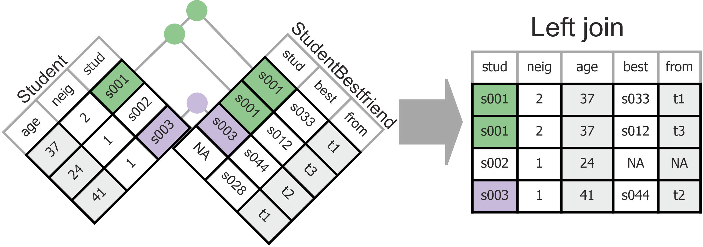
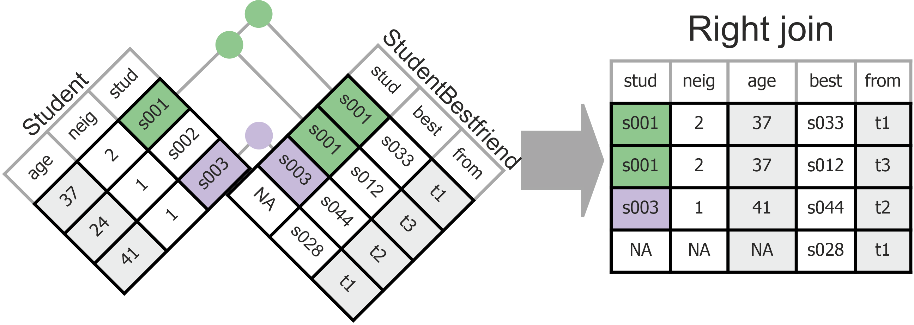
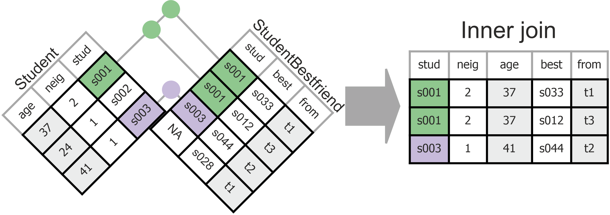
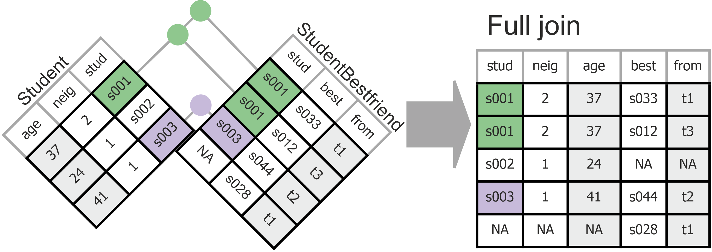

```{r setup, include=FALSE}
# Ensure that libraries are loaded.
library(tidyverse)
library(learnr)
library(gradethis)
library(knitr)
library(kableExtra)

tutorial_options(exercise.timelimit = 60, exercise.checker = gradethis::grade_learnr)
knitr::opts_chunk$set(echo = FALSE, warning = FALSE, message = FALSE)
```

```{r, context="data", include=FALSE}
# Ensure that the data is loaded for the remainder of this tutorial.
GlasgowFriends <- UsingRTutorials::GlasgowFriends # readr::read_csv("data/GlasgowFriends.csv")
# Create the Student table.
# It is not used in grade_result(), so it may already be around.
Student <- GlasgowFriends |> select(student, neighbourhood, schooldist, hoodname, age, sex, smoking_at_home, smoking_parents, smoking_siblings) |> distinct()
```

<!-- Define programming tip style -->

```{=html}
<style>
.tip {
  background-color: #f5f5f5;
}
</style>
```
<!-- Define question style -->

```{=html}
<style>
.question {
  color: #5A9DDB;
}
</style>
```
<!-- Define emphasis style -->

```{=html}
<style>
.emphasis {
  color: #e8301b;
}
</style>
```
## Overview

-   AI
-   Four principles of tidy data
-   Principle 3: Each variable must have its own column.
-   Principle 4: Each value must have its own cell.
-   Connecting different types of data through Joins

## Tidy Data: Eve`R`ything In One Place

-   Rules for optimal data structure designed for efficient and
    consistent data storage.
-   Key goals are to facilitate easy storage and (re-)use of complex
    datasets by
-   Storing data in a way that conserves space,
-   Storing data in a way that is easily understandable by others,
-   Preparing the dataset for common operations (e.g. merging different
    types of data) given the characteristics of the R programming
    language.

## Four Principles of Tidy Data

1.  Each type of case must have its own tibble (table).
    -   Is the same information repeated in different rows?\
    -   Split the tibble; transfer the info on each type of case to a
        separate tibble.\
    -   The book *R for Data Science (2nd Edition)* does not discuss
        this much. See Chapter 19 on Joins.
2.  Each observation must have its own row.
    -   Do different variables address the same information?\
    -   Stack repeated information.\
    -   Don't allow values as columns.
3.  Each variable must have its own column.
    -   Is there a variable with values that should be variables by
        themselves?
    -   Don't stack different types of information in the same column.
    -   Spread information over different columns.
4.  Each value must have its own cell.
    -   Does a variable contain more than one piece of information?
    -   Don't cram more than one piece of information in a cell.\
    -   Split the variable.

Last time, we discussed principles 1 and 2. Today, we will focus on
principle 3 and 4.

## 3. Each variable must have its own column.

### 

Inspect the tibble `StudentBestfriend` that you created previously.

::: question
Is there a variable with values that should be variables by themselves?
:::

```{r owncolumn, eval = TRUE, echo = FALSE}
GlasgowFriends |> 
  select(student, bestfriend, bfperiod, bfwave ) |> 
  distinct()|>
  slice(1:10) |>
  kable(booktabs = TRUE) |>
  kableExtra::kable_classic(full_width = FALSE)
```

### 

Values in variable `bfperiod` are variable names:

-   `from`: wave in which the student mentioned a peer as best friend
    for the first time;
-   `to`: idem, for the last time (`to`).
-   The actual value for `from` and `to` are stored in the `bfwave`
    variable.

::: emphasis
Tidy Rule 3. Each variable must have its own column.
:::

### 

Tidy data: tibble with variables `from`and `to` instead of `bfperiod`
and `bfwave`.

```{r owncolumn2, eval = TRUE, echo = FALSE}
GlasgowFriends |> 
  select(student, bestfriend, bfperiod, bfwave ) |> 
  distinct()|>
  # students without best friend are dropped
  filter(!is.na(bestfriend)) |>
  # spread the bfperiod values into new variables
  pivot_wider(id_cols = student:bestfriend, names_from = bfperiod, values_from = bfwave) |>
  arrange(student, bestfriend) |>
  slice(1:6) |>
  kable(booktabs = TRUE) |>
  kableExtra::kable_classic(full_width = FALSE)
```

::: question
Replace the `StudentBestfriend` tibble by a tibble with variables `from`
and `to` instead of `bfperiod` and `bfwave`.
:::

```{r bestfriendstable-solution}
StudentBestfriend <- GlasgowFriends |> select(student, bestfriend, bfperiod, bfwave ) |> distinct()
```

```{r gatherBestfriend, exercise = TRUE, eval=FALSE, exercise.setup = "bestfriendstable-solution"}
StudentBestfriend <- StudentBestfriend |>
  # students without best friend are dropped
  ____( ____ ) |>
  # spread the bfperiod values into new variables
  pivot_wider( ____ )
# Show result.
StudentBestfriend
```

```{r gatherBestfriend-solution, exercise.reveal_solution = FALSE}
StudentBestfriend <- StudentBestfriend |> filter(!is.na(bestfriend)) |> pivot_wider(id_cols = student:bestfriend, names_from = bfperiod, values_from = bfwave)
```

```{r gatherBestfriend-hint-1}
# Drop cases (filter()) with missing values on bestfriend (function is.na()).
```

```{r gatherBestfriend-hint-2}
# Within pivot_wider() function, use arguments: id_cols, names_from, and values_from.
```

```{r gatherBestfriend-hint-3}
# Check out the vignette: issue the R command `vignette("pivot")` in RStudio.
```

```{r gatherBestfriend-check}
gradethis::grade_result(
  fail_if(~ "NA" %in% names(StudentBestfriend), "Missing values become a new variable too. Remove them first."),
  fail_if(~ !("from" %in% names(StudentBestfriend)), "I guess that you spread the wrong variable. It should be `bfperiod`."),
  fail_if(~ !("t1" %in% StudentBestfriend$from), "Did you retrieve the values of the new variables from `bfwave`?"),
  pass_if(~ TRUE, "You removed missing values correctly and spread the `bfperiod` variable, using `bfwave`for the new values.")
)
```

## 4. Each value must have its own cell.

Split a variable containing more than one piece of information.

Trivial example, variable `alcohol` with values containing both a
numeric code and a label:

-   `1 none`;
-   `2 once or twice a year`;
-   `3 once a month`;
-   and so on.

::: question
Write tidyverse code to split the `alcohol` variable in the
`StudentWave` tibble into a numeric variable `alcohol_code` and a
character variable `alcohol_label`.
:::

Note: Send the results to the screen, do not store it in a new data
object (so the code checker can do its work).

```{r studentwavetable-solution}
StudentWave <- GlasgowFriends |> select(student, wave, alcohol, cannabis, money, romantic, friend_1, friend_2, friend_3, friend_4, friend_5, friend_6 ) |> distinct()
```

```{r separate, exercise = TRUE, exercise.setup = "studentwavetable-solution"}
StudentWave |> 
  separate_wider_delim()
```

```{r separate-solution, exercise.reveal_solution = FALSE}
#step1
StudentWave  |>  
  separate_wider_delim(alcohol, delim = " ", names = c("alcohol_code", "alcohol_label"),
  too_many = "debug")
#step2
StudentWave  |>  
  separate_wider_delim(alcohol, delim = " ", names = c("alcohol_code", "alcohol_label"),
  too_many = "merge")
```

```{r separate-hint-1}
# Within separate_wider_delim() function, use arguments: col, delim, names, and too_many.
```

```{r separate-hint-2}
# The names argument requires a vector (c()) with names for the new variables to be created.
```

```{r separate-hint-3}
# The delimiter should be a space (' '). In a first step, use "too_many='debug'" to check which cases produce issues with this delimiter. Then decide what to do with those cases in a second step using too_many='merge' or too_many='drop'
```

```{r separate-check}
gradethis::grade_code(
  correct = "", 
  incorrect = ""
  )
```

## Overview Data Tidying Steps

-   Determine the initial structure of your dataset.
-   What are they primary keys?
-   What violations of the tidy data principles can you see?
-   Adress the issues:
-   Start with Principle 1 (redistributing data to different tibbles if
    necessary)
-   Continue with Principle 2 (pivot_longer)
-   Finish by addressing issues for Principle 3 and 4
-   Confirm and document the new structure of your dataset.
-   What are the primary and foreign keys of the final data set?
-   How can different data sources be joined?

This concludes data tidying.

## Meet the Experts

### 

-   You need to know about and apply all tidy data principles in your
    *Group Data Project*.
-   To help you get there, we will engage in peer-learning.

::: emphasis
HOMEWORK BEFORE SESSION 5: Become an expert in 1 out of the 4 tidy data
principles.
:::

“Becoming an expert" means:

-   Re-visit the tidy data principle in the book and course materials.
-   Apply it to one of your Data Project data sets.
-   Produce 2 PowerPoint slides (use the template in Session 5 module on
    Canvas).

### 

Slide 1: explain the tidy data principle in your own words, using 3
questions:

-   WHAT type of data structure the tidy data principle refers to (What
    does untidy and what does tidy data look like?)
-   HOW the tidy data principle can be implemented using R code (What
    function(s) do you use?).
-   WHY the tidy data principle creates tidy data that is easier to work
    with than untidy data.

### 

Slide 2: visualize the application of the tidy data principle to your
*Group Data Project* dataset:

-   Include a screenshot of the data (only relevant variables) in it’s
    untidy form.
-   Include a screenshot of the data in it’s tidy form.
-   Include the R code you used to tidy the data.

### Who becomes an expert in what?

see [Canvas Discussion Forum](ADD%20LINK)

## Joins: Combining Different Data Sources

### 

As a result of tidying the `GlasgowFriends` tibble, we now have several
tibbles:

-   `Student`,
-   `StudentWave`,
-   `StudentWaveFriend`,
-   `StudentBestfriend`,
-   `Neighbourhood`.

Every piece of information is now stored in just one spot, which is
efficient and least error prone.

### 

However, when we want to analyze data, we may need information from
different tibbles. To this end, tidyverse offers us four join functions:

-   `left_join()`
-   `right_join()`
-   `inner_join()`
-   `full_join()`

These functions may yield different results, most notably, different
numbers of cases.

```{r eval=FALSE}
Student |> left_join(StudentBestfriend, by = "student")
Student |> right_join(StudentBestfriend, by = "student")
Student |> inner_join(StudentBestfriend, by = "student")
StudentBestfriend |> inner_join(Student, by = "student")
Student |> full_join(StudentBestfriend, by = "student")
```

### 

::: question
Use the below code box to join the `Student` and `StudentBestfriend`
tibbles with each of the four joins.

-   Do you get the same number of cases (rows) with all joins?
-   Compare the number of cases with those of the `Student` tibble
    (`r nrow(Student)` rows) and the `StudentBestfriend` tibble
    (`r GlasgowFriends |>    select(student, bestfriend, bfperiod, bfwave ) |> distinct() |>   filter(!is.na(bestfriend)) |>    pivot_wider(id_cols = student:bestfriend, names_from = bfperiod, values_from = bfwave) |> nrow()`
    rows). Why is it equal, larger, or smaller than in the original
    tables?
:::

```{r join1-setup}
# Create the definitive StudentBestfriend tibble.
StudentBestfriend <- GlasgowFriends |> 
  select(student, bestfriend, bfperiod, bfwave ) |> distinct() |>
  filter(!is.na(bestfriend)) |> 
  pivot_wider(id_cols = student:bestfriend, names_from = bfperiod, values_from = bfwave)
```

```{r join1, exercise = TRUE}
# Select different join types. Also switch the two tibbles.
Student |>
  left_join(StudentBestfriend, by = "student")
# Note the resulting number of cases in the bottom-left of the table.
```

```{r join1-hint-1}
# Join the two tibbles, using `student` as key.
# Start, for example, with a left join:
Student |> left_join(StudentBestfriend, by = "student")
```

### 

Graphical examples of what happens with the four different joins:

-   A left join that joins `StudentBestFriend` to `Student`:
    `Student |> left_join(StudentBestfriend, by = "student")`

```{r out.width="80%"}

```

-   Each row (case) in the first (left) tibble is preserved in the
    resulting tibble.
-   In addition, each row in the second (right) tibble with a match in
    the first tibble is preserved.

### 

-   A right join that joins `StudentBestFriend` to `Student`:
    `Student |> right_join(StudentBestfriend, by = "student")`

```{r out.width="80%"}

```

-   Like a `left_join()` but now with the tibbles reversed.

### 

-   An inner join that joins `StudentBestFriend` to `Student` or the
    other way around:
    `Student |> inner_join(StudentBestfriend, by = "student")`
    `StudentBestfriend |> inner_join(Student, by = "student")`

```{r out.width="80%"}

```

-   Only rows with key values that appear in both tibbles are preserved.

### 

-   A full join that joins `StudentBestFriend` to `Student`:
    `Student |> full_join(StudentBestfriend, by = "student")`

```{r out.width="80%"}

```

-   All rows of both tibbles are preserved.

### Check the join results

A.  Determine the primary key of the joined tibble. What are you
    counting when you count cases?

B.  Did you have missing values on key variables used for the join? Do
    you want these cases in the joined tibble?

C.  Which cases from the original tibbles are NOT included in the joined
    tibble. Is this as you want it to be?

### Ad A. Determining the primary key.

You have learned this earlier in this tutorial.

Does the primary key make sense? Do you understand what you are
counting?

### Ad B. Checking for missing values on a join key

Missing values on a variable used as join key may yield many new cases
or missing values in the joined tibble.

```{r join1b-setup}
# Create the StudentBestfriend tibble with some missing values for bestfriend.
StudentBestfriend2 <- GlasgowFriends |> 
  select(student, bestfriend, bfperiod, bfwave ) |> distinct() |>
#  filter(!is.na(bestfriend)) |> 
  pivot_wider(id_cols = student:bestfriend, names_from = bfperiod, values_from = bfwave)

# Create the StudentWave tibble.
StudentWave <- GlasgowFriends |> select(student, wave, alcohol, cannabis, money, romantic, friend_1, friend_2, friend_3, friend_4, friend_5, friend_6 ) |> distinct()
```

::: question
Count the number of missing values on variable `bestfriend` in the
tibble *StudentBestfriend2* and in the tibble *AlcoholComparison*. What
has happened and why?
:::

```{r join1b, exercise = TRUE, exercise.lines = 19}
# Count the number of missing values on join key variable bestfriend 
# in the StudentBestfriend tibble.
StudentBestfriend2 |> 
  summarise( ____ )
# Join StudentBestFriend with StudentWave to compare alcohol use 
# of a student to their best friends' alcohol use.
AlcoholComparison <- StudentBestfriend2 |>
  # add alcohol use for the friendship nominator
  left_join(StudentWave, by = "student") |>
  # just keep the alcohol use and wave info
  select( student:to, studentWave = wave, studentAlcohol = alcohol) |>
  # same for nominate best friend
  left_join(StudentWave, by = c("bestfriend" = "student")) |>
  # just keep the alcohol use and wave info
  select( student:studentAlcohol, friendWave = wave, friendAlcohol = alcohol)
# Count the number of missing values on join key variable bestfriend 
# in the StudentBestfriend tibble.
AlcoholComparison |> 
  summarise( ____ )
```

```{r join1b-hint-1}
# Remember how to count the number of missing values?
# For example, use sum(is.na()) within summarise().
```

```{r join1b-hint-2}
# For the StudentBestfriend tibble, replace ____ by one the join key variable(s).
StudentBestfriend2 |> 
  summarise(
    n_missing_bestfriend = sum(is.na( ____ ))
    )
```

```{r join1b-hint-3}
# Have a look at the cases with a missing value on `bestfriend` in the joined table to understand what has happened.
```

### Ad C. Checking join key overlap: `anti_join()`

Which cases from the original tibbles are NOT included in the joined
tibble. Is this as you want it to be?

```{r join2-setup}
# Create the definitive StudentBestfriend tibble.
StudentBestfriend <- GlasgowFriends |> 
  select(student, bestfriend, bfperiod, bfwave ) |> distinct() |>
  filter(!is.na(bestfriend)) |> 
  pivot_wider(id_cols = student:bestfriend, names_from = bfperiod, values_from = bfwave)

# Create the StudentWave tibble.
StudentWave <- GlasgowFriends |> select(student, wave, alcohol, cannabis, money, romantic, friend_1, friend_2, friend_3, friend_4, friend_5, friend_6 ) |> distinct()
```

For example, are all students from the *Student* tibble included in the
joined tibble comparing a student's alcohol use with their best friends'
alcohol use?

::: question
Use the `anti_join()` function to find the students registered in tibble
*Student* but not in tibble *AlcoholComparison* or the other way around.

How many student are missing in one of the two tibbles?
:::

```{r join2, exercise = TRUE}
# Join StudentBestFriend with StudentWave to compare alcohol use 
# of a student to their best friends' alcohol use.
AlcoholComparison <- StudentBestfriend |>
  # add alcohol use for the friendship nominator
  left_join(StudentWave, by = "student") |>
  # just keep the alcohol use and wave info
  select( student:to, studentWave = wave, studentAlcohol = alcohol) |>
  # same for nominate best friend
  left_join(StudentWave, by = c("bestfriend" = "student")) |>
  # just keep the alcohol use and wave info
  select( student:studentAlcohol, friendWave = wave, friendAlcohol = alcohol) |>
  # (NEW) only keep alcohol use in the same wave
  filter(studentWave == friendWave)
# Select cases that appear in one table but not the other.
____ |> anti_join( ____ , by = "____" )
```

<!-- To hide the solution, use a textual hint. -->

::: {#join2-hint}
**Hint:** The order of tibbles in the anti_join() function matters. Try
both orders: matching `Student` to `AlcoholComparison` and the other way
around.
:::

```{r join2-solution}
AlcoholComparison <- StudentBestfriend |>
  # add alcohol use for the friendship nominator
  left_join(StudentWave, by = "student") |>
  # just keep the alcohol use and wave info
  select( student:to, studentWave = wave, studentAlcohol = alcohol) |>
  # same for nominate best friend
  left_join(StudentWave, by = c("bestfriend" = "student")) |>
  # just keep the alcohol use and wave info
  select( student:studentAlcohol, friendWave = wave, friendAlcohol = alcohol) |>
  # (NEW) only keep alcohol use in the same wave
  filter(studentWave == friendWave)
Student |> anti_join(AlcoholComparison, by = "student")
```

```{r join2-check}
gradethis::grade_code(
  correct = "All students in tibble `AlcoholComparison` appear in tibble `Student`, but not the other way around.", 
  incorrect = "Swap the order of tibbles. Perhaps that may work."
  )
```

### Recognizing untidy data

::: tip
**Programming Tips**

-   If the number of observations for a variable is larger than you
    should expect given the description of the data, you probably have
    to split tibbles.
-   If your R code is complicated when you want to do a simple thing,
    your data are probably in wide format, while tidy data are in long
    format.
:::

## Fancy Stuff

### Contingency tables (crosstabs)

Another application of spreading: cross-tabulation. A contingency table
of two variables has variable values in rows and columns.

::: question
Add comments to the code explaining each step of the pipe.
:::

```{r crosstabs1-setup}
Student <- GlasgowFriends |> 
  select(student, neighbourhood, schooldist, hoodname, age, sex, smoking_at_home, smoking_parents, smoking_siblings) |> 
  distinct()
StudentWave <- GlasgowFriends |> 
  select(student, wave, alcohol, cannabis, money, romantic, friend_1, friend_2, friend_3, friend_4, friend_5, friend_6 ) |> 
  distinct()
```

```{r crosstabs1, exercise = TRUE, exercise.eval = TRUE}
# alcohol use by wave crosstabs from original dataset
GlasgowFriends |>
  distinct(student, wave, alcohol) |>
  count( wave, alcohol ) |>
  pivot_wider(names_from = wave, values_from = n) |>
  knitr::kable(booktab = FALSE) |>
  kableExtra::kable_styling(full_width = FALSE)
```

::: {#crosstabs1-hint}
**Hint:** If you want to know the result of a step in the pipe, send the
intermediate result to the screen or to View().
:::

### 

Let us go one step further. Let us use our knowledge about the
`kableExtra` package from Session 2.

::: question
Play around with (more) `kableExtra` settings.
:::

```{r crosstabs2-setup}
Student <- GlasgowFriends |> 
  select(student, neighbourhood, schooldist, hoodname, age, sex, smoking_at_home, smoking_parents, smoking_siblings) |> 
  distinct()
StudentWave <- GlasgowFriends |> 
  select(student, wave, alcohol, cannabis, money, romantic, friend_1, friend_2, friend_3, friend_4, friend_5, friend_6 ) |> 
  distinct()
```

```{r crosstabs2, exercise = TRUE, exercise.eval = TRUE}
StudentWave |> 
  left_join(Student, by = "student") |> 
  count( sex, wave, alcohol ) |> 
  pivot_wider(names_from = c(sex, wave), values_from = n, values_fill = 0) |> 
  kable(booktab = TRUE, col.names = c("Alcohol Usage", "wave 1", "wave 2", "wave 3", "wave 1", "wave 2", "wave 3")) |> 
  add_header_above(c(" " = 1, "Boys" = 3, "Girls" = 3)) |> 
  kable_paper(full_width = FALSE)
```

::: {#crosstabs2-hint}
**Hint:**

-   For the layout, use the [kableExtra
    webpage](https://cran.r-project.org/web/packages/kableExtra/vignettes/awesome_table_in_html.html).
-   Note the column names are partly defined in the `kable()` function
    and partly in a `kableExtra` function.
:::

### Joins: (Relational) database diagram

A relational database is a network of tables (tibbles) and joins between
tables. To the best of my knowledge, packages for network analysis
cannot display tables. The R package `DiagrammeR`, which uses
[graphviz](http://www.graphviz.org/), can do this.

```{r diagram1, exercise = TRUE, exercise.eval = TRUE}
#After installing the DiagrammeR package, load it.
# install.packages("DiagrammeR")
library(DiagrammeR)

DiagrammeR::grViz("
digraph database {
graph [
rankdir = 'LR'
];
node [
fontsize = '16'
shape = 'ellipse'
];
edge [
];
'node1' [
label = 'Student | <f1> student | <f2> neighbourhood | age | sex |smoking_at_home | smoking_parents | smoking_siblings'
shape = 'record'
];
'node2' [
label = 'Neighbourhood | <f1> neighbourhood | schooldist | hoodname'
shape = 'record'
];
'node3' [
label = 'StudentBestfriend | <f1> student | bestfriend | from | to'
shape = 'record'
];
'node4' [
label = 'StudentWave | <f1> student | <f2> wave | alcohol | cannabis | money | romantic'
shape = 'record'
];
'node5' [
label = 'StudentWaveFriend | <f1> student | <f2>wave | friend'
shape = 'record'
];
'node2':f1 -> 'node1':f2;
'node1':f1 -> 'node3':f1;
'node1':f1 -> 'node4':f1;
'node1':f1 -> 'node5':f1;
'node4':f2 -> 'node5':f2;
}
")
```

### 

With this concise definition of the tables, it is not possible to change
the background colour of a the first table row indicating the table name
or use underlining to mark the variables that constitute the primary key
of a table.

For such fine-tuning, we have to use HTML code.

```{r diagram2, exercise = TRUE, exercise.eval = TRUE}
library(DiagrammeR)
DiagrammeR::grViz("
digraph database {
    graph [rankdir = LR]
    node [
      shape=plaintext
      fontname = 'Helvetica'
    ]
    Student [label=<
<TABLE BORDER='0' CELLBORDER='1' CELLSPACING='0'>
  <TR><TD BGCOLOR='black'><FONT COLOR='white'>Student</FONT></TD></TR>
  <TR><TD PORT='f1'><U>student</U></TD></TR>
  <TR><TD PORT='f2'>neighbourhood</TD></TR>
  <TR><TD>age</TD></TR>
  <TR><TD>sex</TD></TR>
  <TR><TD>smoking_at_home</TD></TR>
  <TR><TD>smoking_parents</TD></TR>
  <TR><TD>smoking_siblings</TD></TR>
</TABLE>>];
    Neighbourhood [label=<
<TABLE BORDER='0' CELLBORDER='1' CELLSPACING='0'>
  <TR><TD BGCOLOR='black'><FONT COLOR='white'>Neighbourhood</FONT></TD></TR>
  <TR><TD PORT='f1'><U>neighbourhood</U></TD></TR>
  <TR><TD>schooldist</TD></TR>
  <TR><TD>hoodname</TD></TR>
</TABLE>>];
    StudentBestfriend [label=<
<TABLE BORDER='0' CELLBORDER='1' CELLSPACING='0'>
  <TR><TD BGCOLOR='black'><FONT COLOR='white'>StudentBestfriend</FONT></TD></TR>
  <TR><TD PORT='f1'><U>student</U></TD></TR>
  <TR><TD><U>bestfriend</U></TD></TR>
  <TR><TD>from</TD></TR>
  <TR><TD>to</TD></TR>
</TABLE>>];
    StudentWave [label=<
<TABLE BORDER='0' CELLBORDER='1' CELLSPACING='0'>
  <TR><TD BGCOLOR='black'><FONT COLOR='white'>StudentWave</FONT></TD></TR>
  <TR><TD PORT='f1'><U>student</U></TD></TR>
  <TR><TD PORT='f2'><U>wave</U></TD></TR>
  <TR><TD>alcohol</TD></TR>
  <TR><TD>cannabis</TD></TR>
  <TR><TD>money</TD></TR>
  <TR><TD>romantic</TD></TR>
</TABLE>>];
    StudentWaveFriend [label=<
<TABLE BORDER='0' CELLBORDER='1' CELLSPACING='0'>
  <TR><TD BGCOLOR='black'><FONT COLOR='white'>StudentWaveFriend</FONT></TD></TR>
  <TR><TD PORT='f1'><U>student</U></TD></TR>
  <TR><TD PORT='f2'><U>wave</U></TD></TR>
  <TR><TD><U>friend</U></TD></TR>
</TABLE>>];
    Neighbourhood:f1 -> Student:f2;
    Student:f1 -> StudentBestfriend:f1;
    Student:f1 -> StudentWave:f1;
    Student:f1 -> StudentWaveFriend:f1;
    StudentWave:f2 -> StudentWaveFriend:f2
}
")
```

## Data Project

We are completing Sprint 2. Remember to do the Sprint 2 Retrospective and Review and Plan Sprint 3. 

Tips for your upcoming Sprint Backlog: With the skills
discussed today, you can:

-   Check and tidy your complex data sets according to principles 3-4.
-   Check which of your complex data sets can be linked. Some of them
    might have to be transformed before they can be joined.
-   Use `dplyr::` and `tidyr::` to link data.
-   Summarize the contents and relations between your data sets in your
    Data Project Quarto file.
-   Plan in some time for everybody to practice with `ggplot()` on the
    Data Project.

## Next Session: Review + Q&A

**Meet the Experts**

Exchange and consolidate data tidying knowledge with experts from other
groups.

**Review course content**

Submit questions and/or difficult topics for review by completing the "Session 5 Preparation" Assignment on Canvas by the end of day Sunday,
November 10th.

**Group consultations for the Data Project**

\~ X minutes per group. Discuss as a group what you want to ask
beforehand.
