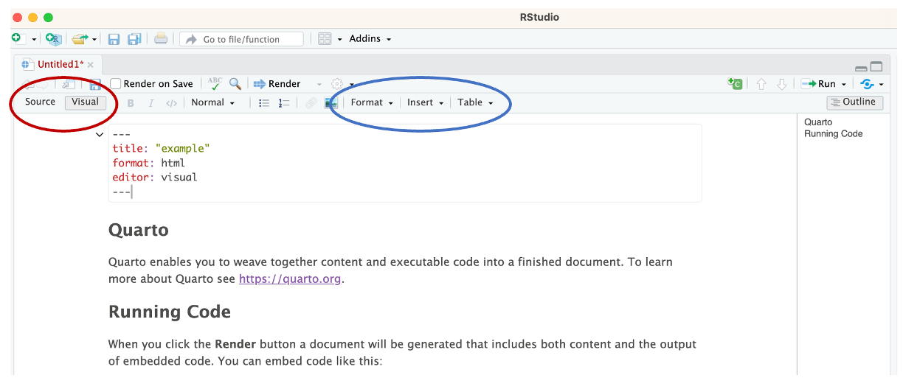
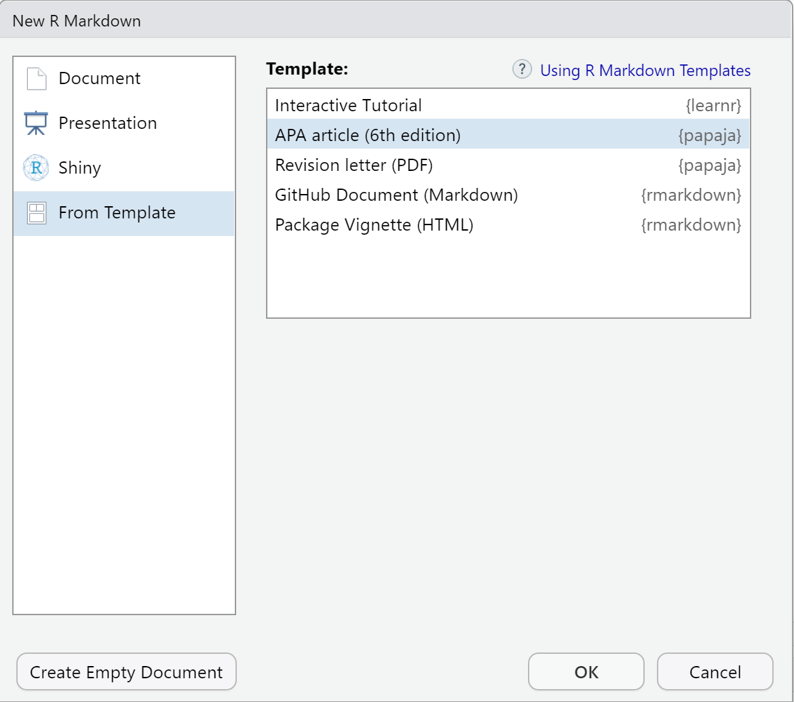
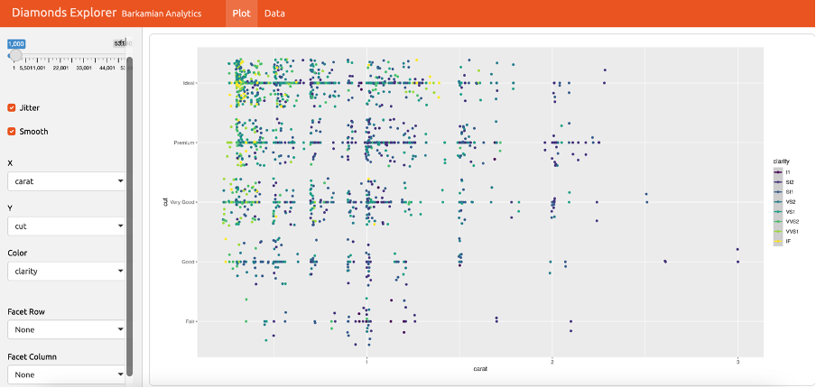

```{r setup, include=FALSE}
# Ensure that libraries are loaded.
library(tidyverse)
library(learnr)
library(gradethis)
library(knitr)
library(kableExtra)
library(RColorBrewer)

tutorial_options(exercise.timelimit = 20, exercise.checker = gradethis::grade_learnr)
knitr::opts_chunk$set(echo = FALSE, warning = FALSE, message = FALSE)

# Note: A (new) R Markdown document can be knitted while a learnr tutorial is
# running both if the tutorial is started from the console and from the Tutorial tab.
```

```{r, context="data", include=FALSE}
# Ensure that the data is loaded for the remainder of this tutorial.
glbwarm <- UsingRTutorials::glbwarm
```

<!-- Define programming tip style -->

```{=html}
<style>
.tip {
  background-color: #f5f5f5;
}
</style>
```
<!-- Define question style -->

```{=html}
<style>
.question {
  color: #5A9DDB;
}
</style>
```
<!-- Define emphasis style -->

```{=html}
<style>
.emphasis {
  color: #e8301b;
}
</style>
```
## Overview

Course Content

-   Report Layout.
-   Polishing Your Graphics.
-   Finalizing the Group Project.

## Report Layout With Quarto

In Quarto, many output characteristics can be set in the YAML header at the beginning of the document.

::: question
In RStudio, open a new Quarto document. One-by-one, add the following options to the YAML header and render the document to see how it changes.
:::

-   Table of contents: `toc: true`
-   Change the position of the table of contents: `toc-location: left` or `toc-location: body`
-   Section numbering: `number_sections: true`
-   Location of Figure and Table captions: for instance `fig-cap-location: bottom` or `tbl-cap-location: top`

You can find many more options online. Careful: Look at the options that are available for your intended output document (e.g. PDF, Word, or HTML): <https://quarto.org/docs/output-formats/all-formats.html>

### Visual editor

```{r out.width="80%"}

```

Use the visual editor for easy:

-   Text formatting.
-   Table and figure insertion.
-   Table formatting.
-   Insertion of footnotes.
-   Insertion of references.

### References

To include literature references in an Quarto document, you need four things:

1.  A bibliography file containing the referenced literature, preferably in BibTex format: `references.bib`. Note: You can also pull references directly from popular reference managers like Zotero or online sources like PubMed.
2.  A line in the YAML specifying the bibliography file(s) to use, for example, `bibliography: references.bib`. Note: If you do not start with a pre-defined .bib file, but instead rely fully on a reference manager, this line will be added automatically to the YAML header when you add your first reference.
3.  A line in the YAML specifying the format to be used for the references, for example, `csl: apa.csl`. Note: The file `apa.csl` needs to be saved in the working directory (more below).
4.  A citation key in the text where you want to insert the reference, for example, "As argued by [@McQuail2005], Communication Science deals with ...".

```{r out.width="90%"}
knitr::include_graphics("images/InsertCitation.png")
```

Adding a reference within the visual editor:

-   Put the cursor where you want the reference.
-   Select *Citation* from the *Insert* menu.
    1.  Select your reference software (if any) to select a reference.
    2.  Or select the R packages that you are using, to acknowledge the work of the authors.
    3.  The default file name of the references file is `references.bib`.
    4.  Insert the selected references in the Quarto document.

### 

RStudio then:

1.  Inserts the reference in the document.
2.  Creates or expands the file `references.bib`.
3.  Adds this file to the YAML, so a list of references is created when you knit the document.

::: question
-   Open a new Quarto file. On the first page, cite the following R packages: `base`, `tidyverse`, `knitr`, and `kableExtra`.
:::

### 

To get the literature references in APA style, we need a citation style file.

::: question
-   Download the file with the APA journal citation style `apa.csl` from <https://www.zotero.org/styles>.
-   Save it in your working directory.
-   Reference the APA journal citation style `apa.csl` in the YAML of the Quarto file. Add the line: `csl: apa.csl`
-   Render the document to HTML and inspect the references. All okay?
:::

<!-- Define emphasis style -->

```{=html}
<style>
.emphasis {
  color: #e8301b;
}
Ensure that the references and citation style files are saved in the working directory!
</style>
```
### Figure code chunk options

Figures usually demand additional attention:

-   not too small and not too large,
-   have a caption,
-   are shown in the right place.

*YAML Header* sets for all figures:

-   Where the figure caption is located: `fig-cap-location: top` or how it's aligned: `fig-align: left`
-   Default width: `fig-width`
-   For more options see: <https://quarto.org/docs/output-formats/all-formats.html> (choose your output format)

Adjust a single figure with code chunk options (<https://quarto.org/docs/computations/execution-options.html>):

-   `#| fig.cap =` figure caption as string.
-   `#| fig.align =` 'left', 'right', or 'center'.
-   `#| out.width =` width of figure in output in percentage of line width (`"80%"`) or as a fixed width in pixels for HTML (`"300px"`) or inches, centimeters for PDF and Word (`"4.5in"`, `"6cm"`).
-   `#| fig.asp =` ratio of height to width.

Figures are automatically numbered in PDF output, but not in Word or HTML. To accomplish this, you need to use cross-referencing. More below.

Note:

-   If the size of a figure in the document is too small, `knitr` may end with the error message that the margins are too large.

::: question
-   Reduce the size of a figure in a Quarto file to 50 percent (half the line width), make it square, and add the caption "This is my figure."
:::

### Custom tables

Table menu in visual editor:

-   Helps including a table that you type from scratch.
-   Only use for a diagram.
-   Never use for R results!

### 

Present summary results as a table with `knitr::kable()` in a code chunk.

::: question
-   Make sense of the below pipe (add comments).
:::

```{r resultstable, exercise = TRUE, exercise.lines = 8, exercise.eval = TRUE}
glbwarm %>% 
  group_by(sex) %>% 
  summarise(sex_mean = round(mean(govact), digits=2), 
            sex_sd = round(sd(govact), digits=2)) %>%
  kable(col.names = c("Sex", "Average Score", "Standard Deviation"),
        caption = "Table: Support for government intervention across the sexes.")
```

### 

For additional table layout options:

-   Package `kableExtra::`
-   Documentation: [kableExtra vignette](https://cran.r-project.org/web/packages/kableExtra/vignettes/awesome_table_in_html.html).

### Cross-references

Quarto allows you to number and cross-reference figures, tables, and sections.

**Cross-referencing a figure added using an image file**

-   Add the figure by adding the following in the Markdown (text) part of a Quarto document: `{#LABEL}`
-   Elsewhere in the document, reference the figure in your text: "See `@fig-CAPTION` for an illustration

**Cross-referecing tables and figures created in code chunks**

-   Create the figure (e.g. using `ggplot::`) or table inside a code chunk

-   Add the beginning of the code chunk:

    -   add a figure label (`#| label: fig-LABEL`) and caption (`#| fig-cap: CAPTION`);

    -   or add a table label (`#| label: tbl-LABEL`) and caption (`#| tbl-cap: CAPTION`)

::: question
-   Add a section label to the **Quarto** Section in a new Quarto file and use it to refer to this section in a sentence "As we have seen in Section 0.1, we can show statistical results in a Quarto document." that you add to the **Running Code** Section.
-   Add a figure using an image file on your computer and cross-reference it: "Figure 1 is beautiful, isn't it?"
:::

::: tip
**Programming Tip**

-   Don't use blanks in Section ID labels or names of code chunks that create a table or figure.
:::

### Knitting Problems

Problems with knitting to HTML:

-   Probably errors in your code (also applies to Word and PDF).
-   Spot and fix them.
-   Use code chunk option `eval=FALSE` to see if a code chunk causes the problem.

Problems with knitting to Word:

-   Functions for tables and figures may not work for Word.
-   Knit to HTML and import HTML in Word.

Problems with knitting to PDF:

-   Characters like `%`, `\`, `/` have special meaning in LaTeX, which is the language used to create the PDF.
-   Ensure that variable names or captions do not include them.

## Polishing Your Graphics

### Labels and legend position

Setting plot labels:

-   `labs()` layer: basic adjustments.
-   `theme()` layer: fine tuning of all details, including the legend. **Note**: features of graphical elements are specified with functions (with their own help page):
-   `element_text()`, e.g., `theme(plot.title = element_text(size = 10))`
-   `element_rect()`, e.g., `theme(plot.background = element_rect(fill = "green"))`
-   `element_line()`, e.g., `theme(axis.line = element_line(linewidth = 3, colour = "grey80"))`

```{r labelsshow}
ggplot(data = glbwarm, mapping = 
    aes(x = age, y = govact, 
        color = partyid)) +
  geom_jitter() +
  labs(title = "Support for intervention by age", 
    x = "Age", y = "Support for government intervention",
    color = "Party identification"
    ) +
  theme(legend.position = "bottom")
```

::: question
-   Create the above plot using tibble `glbwarm`, which is available in this tutorial. Pay special attention to the labels and legend position.
:::

```{r labels, exercise = TRUE}

```

<!-- To hide the solution, use a textual hint. -->

::: {#labels-hint}
**Hint:** Remember that the answer checker checks the presence of all layers before it checks the contents of the layers, so first add all layers if you want to use the automatic feedback for building the plot.

**Hint:** Check out help on function `theme()` to find the argument that sets the position of the legend.
:::

```{r labels-solution}
ggplot(data = glbwarm, mapping = aes(x = age, y = govact, color = partyid)) + geom_jitter() + labs(title = "Support for intervention by age", x = "Age", y = "Support for government intervention", color = "Party identification") + theme(legend.position = "bottom")
```

```{r labels-check}
gradethis::grade_code(
  correct = "", 
  incorrect = "You may have the layers in a different order, e.g., first theme() and then labs(). That is OK."
  )
```

### Themes

Some plot characteristics are combined into theme types, e.g.:

-   `theme_bw()`,
-   `theme_classic()`,
-   `theme_dark()`,
-   `theme_void()`,
-   `theme_minimal()`.

You can set some overall plot characteristics within these theme layers, e.g.:

-   `base_size` (size of fonts used)
-   `base_family` (font type used: `"serif"`, `"sans"`, or `"mono"`).

::: question
-   Experiment with `base_size` and `base_family` in the code below.
:::

```{r themes, exercise = TRUE}
ggplot(data = glbwarm, mapping = 
    aes(x = age, y = govact, 
        color = partyid)) +
  geom_jitter() +
  labs(title = "Support for intervention by age", 
    x = "Age", y = "Support for government intervention", 
    color = "Party identification") +
  theme_classic(base_size = 14, base_family = "sans") +
  theme(legend.position = "bottom")
```

::: tip
**Programming Tip**

-   Use `theme()` after, not before a theme type (such as `theme_bw()`), otherwise the theme type overrides the `theme()` settings.
:::

### 

Argument `base_size` sets a base size for all texts displayed in a plot.

If you want to set the size of a particular type of text within the plot, for example, the text values displayed in the legend, you can do that within a `theme()` layer.

::: question
-   Complete the code below to set the size of the legend title to 10 and the size of the legend entries to 8.
:::

```{r legend, exercise = TRUE}
ggplot(data = glbwarm, mapping = 
    aes(x = age, y = govact, 
        color = partyid)) +
  geom_jitter() +
  labs(title = "Support for intervention by age", 
    x = "Age", y = "Support for government intervention", 
    color = "Party identification") +
  theme_classic(base_size = 14, base_family = "sans") +
  theme(legend.position = "bottom",
        legend.
        legend.
        )
```

```{r legend-hint-1}
# The arguments to change legend title or legend entries are among the ones
# starting with legend. ; makes sense, doesn't it?
?theme
```

```{r legend-hint-2}
# The arguments that address properties of the text, use function element_text(). Check out help on this function.
?element_text
```

```{r legend-solution}
ggplot(data = glbwarm, mapping = aes(x = age, y = govact, color = partyid)) + geom_jitter() + labs(title = "Support for intervention by age", x = "Age", y = "Support for government intervention", color = "Party identification") + theme_classic(base_size = 14, base_family = "sans") + theme(legend.position = "bottom", legend.title = element_text(size = 10), legend.text = element_text(size = 8))
```

```{r legend-check}
gradethis::grade_code(
  correct = "", 
  incorrect = ""
  )
```

### Custom colors

For marking groups by colors , `ggplot()` uses a vector of colors, assigning the first group to the first color, and so on.

Custom colors:

-   Create a vector of colors that matches (number and order) the groups in your plot.
-   `RColorBrewer` offers nice color palettes ([book, p. 458](https://r4ds.had.co.nz/graphics-for-communication.html#replacing-a-scale)).
-   Function `brewer.pal` in this package creates such a vector.

Democrats should be blue, Republicans red, and let us use green for Independents.

::: question
-   Use the `scale_color_manual()` layer and the RColorBrewer `Accent` palette to assign the right colors to party identification in the plot.
:::

```{r colors, exercise = TRUE}
ggplot(data = glbwarm, mapping = 
    aes(x = age, y = govact, 
        color = partyid)) +
  geom_jitter() +
  labs(
    title = "Support for intervention by age", 
    x = "Age", 
    y = "Support for government intervention",
    color = "Party identification"
    ) +
  theme_classic(base_size = 14, base_family = "sans") +
  theme(legend.position = "bottom") +
  scale_color_manual()
```

```{r colors-hint-1}
# Look up the Accent palette in the book or with the code below.
display.brewer.pal(8, name = "Accent")
# It has 8 colors ordered from green [1] to darkgrey [8].
# Which entries do you need from this vector?
```

```{r colors-hint-2}
# Extract the codes of the three desired colors from the palette.
brewer.pal(8, "Accent")[c( )]
# Note: 8 specifies the number of colors in this palette.
```

```{r colors-hint-3}
# The `values =` argument in scale_color_manual() assigns colors to groups.
scale_color_manual(values = brewer.pal(8, "Accent")[c(5, 1, 6)])
```

```{r colors-solution}
ggplot(data = glbwarm, mapping = aes(x = age, y = govact, color = partyid)) +
  geom_jitter() + labs(title = "Support for intervention by age", x = "Age", y = "Support for government intervention", color = "Party identification") + theme_classic(base_size = 14, base_family = "sans") + theme(legend.position = "bottom") + scale_color_manual(values = brewer.pal(8, "Accent")[c(5, 1, 6)])
```

```{r colors-check}
gradethis::grade_code(
  correct = "", 
  incorrect = ""
  )
```

::: tip
**Programming Tip**

-   Discrete scales, for example, distinguishing between groups, are quite different from continuous scales. As a consequence, palettes for discrete scales do not work for continuous scales and the other way around.
:::

### Scales and ticks

Fine-tuning the ticks (value labels) on axes:

-   Use layers `scale_x_continuous()` and `scale_y_continuous()`,
-   to set the breaks, minor breaks, limits, and, if you like, axis label.

::: question
-   Adjust the plot axes such that the vertical axis shows a grid line and label for each possible value of the original 7-point scale (1 to 7) and the horizontal axis shows labels and grid lines for decades (20, 30, 40, ..., 90) and only a grid line for each 2.5 years within a decade starting at 15 (15, 17.5, 22.5, 25, ..., 87.5).
:::

```{r ticks, exercise = TRUE, exercise.eval = TRUE}
ggplot(data = glbwarm, mapping = 
    aes(x = age, y = govact, color = partyid)) +
  geom_jitter() +
  theme_bw(base_size = 14) +
  theme(legend.position = "none") 
```

```{r ticks-hint-1}
# Add the two layers.
ggplot(data = glbwarm, mapping = 
    aes(x = age, y = govact, color = partyid)) +
  geom_jitter() +
  theme_bw(base_size = 14) +
  theme(legend.position = "none") +
  scale_y_continuous() +
  scale_x_continuous()
```

```{r ticks-hint-2}
# Use `breaks =` for labels with grid lines and `minor_breaks =` for grid lines only.
ggplot(data = glbwarm, mapping = 
    aes(x = age, y = govact, color = partyid)) +
  geom_jitter() +
  theme_bw(base_size = 14) +
  theme(legend.position = "none") +
  scale_y_continuous(breaks = , minor_breaks = ) +
  scale_x_continuous(breaks = , minor_breaks = )
```

```{r ticks-hint-3}
# Use an efficient way to get sequences of numbers for the axis values.
1:7
seq(from = 20, to = 90, by = 10)
```

```{r ticks-hint-4}
# And don't forget to switch off minor breaks on the Y axis.
minor_breaks = NULL
```

```{r ticks-solution}
ggplot(data = glbwarm, mapping = aes(x = age, y = govact, color = partyid)) + geom_jitter() + theme_bw(base_size = 14) + theme(legend.position = "none") + scale_y_continuous(breaks = 1:7, minor_breaks = NULL) + scale_x_continuous(breaks =  seq(from = 20, to = 90, by = 10), minor_breaks = seq(from = 15, to = 87.5, by = 2.5))
```

```{r ticks-check}
gradethis::grade_code(
  correct = "", 
  incorrect = "Perhaps, you added the scale layers in a different order or in a different place. That is OK if you see the required axis values and grey lines."
  )
```

### Manual additions

Use graphical primitives and `geom_label()` or `geom_text()` to touch up a graphic.

There are two ways of manually positioning graphical primitives within a plot

-   If the axes are numerical, use axis values as coordinates.
-   Otherwise, use a number between 0 and 1 as relative position.

```{r additionsshow}
ggplot(data = glbwarm, mapping = 
    aes(x = age, y = govact, 
        color = partyid)) +
  scale_color_manual(values = 
    brewer.pal(8, "Accent")[c(5, 1, 6)]) +
  geom_jitter() +
  geom_text(x = 90, y = 4, 
    label = "Source: Global warming data set by Eric Nisbeth.
    Author: Yah Tutor.",
    angle = 90, size = 2.5,
    color = "black") +
  scale_x_continuous(limits = c(15, 90)) + 
  theme_classic(base_size = 11) +
  theme(legend.position = "bottom")
```

::: question
-   Use a text geom to add the source ("Source: Global warming data set by Eric Nisbeth.") and author ("Author: Yah Tutor.") to the plot as shown in the above figure.
:::

```{r additions, exercise = TRUE}
ggplot(data = glbwarm, mapping = 
    aes(x = age, y = govact, 
        color = partyid)) +
  scale_color_manual(values = 
    brewer.pal(8, "Accent")[c(5, 1, 6)]) +
  geom_jitter() +
  geom_text( ) +
  scale_x_continuous(limits = c(15, 90)) + #ensures that the text fits within the plot
  theme_classic(base_size = 11) +
  theme(legend.position = "bottom")
```

```{r additions-hint-1}
# Check out section Aesthetics in the help on geom_text() to find the
# arguments that you need.
```

```{r additions-hint-2}
# You are supposed to provide the coordinates manually in the ggplot code
# (instead of calculating it from the data set.)
# For this reason, do not put the coordinates within an aes() function.
```

```{r additions-hint-3}
# Divide the label over two lines in your code to get the source and author on
# different lines.
label = "Source: Global warming data set by Eric Nisbeth.
    Author: Yah Tutor."
```

```{r additions-solution}
ggplot(data = glbwarm, mapping = aes(x = age, y = govact, color = partyid)) + scale_color_manual(values = brewer.pal(8, "Accent")[c(5, 1, 6)]) + geom_jitter() + geom_text(x = 90, y = 4, label = "Source: Global warming data set by Eric Nisbeth.
    Author: Yah Tutor.", angle = 90, size = 2.5, color = "black") + scale_x_continuous(limits = c(15, 90)) +  theme_classic(base_size = 11) + theme(legend.position = "bottom")
```

```{r additions-check}
gradethis::grade_code(
  correct = "", 
  incorrect = ""
  )
```

## Fancy Stuff

### APA format article with `papaja::`

Instead of adapting a standard R Markdown document, you can use the `papaja` package, which contains an APA6 article template. Once you have installed this package, an APA article template is available if you create a new R Markdown file using the *From Template* option (see figure).

```{r out.width="60%"}

```

If you didn't do so, install `papaja`. Run the command `remotes::install_github("crsh/papaja")` from the RStudio console.

`papaja` uses `bookdown` but you do not have to load this package separately.

::: question
-   Create a new R Markdown document from the APA journal template.
-   Inspect the contents of the template, check out the options.
-   Knit it to pdf (`output : papaja::apa6_pdf`) or Word (`output : papaja::apa6_word`) and inspect the knitted document.
-   Apply your skills for cross-referencing sections, tables, and figures.
:::

A manual for `papaja` is available at <https://crsh.github.io/papaja_man/> .

### Templates for other journals

The `rticles` package offers R Markdown templates for several journals and some journal publishers.

If you install this package, the journal or publisher templates are shown in the list of templates when you create a new R Markdown document.

### Dashboards

A dashboard is used to show a group of related data visualizations. Below is a screen shot of an example created with package `flexdashboard`. It uses HTML widgets to show pop-ups when you hover over a graph (in the original dashboard, not in the screen shot below).

```{r out.width="100%"}

```

Read more about `flexdashboard` at <https://RMarkdown.rstudio.com/flexdashboard/index.html> .

Another package is `shinydashboard`, which uses shiny to create interactive dashboards. See <https://rstudio.github.io/shinydashboard/index.html> for more information.

## Finalizing the Group Project

### What to submit

Report:

-   Submit knitted R Markdown document (HTML, PDF, or Word) & R Markdown file via Canvas.
-   Knitted file must be reproducible from the R Markdown file.

Presentation (15 or 20 minutes per group, not necessarily in R Markdown):

-   Brief description of the data set.
-   Each group member presents a draft of their graph.
-   Goal: get feedback from the group.

### Group work on the project
